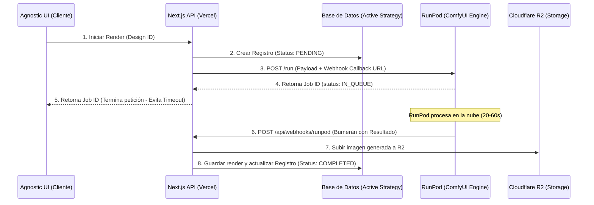

# Estrategia de Arquitectura: Integración de Agentes e Infraestructura de Renderizado (Veta & NOMON)

Este documento redefine las ideas preliminares en una estrategia técnica real, estructurada y acoplada a la arquitectura del **Agnostic System**.

---

## 1. Clarificación del Modelo: Webhook Endpoint vs. Outgoing Adapter

El diseño preliminar proponía un `"webhook.adapter"`, lo cual conceptualmente mezcla el flujo de entrada con el de salida. En una arquitectura de producción limpia, los separamos de la siguiente manera:

*   **Webhook Endpoints (Entradas HTTP):** Rutas públicas del servidor Next.js (ej. `/api/webhooks/runpod`, `/api/webhooks/instagram`) que actúan únicamente como oyentes (listeners). Validan firmas criptográficas de seguridad y encolan la solicitud en la base de datos o sistema de colas. No procesan lógica de red saliente.
*   **Service Adapters (Salidas HTTP/SDK):** Módulos clientes de servicios externos (ej. `RunPodClient`, `MetaClient`, `LinkedinClient`) que encapsulan la lógica de comunicación saliente hacia APIs externas.

---

## 2. Catálogo de Adaptadores de Servicio Requeridos

Para soportar los tres ecosistemas propuestos (Veta, NOMON y Automatización IA), el sistema necesita los siguientes adaptadores en `src/lib/integrations/`:

| Nombre del Adaptador | Tipo de Servicio | Descripción | Librerías Open Source Propuestas |
|---|---|---|---|
| **`ComfyUiAdapter`** | Generación Gráfica | Envía esquemas de nodos (workflows) y planos geométricos (ControlNet) a instancias de ComfyUI sobre RunPod o servidores locales. | `Axios` / `Fetch` (REST API nativa de ComfyUI) |
| **`StorageAdapter`** | Persistencia de Medios | Sube imágenes y videos generados a buckets compatibles con S3 libres de costo de descarga (egress fees). | `@aws-sdk/client-s3` (Conectado a Cloudflare R2) |
| **`InstagramAdapter`** | Publicación Social | Automatiza posteos, Reels y stories usando la API oficial Graph de Meta. | `facebook-nodejs-business-sdk` |
| **`LinkedinAdapter`** | Publicación B2B | Publica artículos, opiniones corporativas y PDF técnicos en perfiles y páginas. | `Fetch` (REST API oficial de LinkedIn v2) |
| **`CognitiveAdapter`** | Razonamiento LLM | Interface unificada para interactuar con modelos generativos (Mistral, LLaMA, GPT) con soporte para Tool Calling y Streaming. | `ai` (Vercel AI SDK) |

---

## 3. Modelo Asíncrono de Procesamiento: El Efecto Bumerán (Webhook Callback)

Dado que las funciones Lambda/Edge en Vercel tienen límites estrictos de tiempo de ejecución (timeouts de 10s en Hobby y 30s en Pro), y un renderizado de ComfyUI (especialmente con FLUX) toma entre 20 y 60 segundos, es técnicamente inviable procesar llamadas de forma síncrona.

Para mantener la simplicidad extrema y evitar agregar infraestructura de colas externas (como QStash o Redis), utilizaremos el **Modelo Bumerán (Webhook Callback)** nativo de RunPod Serverless:

### Funcionamiento Técnico del Bumerán:

1.  **Lanzamiento:** El backend recibe la solicitud de renderizado, realiza una petición rápida a RunPod registrando el endpoint `/api/webhooks/runpod` en el campo `webhook` de la carga útil, y responde inmediatamente al cliente.
2.  **Retorno:** Al finalizar la generación, la infraestructura de RunPod invoca el endpoint de webhook (`POST`). Este endpoint descarga la imagen temporal, la sube a **Cloudflare R2** para persistencia permanente, y actualiza el registro en la base de datos a `status: "COMPLETED"`.

---

## 4. Flujo de Renderizado de Alta Gama (Caso Veta)

Así se orquesta el renderizado automatizado de muebles respetando la geometría del plano técnico:

1.  **Registro de Entrada:** El diseñador registra un plano en el esquema `furniture_designs` (ej. una imagen PNG de líneas negras con fondo blanco).
2.  **Preparación del Payload:** El sistema genera un JSON de Workflow de ComfyUI donde:
    *   El nodo `LoadImage` apunta a la URL pública del plano en R2.
    *   El nodo `ControlNetApply` usa el modelo `control_v11p_sd15_canny` o equivalente para forzar al modelo a seguir las líneas del mueble.
    *   El nodo `CLIPTextEncode` recibe el prompt de ambientación (ej: *"loft minimalista industrial en Tokio, madera de nogal"*).
3.  **Procesamiento:** El adaptador envía el payload a RunPod de manera asíncrona.
4.  **Recuperación y Persistencia:** Al completarse la tarea en RunPod, el endpoint de webhook descarga la imagen terminada, la sube al bucket de Cloudflare R2 y guarda un nuevo registro en la tabla `furniture_renders`.

---

## 5. Principales Obstáculos y Mitigaciones

1.  **Timeout de Vercel:** Mitigado por completo al delegar la ejecución pesada a RunPod y responder en menos de 1 segundo al cliente.
2.  **Seguridad del Webhook:** Para evitar que agentes externos envíen peticiones maliciosas al endpoint del bumerán, se valida la firma de la petición en el cabezal de autorización (`Authorization` header con token compartido) o se verifican los datos contra las llaves públicas de RunPod.
3.  **Consistencia de ControlNet:** Si el plano técnico tiene líneas muy tenues, el modelo de IA puede deformar el mueble. El sistema debe contar con un preprocesador en ComfyUI que normalice y aumente el contraste del plano antes de pasarlo al nodo generador.

