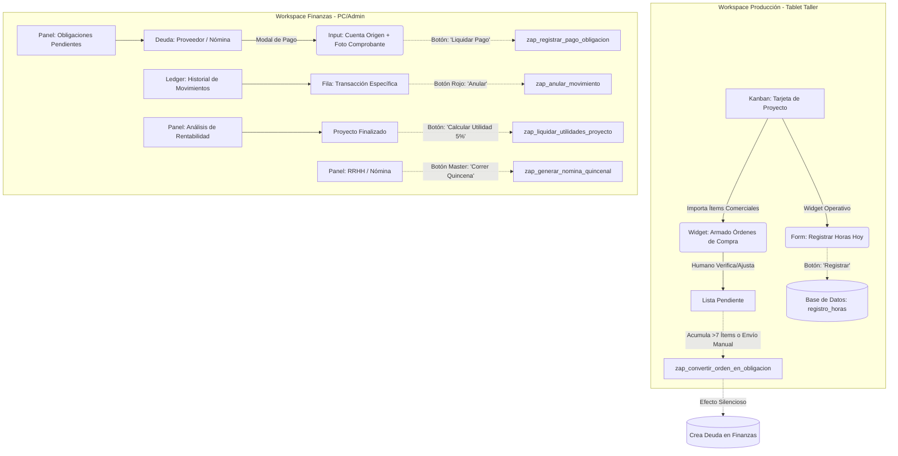

# Diagrama Conceptual de Interfaces y Zaps (Ergonomía Cognitiva)

Este documento mapea la ubicación física y lógica de los botones que disparan la inteligencia algorítmica (Zaps) dentro del ERP Agnostic.

### Detalle de Componentes TSX Propuestos:

1. **`WidgetArmadoOrdenCompra.tsx` (En Workspace Producción)**
   - **Ubicación:** Dentro de la vista de detalle de un proyecto en el taller.
   - **Teleología (Axioma de Verificación):** No transfiere la lista comercial ciegamente. Permite a Harold importar los `items_variante` cotizados y verificar/ajustar especificaciones técnicas reales (ej. cambiar tamaño de tornillos, tipo de bisagra) uno por uno hacia una lista oficial.
   - **Ergonomía y Zaps:** Acumula los ítems verificados en un "carrito" (Lista pendiente de compra). Al acumular 7 elementos o forzar el envío, agrupa todo y dispara el `zap_convertir_orden_en_obligacion`, enviando un único bloque limpio al Ledger Financiero.

2. **`ModalLiquidarObligacion.tsx` (En Workspace Finanzas)**
   - **Ubicación:** Al darle clic a una "Cuenta por Pagar" o "Nómina Pendiente".
   - **Campos:** Selector de `cuenta_origen` (Ej. Nequi Javier) y FilePicker nativo para el comprobante.
   - **Acción:** Dispara `zap_registrar_pago_obligacion`.

3. **`BotonAnular.tsx` (En Workspace Finanzas)**
   - **Ubicación:** Al final de cada fila de la tabla del Ledger.
   - **Ergonomía:** Es un ícono discreto (papelera o flecha atrás). Al hacer clic pide confirmación (Doble fricción para evitar errores por fatiga de clic). Dispara `zap_anular_movimiento`.

4. **`PanelCierreProyecto.tsx` (En Workspace Finanzas / Admin)**
   - **Ubicación:** Vista de estadísticas de un proyecto completado.
   - **Acción:** Muestra un resumen de horas (KPIs) y un botón verde principal "Liquidar Utilidades Harold (5%)". Dispara `zap_liquidar_utilidades_proyecto`.

5. **`BotonGenerarNomina.tsx` (En Workspace Finanzas)**
   - **Ubicación:** Dashboard global financiero (Header superior).
   - **Acción:** Un botón maestro que procesa automáticamente las horas de los últimos 15 días y puebla el panel de obligaciones.
