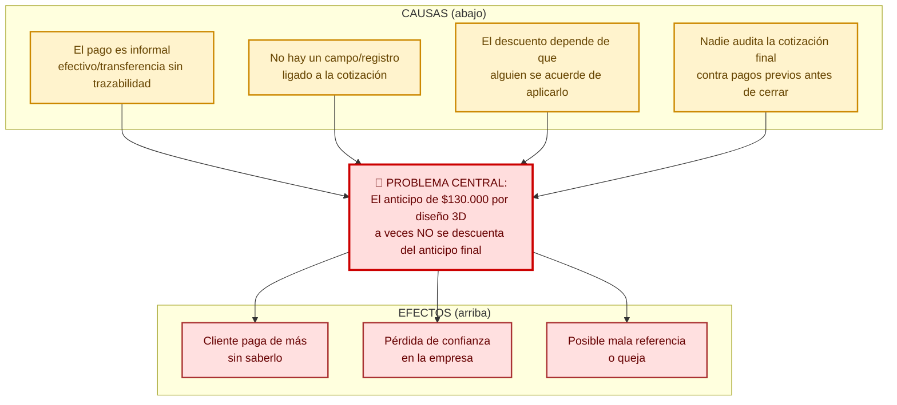

# Diseño de Hermanos García González S.A.S. — lógica de negocio sistémica

**Esto es un documento de diseño de empresa, no una auditoría de repositorio.** Existe para entender y diseñar cómo opera el negocio de punta a punta — de dónde sale un cliente hasta la garantía a 2 años — antes de que ninguna de esas decisiones se traduzca en código. El software (schema, UI, módulos) es una CONSECUENCIA de este diseño, no el objetivo. Ese trabajo técnico aparece en la Parte II, al final, deliberadamente subordinado.

**Nota de autocorrección (no se borra, se deja como registro):** la primera versión de este archivo se llamaba `auditoria_schemas_ui.md`, con un título e índice que terminaban en "el módulo ya diseñado (schema + UI)" como si esa fuera la conclusión de la sesión. El Supervisor señaló correctamente que eso traicionaba el trabajo real hecho acá — diseñar la lógica de un negocio, no auditar un repositorio de GitHub. Se renombró y se reescribió el marco. El contenido de fondo no cambió, el énfasis sí.

---

## Índice de lectura (macro-zoom — qué hay acá y en qué orden leerlo)

**Parte I — Diseño de negocio (el contenido real de esta sesión):**

1. **Diagramas** (acá abajo) — el flujo completo del negocio de punta a punta en Mermaid, con los reprocesos reales marcados en rojo (tus "líneas de Miro").
2. **Cuestionario de lógica de negocio** — calificación de lead, agenda, el modelo de pago del diseño 3D, el modelo gig para diseñadores/comerciales (con su análisis de precedente real y riesgo legal), métricas holísticas (Triple Bottom Line + Balanced Scorecard).
3. **Discover ancho** — los 14 subsistemas del negocio (Comercial, Producción, Compras, Marketing, Tienda web, Facturación, RRHH, Impuestos, Control de cronograma, Documentación, Integraciones...), cada uno con su propia narrativa real.
4. **Línea de tiempo de eventos** — el flujo completo, evento por evento, de lead a garantía, con el principio de roles-no-personas y la capa de "momentos de verdad" (Service Blueprint).

**Parte II — Implicaciones técnicas (derivadas de lo anterior, no el objetivo):**

5. Módulos de software que emergen del diseño de negocio, con la revisión crítica de sus límites.
6. El único módulo con schema/UI ya bocetado en detalle: Taller/Herramientas.

**Lo que todavía NO existe en este documento:** ningún otro módulo tiene schema/UI diseñado (Compras, Producción subdividido, Entrega, Facturación-dashboard, RRHH) — siguen en diseño de negocio, no en diseño técnico. Ese es el trabajo que sigue, y viene después de cerrar la Parte I, no antes.

### Método (referencia técnica del proceso, no el contenido)

Sigue `arnes/ARNES_AGENTICO.md` §2.C + Double Diamond (Design Council, 2005): Discover ancho (diverge) → Define (converge) → línea de tiempo por área (diverge en profundidad, + Service Blueprint) → módulos emergen (converge) → schema/UI por módulo → revisión cruzada final.

## Diagramas

### Flujo completo del negocio (líneas rojas = reprocesos/gaps reales, no hipotéticos)

```mermaid
flowchart TD
    A[Lead llega: web/IG/TikTok/WhatsApp] --> B{¿Manda fotos y pide<br/>presupuesto ya?}
    B -->|Sí| C[Presupuesto preliminar<br/>mismo cotizador, poca info]
    B -->|No, pide asesoría| D[Se agenda visita]
    C --> E{¿Viable?}
    E -->|Sí| D
    E -->|No| Z1[["¿Se pierde el lead?<br/>sin proceso definido"]]
    D --> F[Visita gratis]
    F --> G{¿Cliente paga<br/>diseño 3D $130k?}
    G -->|No| H[Presupuesto gratis]
    G -->|Sí| I[Diseño 3D + presupuesto<br/>facturado DIAN]
    I -.->|"⚠ a veces no se descuenta<br/>del anticipo final"| RED1[["REPROCESO:<br/>depende de memoria humana"]]
    H --> J[Cliente recibe propuesta<br/>/propuesta/:proyectoId]
    I --> J
    J --> K[Ajustes del cliente]
    K --> L[Cotización formal]
    L --> M{Firma del contrato}
    M -.->|"⚠ no existe mecanismo<br/>de firma virtual hoy"| RED2[["GAP: firma sigue siendo<br/>manual/informal"]]
    M --> N[Retoma de medidas<br/>comercial + desarrollador]
    N -.->|si hay anomalía| N2[Cambio de contrato<br/>flow organizado (I-027):<br/>adicional, cambio con impacto<br/>medible o costo al cliente]
    N --> O[Desarrollo técnico<br/>el más bloqueante]
    O --> P{Check de schema<br/>pre-compras<br/>— no es reunión}
    P -->|registrado en sistema| Q[Compras<br/>pago por prioridad:<br/>materiales → arriendos → nóminas]
    Q -.->|"⚠ timing depende<br/>de flujo de caja"| RED3[["RIESGO: retraso en ventas<br/>retrasa TODO el proyecto"]]
    Q --> Q2{Triple verificación<br/>de recepción:<br/>pedido+despacho+material}
    Q2 -->|1. compras hizo bien el pedido<br/>2. proveedor bien el despacho<br/>3. material verificado| R[Armado en taller]
    R --> S[Citación de calidad<br/>push hacia Comercial<br/>otra persona, no quien construyó]
    S --> T{Entrega + acta}
    T -.->|"⚠ el acta existe en el<br/>contrato pero nunca se hace"| RED4[["GAP: 100% informal hoy,<br/>se quiere 100% digital"]]
    T --> U[Cobro]
    U -.->|atraso| U2[Recordatorio manual<br/>+ 12 días de holgura]
    U --> V[Garantía 2 años<br/>8-12 días hábiles<br/>reutiliza ordenes_trabajo]

    classDef reproceso fill:#ffdddd,stroke:#cc0000,stroke-width:2px,color:#660000
    classDef gap fill:#fff3cd,stroke:#cc8800,stroke-width:2px,color:#664400
    class RED1,RED2,RED3,RED4 reproceso
    class Z1 gap
```

### Árbol de problemas — pago de diseño 3D no descontado

**Autocorrección, no se borra:** Javier no pidió este árbol — preguntó por qué el agente creía que era necesario, y la respuesta honesta es que no lo era. La solución completa cabe en una frase (registrar el pago, que el sistema aplique el descuento); no hay complejidad oculta que justifique un análisis de causa raíz con 4 ramas. Se generó por una lectura apurada de la pregunta ("¿por armarías...?" leído como pedido, no como cuestionamiento de criterio) y, más de fondo, por no aplicar el criterio que el propio §2.D del arnés exige: un consultor crítico decide CUÁNDO una herramienta corresponde, no la aplica porque el nombre apareció cerca de un signo de interrogación. Queda como ejemplo documentado de sobre-aplicación de método — el error tiene valor como caso de estudio del propio §2.D, por eso no se elimina.



**Lectura del árbol:** las 4 causas de abajo son estructurales, no un descuido puntual — mientras el pago siga siendo informal (C1) y sin campo propio en el sistema (C2), el descuento seguirá dependiendo de memoria humana (C3) sin nadie que lo audite (C4). **La solución de raíz no es "recordarle a la gente que lo haga" — es eliminar C1 y C2**: darle al pago un registro estructurado ligado a la cotización, para que C3 y C4 dejen de depender de una persona. Esto es directamente lo que Javier ya había intuido en el punto 3 del cuestionario, el árbol solo lo hace explícito y trazable a la raíz.

---

## Cuestionario pendiente (respondé al ritmo que quieras, no hace falta todo junto)

Cada pregunta apunta a un hallazgo concreto de la revisión crítica (§3, "Define real"). Se responde acá mismo en la conversación; yo las voy cerrando en el documento a medida que lleguen.

### 1. Calificación de lead — RESUELTO

Tres filtros reales, en palabras de Javier:
1. **Calidad de la comunicación**: si el lead no es claro con lo que necesita, responde monosílabos, no demuestra interés genuino en su propio proyecto → no calificado.
2. **Ubicación geográfica**: estratos bajos o zona sur no se cubren.
3. **Tipo de proyecto**: quien busca cambiar un mesón o una refacción puntual (no diseñar algo nuevo) se descarta y se redirige directo al marmolero — el negocio busca clientes que quieran **diseñar y fabricar**, no reparar. "El cliente que requiere chicharroncitos chiquitos" queda descartado.

**Nota de Javier, preservada:** esta información (junto con la de agenda, punto 2) es exactamente la que hace falta si algún día se entrena un LLM para responder el WhatsApp de los primeros leads — conecta directo con la decisión de mensajería/Chatwoot ya documentada arriba. El arnés ya está quedando armado para eso sin que fuera el objetivo original de este documento.

### 2. Visita / agenda — RESUELTO, con una tensión real sin decidir

- **Geografía del servicio**: ya está definida en investigación de SEO/servicio existente (fuente externa a este documento, no se repite acá).
- **Quién agenda**: variable — a veces el comercial, a veces una IA detrás del WhatsApp de primera línea, a veces se hacen presupuestos a distancia sin visita. No es un flujo único.
- **Mecánica deseada**: cada comercial necesita un calendario con franjas libres — el agendamiento (lo haga una IA o el comercial) solo debería poder caer dentro de esas franjas. Hoy se hace de palabra por WhatsApp.
- **Tensión explícita, sin resolver — no forzar una respuesta:** Javier quiere una app de agendamiento pero le preocupa que "se vuelva muy app" y pierda el trato humano con el cliente; al mismo tiempo reconoce que para clientes acostumbrados a apps es una ventaja real (organización interna + que el cliente agende/cancele/reagende solo). Su instinto es un modelo **híbrido según el lead**, no todo-o-nada.
- **Visión a futuro (norte, no requisito inmediato):** que el cliente ni siquiera escriba por WhatsApp — que agende directo en la web, **prepagando el diseño por pasarela de pago ahí mismo**, y que Javier solo vea agendamientos ya pagados aparecer solos en el celular, con los tiempos de todos los comerciales automatizados. Anotado como meta explícita, no como alcance de la primera versión.

### 3. Pago del diseño 3D — RESUELTO, revela una capa de negocio nueva

Es informal a propósito, no por descuido: **si se facturara, tocaría cobrar impuestos sobre ese servicio.** Por ahora la idea es que quede registrado como una entrada, y que ese abono **vaya directo al diseñador** que hizo la visita/diseño — no es ingreso general de la empresa, es la compensación de esa persona por ese trabajo puntual.

**De acá sale una idea de modelo de negocio nueva — Javier preguntó directo "¿estoy loco?", respuesta honesta abajo en la narrativa.**

### 4. Límites del módulo Producción — RESUELTO, confirma la subdivisión (hallazgo B)

**Son etapas claramente separadas, con una cadena de dependencias dura, no una zona gris.** En palabras de Javier: diseño+contrato → desarrollo → aprobación → compras → armado, en ese orden, sin atajos:
- No se puede iniciar un proyecto sin diseño y contrato.
- No se puede comprar material sin desarrollo hecho.
- No se puede armar sin compras hecha.
- **La aprobación de compras no es "un requisito más" — es la ÚNICA causa válida para que exista una compra.** Nunca se compra directo desde la cotización.
- **Desarrollo es la etapa más bloqueante de todas**: define cada detalle del proyecto — "si desarrollo no está completo, no se clava un tornillo."
- **Única variable real**: el timing de compras depende del flujo de caja de la empresa — si hay atraso en ventas o entregas, compras se retrasa, y por lo tanto el proyecto entero se retrasa. No es una excepción al orden, es una restricción externa (dinero disponible) sobre una de las etapas.

**Conclusión para el diseño de módulos:** confirma la sospecha del hallazgo B — "Producción" no es un módulo, es una cadena de 4-5 etapas secuenciales con un gate no negociable (aprobación) entre desarrollo y compras. Se subdivide así cuando llegue el turno de diseñar schema/UI, no como una sola pantalla.

### 5. Tienda web como línea de negocio — RESUELTO, corrige un supuesto mío equivocado

**Mi pregunta original estaba mal planteada — Javier lo señaló directo:** "un proyecto es de un cliente, un producto es un módulo hecho por la empresa, que se puede anidar dentro de un proyecto." No son dos catálogos que comparar — es la misma relación que ya construimos en t-023 (prefabricados): un producto (`productos_catalogo`) puede vivir suelto en la tienda, o anidarse como ítem dentro del proyecto de un cliente. Corregido para el resto de este documento.

**Los productos de tienda pasan por el MISMO pipeline de producción que un proyecto** — desarrollo hecho → desencadena aprovisionamiento → desencadena orden de armado a taller (jefe/desarrollador → auxiliares). **Esto revela un gap real hoy no cubierto**: `pedidos_web` (t-015) registra el pedido y el pago, pero no dispara ninguna orden de producción todavía — ese enganche no existe.

**Pregunta de arquitectura que Javier hizo sobre el catálogo maestro — CORRECCIÓN: mi primera respuesta estaba mal, no la defiendo.** Dije que el booleano `publicado_web` era "patrón estándar de e-commerce" — Javier señaló el error real: en la MISMA tabla `productos_catalogo` conviven insumos internos (bisagras, tornillos, melamina — cosas que solo deberían existir para construir cotizaciones) con productos terminados vendibles al público. Si alguien marca "publicar en web" en una bisagra de ferretería, aparece en la tienda como si fuera un producto de venta al público. **Es el mismo error de fondo que prefabricados-antes-de-t023**: dos conceptos de negocio distintos (insumo interno vs. producto terminado vendible) mezclados en una tabla, "resuelto" con un flag en vez de con una distinción real de tipo. No es un booleano de visibilidad inocente — falta una distinción de fondo (¿`tipo` = 'insumo' vs. 'producto_terminado'? ¿solo los `producto_terminado` pueden tener `publicado_web = true`, aplicado a nivel de validación?). Queda como hallazgo real pendiente de resolver cuando se audite/rediseñe Catálogo, no una pregunta cerrada.

**Nuevos campos que además hacen falta (esto sí quedó bien identificado):**
- `requiere_instalacion` (booleano) — determina si el producto se puede despachar fuera de Bogotá o no.
- Alcance de envío: hoy solo Bogotá; a futuro, nacional para lo que no requiere instalación (pendiente de probar el sistema de envíos, no es requisito inmediato).

### 6. Métricas / KPIs — RESUELTO, con una capa filosófica real detrás

**Hoy no se mide nada** — solo "hay plata en la cuenta" y "hay proyectos andando". Las métricas básicas que Javier sí quiere, y todas son construibles con el schema que ya existe, sin necesitar tablas nuevas:
- Al menos 1 proyecto vendido por semana (`proyectos.created_at`).
- Entrega dentro de la **promesa contractual de 7 semanas, entregable antes** (I-024) — con el **check de los 15 días** (I-025) como indicador real: si el log de producción va bien, se insinúa instalación en los siguientes 15 días (~30 días ideal); si hay novedad, entrega hasta 3 semanas tarde dentro de la promesa. El KPI operativo de "15-20 días de la venta" queda **superado** por este mecanismo (reconciliado en el Define). **El KPI de 4 semanas (≈ la estimación del cronograma acordado por factores de tamaño) es el que activa la comisión 5% de desarrollador y carpintero; el de 7 semanas es el de la recomendación del cliente; el de ventas es el del comercial — cada uno mide su subsistema (D6).**
- Salud de caja: (compras del proyecto + nómina + costos de empresa) restado de (saldos de clientes pendientes) debe dar números verdes (`movimientos_financieros` + `obligaciones_pendientes`, ya existen).

**Y una segunda capa, explícitamente tan importante como la primera para Javier — bienestar, no solo dinero:** tiempo de ejecución corto por fase, cero horas extra, no trabajar sábados, que los jefes tengan tiempo libre. Cita textual: *"de nada sirve tener muchos números en finanzas si los jefes estamos estallados y sin tiempo."* Esta capa depende de que exista el módulo de RRHH/Nómina (horas trabajadas) — hoy no se puede medir porque no se registra.

**Marco teórico pedido, verificado antes de citarlo (no improvisado):**
- **Decrecimiento / *décroissance*** (Serge Latouche, economista francés, *Le pari de la décroissance*, 2006) — cuestiona el crecimiento del PIB como única medida de éxito. Es una crítica macro/social, potente como filosofía, pero no es un marco listo para armar un dashboard de KPIs de una empresa puntual.
- **Doughnut Economics** (Kate Raworth, 2017) — combina una "base social" (12 dimensiones inspiradas en los Objetivos de Desarrollo Sostenible de la ONU) con un "techo ecológico" (9 límites planetarios), y busca operar en el espacio seguro entre ambos. Rico y holístico, pero diseñado a escala planetaria/nacional — requeriría adaptación real para una PYME.
- **Triple Bottom Line — "People, Planet, Profit"** (John Elkington, 1994) — a diferencia de los dos anteriores, este SÍ está pensado para que una empresa individual se mida a sí misma más allá de la ganancia. El más directamente aplicable de los tres a lo que pediste.
- **Balanced Scorecard** (Kaplan & Norton, 1992) — cuatro perspectivas (financiera, procesos internos, cliente, aprendizaje/crecimiento) — es la herramienta de gestión establecida para estructurar un dashboard de KPIs multidimensional de verdad, con indicadores concretos por categoría, no solo principios.

**Mi recomendación, no improvisada:** combinar Triple Bottom Line (para que el bienestar de las personas sea un pilar real del dashboard, no un afterthought) con la disciplina estructural de Balanced Scorecard (cada pilar con indicadores concretos y medibles). Decrecimiento y Doughnut Economics son intelectualmente valiosos — más apropiados para una tesis/exploración académica tuya (estás en la universidad, tiene sentido ahí) que para el dashboard operativo que se va a construir en el sistema.

### 7. Dependencias externas — diferido a propósito, foco en lógica de negocio

Javier pidió centrarnos en lógica de negocio a detalle y dejar esto para después. Queda pendiente sin investigar todavía.

### ¿La lógica de los puntos 4 y 5 tiene sentido? Sí, sin contradicciones.

Revisado explícitamente porque Javier lo pidió: la cadena diseño+contrato → desarrollo → aprobación (gate único, no opcional) → compras (con timing variable por caja) → armado, aplicada igual a proyectos de cliente y a productos de tienda (mismo pipeline, confirmado en el punto 5), es una secuencia lógicamente consistente — no encontré una contradicción real al cruzarla contra todo lo mapeado antes. El único gap que salió a la luz no es de lógica, es de implementación: `pedidos_web` hoy no dispara producción.

### Herramientas de diseño — cuáles corresponden y cuáles no (pedido explícito: aplicar según corresponda, no todas)

Javier nombró DOFA, árbol de problemas, diagrama de Ishikawa, metodología de futuros posibles. Las cuatro son reales y reconocidas, pero no todas sirven para lo mismo — iría en contra de todo lo que ya acordamos (Business Model Canvas parqueado, no todo framework aplica siempre) usarlas todas ahora porque suenan bien.

| Herramienta | ¿Corresponde ahora? | Por qué |
|---|---|---|
| **Árbol de problemas** (metodología clásica de análisis de causa raíz, usada en diseño de proyectos de desarrollo) | **Sí, ahora mismo** | Ya tenemos 2-3 reprocesos reales identificados (pago de diseño 3D no descontado, retraso de compras en cascada) — es exactamente para lo que sirve esta herramienta. Ofrezco armar uno para el caso del diseño 3D como ejemplo si querés. |
| **Diagrama de Ishikawa** (Kaoru Ishikawa, control de calidad — causa-efecto por categorías) | **Más adelante, para un módulo específico** | Ya tenemos una taxonomía real de fallas de taller documentada (material defectuoso, error de desarrollo, incidente físico, fallo de información) — es candidata perfecta para formalizarse como Ishikawa cuando se diseñe el módulo de control de calidad/incidencias, no para revisar todo el negocio ahora. |
| **DOFA** (análisis estratégico fortalezas/oportunidades/debilidades/amenazas) | **Más adelante, nivel estratégico** | Sirve para decisiones de modelo de negocio (¿entramos a envío nacional? ¿el modelo socios-por-comisión?), no para validar si un flujo operativo es lógicamente consistente. Mismo lugar en la cola que Business Model Canvas — cuando trabajemos propuesta de valor. |
| **Metodología de futuros posibles** (planeación de escenarios, origen en Herman Kahn/RAND en los 50-60, popularizada por el equipo de Shell en los 70) | **Más adelante, nivel estratégico** | Para pensar "qué pasa si el envío nacional funciona" o "qué pasa si escala el modelo socios-por-comisión" — visión de largo plazo, no para el flujo operativo de hoy. |

**Resumen: de las cuatro, solo Árbol de problemas corresponde ahora.** Las otras tres quedan anotadas para su momento correcto, no descartadas.

---

## Idea de negocio: de "modelo gig" a "socios-por-comisión" — confirmado en ronda 2 con números

> **CONTRATO VIVO** — la compensación por rol y sus comisiones DEBEN reflejarse en el schema del módulo de Finanzas cuando se diseñe. Si un socio ya no cobra así, esta sección se actualiza, no se archiva.

> **Autocorrección (registro del cambio):** la ronda 1 lo llamó "modelo gig"; la ronda 2 corrige el nombre y le da números — no es una app de servicios, es un **sistema de socios donde la compensación es la moneda de confianza**.

Javier propuso (a partir del punto 3): pagar diseñadores/comerciales como una app de servicios — sin horario fijo, cuadran sus propios tiempos, reciben asesorías pagas, cobran por la visita/diseño y además una comisión si el proyecto cierra.

**No es una idea loca — tiene un precedente real y probado: es exactamente cómo funcionan los agentes inmobiliarios en la mayoría de mercados.** Sin salario fijo, comisión por cierre, a veces un fee chico por la "muestra"/visita — el paralelo es casi 1 a 1 (visita+diseño de acá = "showing" allá; comisión de cierre = la misma en ambos). También es el patrón de plataformas de servicios a domicilio tipo Angi/Thumbtack. No es experimental, es un modelo de décadas.

**El modelo con números (ronda 2, todos-socios):**

| Rol | Compensación | Momento de pago |
|---|---|---|
| **Diseñador** | $130k por diseño 3D + comisión por cierre | Se define en el diseño del modelo; hoy "no lleva cuenta consigo mismo" — el sistema debe llevarla |
| **Desarrollador** | Desarrollo aparte + mano de obra aparte + **comisión 5% por cumplimiento de cronograma** | **Por quincena, por hitos terminados**; si se desfasa, se resta |
| **Carpintero** | **5% por tamaño** del proyecto (resuelto 2026-08-03) | Por módulo instalado (con comisión si cumple cronograma) |
| **Auxiliar** | Tiempo (horas + extras) + **comisión por módulo instalado** si cumple cronograma | Por ciclo/hitos |

**Dos decisiones de fondo tomadas en la ronda 2:**
- **El diseño 3D sube a $130k y se factura en DIAN** (por eso sube el precio). **Neto post-impuestos (resuelto 2026-08-03):** se modela como **parámetro configurable** — el sistema calcula el neto del diseñador desde el bruto menos retención ± IVA; el **valor real de la retención queda pendiente de validación con el contador** antes del corte.
- **Idea emergente:** capacitaciones especializadas para el diseño y venta de proyectos (el diseñador como "diseñador libre" con formación propia).

**A favor (de la ronda 1, sigue vigente):**
- Alinea el incentivo: cobran por el esfuerzo (diseño) y por el resultado (cierre) — igual que ya reconociste que el pago real ya sigue la lógica de roles-no-personas.
- Escala sin comprometer nómina fija — podés sumar diseñadores sin apostar salario fijo en meses flojos.
- Encaja con la realidad que ya describiste en RRHH: contratación informal, gente que dura días. Un modelo de esfuerzo/resultado puede ser más honesto que forzar una relación de empleado fijo sobre un trabajo que ya es, en los hechos, por proyecto.

**En contra — lo que hay que verificar antes de comprometerse, no es una decisión de producto, es legal:**
- **Riesgo de clasificación laboral.** Si un diseñador trabaja solo para vos, sigue tus reglas/horarios/marca de forma significativa, un juez colombiano puede considerar que en los hechos es una relación laboral real (con prestaciones sociales debidas) sin importar cómo se llame el contrato — es el mismo riesgo que enfrentó Uber en varias jurisdicciones. **Esto no lo puedo asesorar yo con certeza — es una pregunta real para tu contador o un abogado laboral antes de construir el modelo completo alrededor de esto**, no algo que decidamos en esta conversación.
- **Riesgo de marca/calidad**: si un diseñador solo aparece cuando quiere, la consistencia de cómo se representa tu marca varía — el mundo inmobiliario resuelve esto con certificación/estándares de marca; acá haría falta algo parecido.

**Conexión directa con el punto 2:** el calendario de franjas libres por comercial que pediste ahí **es la infraestructura que este modelo necesita para funcionar** — sin eso, no hay forma de "matchear" asesorías pagas con disponibilidad real. Son la misma pieza vista desde dos ángulos, no dos ideas separadas.

---

## Control de cronograma — el contexto central emergente (ronda 2, Q7)

> **CONTRATO VIVO** — el motor de reloj de eventos por proyecto (fijar cronograma, clasificar causa interno/externo, recalcular, alimentar comisiones) es parte de la capa 1 que se construye.

> **Adición de la ronda 2.** El contexto central del sistema deja de ser "Producción" y pasa a ser **Control de cronograma** — el pegamento entre todos los módulos. Antes no existía como concepto. Destilado del cierre del diamante (§6) como reglas del sistema:

> **Correcciones del Supervisor (2026-08-03, I-024/I-025/I-027/I-034/I-043) — integradas vía loop focalizado. Marcan el estado vigente del contrato vivo:**

- **La promesa contractual de entrega es de 7 semanas, entregable antes** (I-024). El cliente firma sabiendo que espera 7 semanas; el colchón (7 > 6.5) cubre el estrés de producción. **Al cerrar el contrato se le pregunta al cliente si tiene viajes o situaciones externas** que puedan afectar el cronograma — se anticipan cambios del flow, incluso por parte del cliente.
- **El cronograma es DOBLE (I-034):** la **línea interna de producción** (fila del taller) puede moverse sin avisar al cliente mientras la entrega caiga dentro de las 7 semanas; la **línea contractual al cliente** es fija e inmutable. El único cambio visible al cliente es el **positivo** (entrega antes); los deslizamientos internos nunca llegan al cliente dentro de la promesa.
- **Check de los 15 días (I-025):** a los ~15 días se genera un **log real de producción** — (a) insumos en taller, (b) comprados o pagados, (c) proyectos en fila en el taller. Decisión con ese log: si el proyecto pasó el flow exitosamente y el taller no tiene novedades → **se insinúa al cliente posible instalación en los siguientes 15 días** (cambio predefinido y positivo, entrega antes de las 7 semanas); si no → el proyecto **pospone cronograma interno**, **las comisiones se reducen**, el cliente NO ve cambios, producción entra en estrés y entrega **3 semanas tarde — dentro de la promesa**; escenario extremo (máximo estrés sin entrega) → **negociar con el cliente**. *Si el cambio positivo no se hace internamente, es un mal indicador de producción.*

El **cronograma nace en el contrato** con las fechas de cada etapa — **corregido por el Define (P5-09, aprobado 2026-08-03): aprobación (check de schema) → compras → ensamblaje → instalación** (el check de schema E-18 precede a las compras, no al revés). Base promedio por etapa: ~1 semana de desarrollo, ~1 semana de compras, ~1 semana de ensamblaje, ~1 semana de instalación.
- Al cliente se le da un **rango de fecha de instalación de 5 días** en la semana programada.
- **Holgura total: máximo 5 días** entre todas las fases. Cada fase puede correrse un par de días, pero la suma no pasa de 5.
- **Inmutabilidad (ahora doble):** las tareas internas se imprimen una vez; no se modifican espontáneamente. Solo eventos externos (cliente, proveedor, dinero, **cambio de contrato**) mueven el cronograma interno, y el sistema lo recalcula automáticamente. La línea contractual al cliente NO se mueve dentro de la promesa de 7 semanas.
- **Causa del desfase = dato auditable:** cada cambio se clasifica como **causa interna, externa o cambio de contrato (tercer origen, I-027)**, y de esa clasificación dependen nóminas e incentivos. Cambio por causa interna → los aliados pierden estímulos. Cambio por causa externa → se corren los plazos y los empleados se miden contra los nuevos. **Precisado por el Supervisor (D4, 2026-08-03): la clasificación interna/externa es un ATRIBUTO, no el determinante — el determinante es la composición causal de dependencias lógicas que sumadas trazan el origen del desfase; si hace falta, se toma una decisión manual justificada.** **Cambio de contrato → flow organizado (I-027):** un **adicional** entra como módulo con su especificación y su propio tiempo o afectación declarada al cronograma; un **cambio** tiene **protocolo con impacto medible** (¿afecta compras? ¿los insumos ya comprados se pueden homologar?); **reprocesos/afectaciones tienen costo y los asume el cliente** que hace el cambio/adicional (está en el contrato). Es un input de Finanzas (cálculo de comisiones), no de calendario.
- **Novedad crítica con SLA:** los eventos del cronograma tienen ventana de respuesta de **5-24 horas** — es un evento con SLA, no un aviso (requiere registrar hora de entrada y hora de resolución).
- **Incentivo:** de este control dependen las nóminas/comisiones (ver tabla de compensación arriba: desarrollador 5%, auxiliar y carpintero por módulo instalado). **La comisión del comercial es por VENTAS, no por producción (I-043)** — si el cronograma se afecta, afecta al equipo de producción, no al comercial, y viceversa.
- **KPIs por subsistema, ninguno residual (corrección del Supervisor 2026-08-03, D6 del checkpoint del Define):** el **KPI de 4 semanas** determina la **comisión 5% de desarrollador Y carpintero** (producción); el **KPI de ventas** determina la **comisión del comercial**; el **KPI de 7 semanas** determina que **el cliente recomiende Veta Dorada**. Cada KPI mide un subsistema y los tres son esenciales; no hay un solo número "residual".
- **Gate de caja bloqueante (D1, 2026-08-03):** el pago a proveedor **no ocurre sin caja real** — es completamente bloqueante y la respuesta es del **gerente, que mueve cronogramas**. Si no hay dinero, compras se retrasa y el cronograma de producción se mueve igual; la penalización cae en el eslabón con el origen del desfase (ej. material 2 semanas tarde por compras + 1 semana extra de producción → producción penalizada 1 semana, compras penalizada 2), no se cruzan intereses ni fronteras.
- **El sistema es guía + registrador de la realidad (D1/C1, 2026-08-03):** el cronograma es **dinámico y responde a cualquier novedad** — la planeación no significa que el sistema se bugee con lo inesperado. Si la guía no se cumple, el sistema avanza, registra y permite el cambio; no es una camisa de fuerza que se rompe, es un arnés.
- **Rastreo de origen del reproceso (D2, 2026-08-03):** cuando algo se recibe mal o se rechaza, el reproceso lo asume el **culpable causante del error** — si el proveedor envió mal un material, el proveedor cambia el herraje y la empresa solo asume el costo de repetir la acción (domicilio), no paga el herraje dos veces; si los planos de armado salen mal, es culpa del desarrollador; si el cajón se arma bien pero el cliente lo devuelve por requerimiento mal definido, lo asume el comercial. Es la lógica de **rastreo de origen**: cada rol hace un check y eso determina quién pasó la información mal.
- **La fila del taller es parte de la capa 1 (B2, 2026-08-03):** el check de los 15 días (E-59) y la novedad crítica (E-34) leen la **fila del taller (avance por módulo)** — se diseña en capa 1 el aspecto bloqueante del taller (su fila de salida), sin pantallas de carpinteros; las novedades específicas de planta (mal manejo de herramientas, daños, mal armado del carpintero) son responsabilidad del subsistema taller en capa 2.
- **Estimar antes de contratar:** existe una función de estimación de duración ≈ f(valor, cantidad de ítems/módulos) — si el proyecto crece, se estima un porcentaje de crecimiento en los tiempos. El tamaño del proyecto se mide por **valor + cantidad de ítems/módulos**. Esto permite **proyectar el cronograma antes del contrato** (lo hace calculable, no estimado de memoria). **Precisado por el Supervisor (C1, 2026-08-03): el cronograma ACORDADO se estima por factores de tamaño, acordado entre desarrollo y gerencia** — base promedio 4 semanas (1 desarrollo + 1 compra + 1 ensamble + 1 instalación), pero cada proyecto puede pedir más: un apartamento completo puede requerir **2 semanas de desarrollo y 1.5 de aprovisionamiento**. El adelanto (E-59 desenlace feliz, entrega antes) no es una "causa interna" que reduzca comisiones — el sistema registra el logro y avanza; solo el desfase con origen atribuible activa la reducción.

**Estructura temporal de referencia:** el proyecto promedio = **2 ciclos de 15 días** (desarrollo+compras / ensamblaje+instalación) → 30 días ≈ **4 semanas ideal**. Hoy tarda 6.5 semanas.

**Implicación de diseño (Parte II):** el sistema necesita un reloj de eventos por proyecto que (a) fije el cronograma en el contrato, (b) registre cada cambio como "interno vs. externo", (c) recalcule fechas automáticamente, (d) alimente el cálculo de comisiones. Es un motor pequeño, explícito, y es la capa 1 que sí se construye.

### Capa 1 = control entre subsistemas (gates concretos, alcance mínimo del MVP)

> **CONTRATO VIVO** — los gates (check de schema, triple verificación, citación de calidad, cronograma con causa) son propiedades del estado del proyecto, no instrucciones. El sistema no deja avanzar sin el check registrado.

> **Adición de la ronda 2 (Q5/Q6/Q19 + A10/A12 del loop 2).** El sistema se construye en dos capas. La capa 1 es el desbloqueante y se construye ahora; la capa 2 (taller detallado, manual ISO, pantallas de carpinteros) se anticipa en el diseño pero NO se construye todavía.

Las **4 rutinas clave** que, cumplidas con calidad, aseguran la calidad del proyecto por default (todo lo demás es capa 2):

1. **Retoma de medidas.**
2. **Reunión post-desarrollo con comercial** — hoy es reunión; mañana es **check de schema** (la aprobación es un check de schema, no una reunión; el gate es propiedad del estado del proyecto, el sistema no deja avanzar sin el check registrado — ni siquiera al dueño).
3. **Comprar** (proceso distribuido a proveedores y terceros, pago apenas se dispone del dinero, prioridad: materiales → arriendos → nóminas).
4. **Recibir material exitoso.**

**Los gates estructurales de la capa 1 (conjunto pequeño y cerrado, no una plataforma de workflow):**
- **(a) Check de schema pre-compras** — el proyecto no avanza de estado sin la validación registrada.
- **(b) Triple verificación de recepción de material** — el proyecto pasa a "control total del subsistema desarrollo-taller" cuando el desarrollador marca: (1) compras hizo bien el pedido, (2) el proveedor hizo bien su despacho, (3) el material está en el taller, verificado en cantidades y funcionamiento.
- **(c) Citación de calidad (push)** — la calidad es un evento **empujado** desde Producción hacia Comercial: "comercial solo espera citación a revisión de calidad", no es algo que Comercial agenda.
- **(d) Cronograma inmutable con causa registrada** — ver reglas arriba.

**Separación ejecutor-verificador a nivel de evento, no de persona:** si la misma persona ocupa los dos roles, "se tiene que reunir con ella misma para hacer la validación sobre el schema" — el check es un **acto del rol verificador**, distinto del acto del rol ejecutor (desarrollo), aunque el actor físico sea el mismo.

> **Corrección del Supervisor (2026-08-03, I-035/I-043 + D3 del checkpoint del Define) — verificador único = el COMERCIAL vendedor:** la verificación la hace **UNA sola persona designada por despacho — el comercial vendedor del proyecto, punto**. No es un pool ni una separación forzosa por persona, y no es el gerente. **No hay conflicto de interés (I-043):** la comisión del comercial es por **ventas**, no por métricas de producción — si el cronograma se afecta, afecta al equipo de producción, no al comercial, y viceversa. La verificación por el comercial vendedor es limpia.

> **Hallazgo B resuelto (cierre del diamante §4): "Producción" ya no es un módulo sobredimensionado — se disuelve en cuatro bounded contexts con nombres propios:** (a) **Desarrollo** (retoma de medidas → desarrollo técnico → check de schema → BOM de compras, capa 1, se construye), (b) **Control de cronograma** (capa 1, se construye), (c) **Taller/Armado** (capa 2, diferida pero anticipada), (d) **Calidad/Verificación** (capa 1, se construye).

---

## Capacidad instalada y restricciones (ronda 2 — Teoría de Restricciones)

> **REGISTRO HISTÓRICO** — contexto de hoy, no contrato. La restricción 2 (leads) y la restricción 1 (dinero) pueden moverse; el ratio y las capacidades se recalculan si el negocio cambia.

> **Adición de la ronda 2 (Q17/Q20/Q21 + A11 del loop 2).**

| Recurso | Capacidad | Restricción real |
|---|---|---|
| **Producción** (2.5 personas: desarrollador + carpintero + auxiliar ocasional) | **1.25 proyectos/semana**, sábado libre | No hay restricción de capacidad declarada — el cuello está en el dinero |
| **Comercial** (2 personas) | **1.25 proyectos/mes** | **Leads cualificados** — no es capacidad de diseño, es falta de leads |
| **Diseñador** | **3 visitas + 3 diseños + 3 presupuestos/semana** | Ninguna con el volumen actual |

**La cadena de restricciones (en orden de severidad):**
1. **Dinero disponible** — el condicionante máximo, puede causar "entropía total". No es una fase, es la restricción que gobierna compras y por lo tanto el cronograma.
2. **Leads cualificados** — limita a Comercial a 1.25 proy/mes, muy por debajo de la capacidad de producción (que haría ~5 proy/mes). **El cuello de botella del negocio hoy es la demanda, no la fábrica** (ratio 4:1). Reforzado por A11: el desbloqueo está en comercial/leads/marketing, no en capacidad productiva — prioriza la tienda web + producto de catálogo como línea de crecimiento.
3. **Cronograma** — el mecanismo de control; si no existe, cada proyecto se entrega "cuando se pueda" (hoy 6.5 semanas reales).

---

## 0. Discover ancho — inventario de subsistemas (diverge, sin profundizar)

| Subsistema | ¿Ya mapeado en detalle? | Hallazgo clave |
|---|---|---|
| Comercial / Cotizador | 🟢 sí (sección 0) | — |
| Contratos | 🟢 sí (sección 0) | — |
| Producción / Taller / Calidad | 🟢 sí (sección 0) | — |
| Compras / Proveedores | 🟡 parcial | Cada proveedor tiene un flujo de pago DISTINTO — ver narrativa abajo, no es un flujo único |
| Entrega / Garantía | 🟢 sí (sección 0) | — |
| **Marketing / Contenido / Publicidad** | ⚪ recién inventariado, sin profundizar | Google Ads hoy es el único canal activo; video/redes identificado como el canal de escala pero sin flujo ni ejecución todavía (cuello de botella: falta tiempo, no herramienta) |
| **Tienda web (línea de producto directo)** | ⚪ recién inventariado | Línea de negocio nueva explícita — despachar productos al cliente directo desde la web. Ya existe infraestructura parcial (`pedidos_web`, checkout de t-015) pero como LÍNEA DE NEGOCIO es más grande que el mecanismo ya construido |
| **Facturación / Contabilidad** | 🟡 hallazgo importante | Se hace en software externo ("Aliado"), NO se construye acá — ver narrativa abajo |
| **Diseño de producto** | ⚪ recién inventariado | Rol nuevo, ligado a la línea de producto fijo/prefabricados (t-023) |
| **RRHH / Nómina** | 🟡 confirmado que hace falta | Cálculo real (horas, tarifas por rol), proceso de contratación explícitamente sin definir — ver narrativa |
| Impuestos (más allá de lo que ve el contador) | 🟡 parcial | Javier quiere visibilidad de qué declaraciones DIAN se han hecho — ver narrativa |
| **Control de cronograma** ⭐ (contexto central, ronda 2) | ⚪ nuevo concepto | El pegamento del sistema — ver sección "Control de cronograma" más arriba |
| **Documentación** | ⚪ recién inventariado | Fotos por etapa, Drive `G:\Mi unidad\VETA_ERP` como alojador actual (diagnóstico pendiente) |
| **Integraciones (producción)** | ⚪ recién inventariado | SketchUp + OpenCutList → CVC → Corte Cloud (SivalTriplex preferido); prototipo "Veta Designer" en `devs` |

**Inventario del Discover ancho: cerrado en ronda 2.** Van 14 subsistemas identificados (11 de la ronda 1 + Control de cronograma, Documentación e Integraciones de la ronda 2).

### Narrativa: RRHH / Nómina

**Cálculo real confirmado:** nómina por empleado, horas extra, pago quincenal — por día o al contrato según el caso. **El pago mismo ya refleja la separación de roles**, sin que nadie lo haya diseñado a propósito: al desarrollador se le paga por el trabajo de desarrollo Y aparte por mano de obra en taller, aunque sea la misma persona ocupando los dos roles ese día. Esto es evidencia adicional (no buscada, mejor todavía) de que modelar por rol y no por persona es el camino correcto — el dinero real ya opera así.

**Proceso de contratación: explícitamente sin definir, no se fuerza una respuesta.** Javier fue claro: es un campo muy informal, a veces se ocupa gente por dos días y no vuelven. No hay un flujo claro todavía de cómo entra alguien nuevo (auxiliar, carpintero). Mismo tratamiento que "cómo calificar un lead" — queda anotado como pregunta abierta, se resuelve cuando se audite este módulo en profundidad, no ahora.

### Narrativa: Compras/Proveedores — no es un flujo único

Cada proveedor tiene su propia mecánica real, confirmado con ejemplos concretos:
- **Melamina** (corte especial): se carga a un servicio de corte ("Cloud"), el proveedor (Sival Triplex) manda factura, se abona, se retira material, se paga el saldo — es decir, un ciclo de anticipo + saldo, no un pago único.
- **Prefabricados de terceros** (puertas de vidrio, mesones, cojines): se subcontratan a otros talleres/proveedores externos.
- **Ferretería**: a veces alcanza con mandar la lista de herrajes y el proveedor la provee completa, pago simple.
- **Flujo común de cierre, confirmado:** pagar → enviar comprobante de pago → registrar salida de efectivo → avisar a taller para que alguien recoja el material → **el desarrollador verifica lo que realmente llegó e informa a compras si está recibido o si hay reproceso** (esto confirma, con un ejemplo real, el punto de control ya anotado en la sección de Producción).

**Implicación para cuando se diseñe Compras:** no alcanza con un solo tipo de "orden de compra" — necesita soportar al menos anticipo+saldo, pago único, y subcontratación a terceros, como formas distintas del mismo evento "comprar algo para el proyecto".

### Narrativa: política financiera "no acumular deuda" (ronda 2, Q19)

> **CONTRATO VIVO** — la regla de prioridad de pagos (materiales → arriendos → nóminas) DEBE reflejarse en el módulo de Finanzas/Compras cuando se diseñe.

**Regla de fondo confirmada por Javier:** apenas se cierra un proyecto, el estimativo de costos sale de la caja y se paga por prioridad: **materiales → arriendos → nóminas**. El gerente siempre sabe cuánto dinero real tiene disponible. El dinero es la restricción máxima del negocio — puede causar "entropía total" — y el cronograma convierte el dinero disponible en plazos comprometidos que la gente cumple porque de ellos depende su paga.

**Control de compras = gobernanza de la sociedad, no solo operación (ronda 2, Q13):** la transparencia de compras/caja es el contrato de confianza entre socios — "se necesita control de compras prioritariamente para mantener la confianza del equipo de socios". El dashboard de compras no es interno de Compras: es el mecanismo que mantiene viva la sociedad.

### Narrativa: integraciones de producción (ronda 2, Q9-11) — NUEVA

> **CONTRATO VIVO** — la cadena SketchUp/OpenCutList → CVC → Corte Cloud y el prototipo Veta Designer son parte del lado "definir" del sistema.

- **Cadena real hoy:** SketchUp + plugin **OpenCutList** → genera el **CVC** (archivo de listas de corte) → se sube a **Corte Cloud** (servicio de corte). **SivalTriplex es el proveedor preferido.**
- **Prototipo "Veta Designer"** (en la carpeta `devs`): materialización en software del lado "definidor de proyecto" — traduce el schema de proyecto a etiquetas del modelo 3D (piezas melamínicas, herrajes por módulo, colores, escenas de render). Ambición declarada: diseño por **control CLI con módulos y predefiniciones dinámicas**.
- **Implicación de diseño (para la Parte II):** el schema de proyecto es el contrato de datos que alimenta (a) el check de aprobación pre-compras, (b) el modelo 3D, (c) la lista de corte. No es una tabla más — es la columna vertebral del lado "definir".

### Narrativa: documentación (ronda 2, Q14) — NUEVA

> **CONTRATO VIVO** — el subsistema de Documentación (fotos por etapa + alojador) DEBE existir; la elección de alojador (Drive vs. R2) está diferida.

- **Alojador actual real identificado:** `G:\Mi unidad\VETA_ERP` (Drive). Diagnóstico de su estructura real de carpetas = **pendiente**.
- Fotos por etapa del proyecto como parte de la documentación.
- **Rol de captura (resuelto 2026-08-03, D5):** el **comercial define todo el proyecto**, y el **desarrollador también define en la retoma** — en ese momento ambos están simultáneamente definiendo el proyecto final y acotando información en el schema (levantamientos de espacio, notas de retoma, medidas de electrodomésticos, obstáculos). Esa es la captura de documentación (E-41), no un catch-all.
- **Implicación de diseño:** la documentación no es un módulo pesado; es captura por etapa + un alojador. Se modela como subsistema de Documentación (fotos por etapa + Drive como alojador actual, idea de Cloudflare R2 diferida).

### Narrativa: financiero/compensación — micro cuentas de cobro (ronda 2, Q12) — NUEVA

> **CONTRATO VIVO** — la autogeneración de micro cuentas de cobro por registro transaccional DEBE reflejarse en Finanzas/Compensación.

- **Solución propuesta concreta por Javier:** permiso de uso de firma previo + **autogenerar la micro cuenta de cobro con cada registro transaccional** del socio.
- **Implicación de diseño:** la compensación a socios genera su documento (cuenta de cobro) automáticamente por registro — automatización documental de la capa de compensación, misma familia que la firma virtual del contrato.

### Narrativa: Facturación — hallazgo importante, no se construye

**La facturación ya se hace en un software externo, "Aliado".** No es un módulo a construir desde cero — es una decisión ya tomada (como Chatwoot para mensajería). El contador crea el cliente y genera la factura ahí. Lo que SÍ hace falta, y no existe:

- **Un dashboard para el contador**, dentro de nuestro sistema, que muestre: el estado de las finanzas, y los contratos pendientes de facturar (para que no tenga que perseguir esa información a mano).
- **Visibilidad para Javier** de qué declaraciones de impuestos ante la DIAN ya se hicieron y el estado general de cumplimiento tributario.

Mismo principio que con la mensajería: la herramienta de facturación en sí es externa y madura, lo que construimos es la VISIBILIDAD/INTEGRACIÓN hacia ella, no un motor de facturación propio.

### Observación de proceso (del propio Javier, vale la pena preservarla)

*"Han salido muchos roles, desde el fotógrafo de contenido en adelante."* Correcto — y es una señal útil, no ruido. Cada vuelta del mapeo agrega roles al inventario (desarrollador, auxiliar de taller, verificador de calidad, diseñador de producto, contador, fotógrafo/creador de contenido...). Esto importa para cuando se audite/rediseñe el sistema de roles y permisos — hoy `usuarios.rol_empleado` solo tiene `admin | comercial | taller | finanzas`, y ya es visible que eso va a quedarse corto. No se resuelve ahora — se seguirá acumulando en esta lista hasta que se audite el módulo de Equipo/roles.

**Herramienta externa en prueba, no construir:** Javier está por testear "RoundPod" para automatizar generación de contenido de redes con IA y renders de proyectos — anotado como decisión externa en evaluación, mismo tratamiento que Chatwoot/Aliado (evaluar herramienta madura antes de construir).

---

## 2. Línea de tiempo de eventos del negocio

Esqueleto acordado: **página web / redes (IG, TikTok) → lead → WhatsApp → visita → diseño → cotización → contrato → producción → entrega.**

Estado de cada tramo:

| Evento | Estado | Notas |
|---|---|---|
| Lead llega (web/IG/TikTok) | 🔵 profundizado | Ver decisión técnica — canal de leads |
| Se atiende por WhatsApp | 🔵 profundizado | Ver decisión técnica — canal de leads |
| Presupuesto preliminar (por fotos, sin visita) | 🟢 sin gap de schema | Es el MISMO cotizador, solo con menos info cargada — ver narrativa abajo |
| Se agenda visita (directo, o tras presupuesto preliminar viable) | ⚪ sin mapear en detalle | Franjas libres compartidas cliente+comercial (ronda 2). **Regla de no-show resuelta (2026-08-03, V-1):** reagenda con límite — el lead vuelve a `calificado`, se reagenda UNA vez; si falla dos veces → `descartado` por no-show; el dato queda registrado (fuga H-09) |
| Visita (gratis) | ⚪ sin mapear en detalle | — |
| Diseño 3D pagado (opcional, $130.000) | 🔴 gap de proceso real detectado | Ver narrativa abajo — pago que a veces no se descuenta del anticipo |
| Cliente recibe presupuesto/diseño (reunión virtual o vista pública) | 🟢 ya construido | `/propuesta/:proyectoId` es exactamente este mecanismo |
| Ajustes del cliente | 🟢 cubierto por el cotizador existente | — |
| Cotización formal | 🟢 ya construido | Revisar en la ronda de auditoría si el flujo real coincide |
| Contrato | 🟢 ya construido | Revisar en la ronda de auditoría |
| Retoma de medidas (post-contrato) | 🔴 evento nuevo, sin modelar | Comercial + desarrollador vuelven al sitio — ver narrativa abajo |
| Desarrollo técnico (planos, piezas, BOM de producción) | 🔴 evento nuevo, sin modelar | Posible gap de schema — ver narrativa abajo |
| Aprobación comercial↔desarrollador (pre-compras) | 🔴 evento nuevo, sin modelar | Gate de control real; hoy reunión → ronda 2: debe ser **check de schema registrado** (ver sección Control de cronograma) |
| Compras (pedidos, pago a proveedores, recepción) | ⚪ módulo completo sin mapear | Ya en cola como [Diseño] Compras |
| Producción / armado | 🔵 profundizado | Ver narrativa — receta de calidad y taxonomía de fallas reales |
| Verificación de calidad pre-despacho | 🔴 evento nuevo, sin modelar | Separación de responsabilidades real (quien verifica ≠ quien construyó) |
| Entrega + acta de entrega | 🔴 evento nuevo, hoy no existe en la práctica | Se quiere 100% digital — ver narrativa |
| Firma virtual del contrato | 🔴 gap real detectado | Hoy no existe mecanismo de firma, es un salto necesario para automatizar el resto |
| Notificación de pago al cliente | 🔴 evento nuevo, sin modelar | Avisar cuándo/cuánto debe pagar, ligado a hitos_pago |
| Cobro con atraso | 🟢 cubierto por proceso, no por sistema | Recordatorio manual del comercial + cláusula de 12 días de holgura operativa en contrato |
| Instalación | ⚪ precisado en ronda 2 | Rango de fecha de instalación de 5 días en la semana programada (Q7) |
| Garantía (2 años, estructura modular) | 🔴 evento nuevo, sin modelar | Genera su propia orden de trabajo; **8-12 días hábiles contractuales** (ronda 2) — ver narrativa |

**Línea de tiempo: completa de punta a punta.** Cierra acá el paso 1 del método. Sigue el paso 2 — proponer cómo emergen los módulos de todo lo mapeado (al final de este documento).

### Principio de modelado: roles, no personas

**Regla explícita del Supervisor, aplica a todo lo que sigue:** el sistema modela ROLES (desarrollador, auxiliar de taller, verificador de calidad, comercial), nunca personas específicas — hoy pocas personas ocupan varios roles a la vez (ej. el padre de Javier es comercial y también arma muebles y a veces verifica calidad), pero el modelo tiene que estar listo para cuando cada rol sea una persona distinta. Es el mismo principio que ya está instalado en el arnés de los agentes (`ejecutor ≠ verificador` en el rol QA) — separación de responsabilidad por rol, no por quién anda disponible ese día.

### Narrativa: producción y control de calidad

**Recepción de materiales:** el desarrollador recibe lo que compras trajo y verifica que la lista pedida llegó completa y sin defectos — es un punto de control real, primera oportunidad de detectar un problema antes de que se meta en producción.

**Distribución del trabajo:** el desarrollador reparte materiales + órdenes de armado a los auxiliares de taller, y él mismo arma también a veces (de nuevo: hoy la misma persona ocupa varios roles).

**Taxonomía real de fallas (según el propio Javier), vale la pena preservarla tal cual para cuando se diseñe un futuro control de incidencias:**
1. Material llegó defectuoso del proveedor.
2. Error de desarrollo (algo mal planificado/especificado).
3. Incidente físico en taller (se dañó material durante el proceso, toca comprar más).
4. Fallo de información que causa un obstáculo en instalación, obligando a reprocesar o devolver un módulo al taller.

Clasificación de alto nivel que el propio Javier usa: **incidentes físicos de calidad en taller** vs. **errores de desarrollo** — dos categorías, no una lista plana. Útil para cuando se audite/diseñe un módulo de incidencias (no existe todavía, no se propone ahora).

**Evento nuevo: verificación de calidad pre-despacho.** El proyecto se termina, se limpia, se embala, y **alguien que NO sea quien lo construyó** hace una verificación de calidad antes de que salga — con frecuencia el mismo día del despacho. Separación de responsabilidad real y ya practicada, aunque hoy sea informal.

### Narrativa: presupuesto → contrato → retoma de medidas → desarrollo → compras

**Presupuesto preliminar y post-visita son el mismo artefacto, no dos conceptos.** El "proyecto" (cotizador) ES la definición del proyecto en sí — empieza con poca información (fotos, sin medidas) y se va llenando (visita, medidas, colores) hasta llegar a contrato. Mismo schema, mismo layout, misma vista pública en todos los puntos del camino. **Confirma que el schema del cotizador ya construido no tiene gap acá.**

**Gap de proceso real (no de schema) — pago del diseño 3D:** cuesta $130.000, hoy es informal, el cliente lo paga antes del contrato y puede pagarlo sin nunca comprar el proyecto. La promesa al cliente es que se descuenta del anticipo final, pero en la práctica **a veces se olvida aplicar el descuento** — es exactamente una "línea roja" (reproceso) en el sentido que vos le dabas en Miro: un paso que depende de la memoria humana y falla. La solución que el propio Javier propone es correcta: que ese pago quede registrado en la cotización/contrato como una línea más, y que el descuento lo aplique el sistema, no la memoria de alguien. **Ronda 2 lo eleva a $130.000 y lo formaliza con facturación DIAN** (corrige el $100k del mapa): el servicio pasa a ser facturado, por eso sube el precio. **Pendiente de negocio:** calcular el neto post-impuestos que le queda al destinatario del pago para que el servicio de "diseñador libre" siga siendo rentable. **Pendiente técnico:** decidir dónde vive ese registro (¿`movimientos_financieros`? ¿un campo en el proyecto?) cuando se audite Finanzas.

**Evento nuevo: retoma de medidas.** Después de firmado el contrato, comercial + "desarrollador" (el técnico de producción, generalmente lidera el taller) vuelven al sitio: miden de nuevo, verifican detalles técnicos y colores (con catálogo y muestras físicas). Después de esto el proyecto queda 100% definido y pasa a ser responsabilidad de Producción — es el evento bisagra entre Comercial y Producción.

**Rol "desarrollador":** aparece como un rol distinto de "comercial" y de "taller" genérico en el relato, aunque puede mapear al rol `taller` que ya existe en `usuarios.rol_empleado`. Pendiente confirmar si necesita distinguirse o si es simplemente quien tiene rol `taller` con más antigüedad/responsabilidad.

**Evento nuevo: desarrollo técnico.** El desarrollador, basado en el diseño ya vendido, genera: (1) modelo 3D con piezas exactas + lista de materiales **más detallada/afinada** que la lista de la cotización original (posible gap de schema: ¿la lista de materiales de producción es la misma `items_variante` o un nivel de detalle nuevo que no existe todavía?), (2) órdenes de armado por módulo con procesos técnicos (acanalar, prensar, instalar luz led — esto mapea razonablemente a `tareas_produccion.nombre_tarea`, revisar si la granularidad actual alcanza), (3) lista de compras.

**Evento nuevo: aprobación pre-compras.** Antes de que la lista de compras se ejecute, hay una reunión de control real: comercial aprueba que lo que desarrollador desarrolló coincide con lo que se vendió. Hoy es una reunión, no un paso del sistema — vale la pena preguntar si debería quedar registrado como un estado/checkpoint explícito.

**Compras, alcance real (más que "qué comprar"):** ejecuta pedidos, paga proveedores, y devuelve a taller "órdenes de recogida o recibido de materiales" — es un ciclo completo (solicitud → orden → pago → recepción), no solo una lista. Esto amplía lo que ya habíamos anotado para el módulo de Compras.

### Narrativa: entrega, firma, cobro y garantía

**Instalación:** hoy la hace la misma persona que ensambla en taller (mismo principio de roles-no-personas: idealmente sería una cuadrilla dedicada solo a instalación, moviéndose por la ciudad, separada de quienes se quedan en taller).

**Acta de entrega: existe en el contrato como cláusula, pero nunca se ha hecho en la práctica.** El cliente hoy simplemente recibe y paga, generalmente un par de días después, sin ningún control más que la confianza mutua. Lo que se quiere: automatizar TODO el tramo final digitalmente — desde firma virtual del contrato hasta acta de entrega en la app, sin documentos físicos. El cliente controla su proyecto desde su propia app (el portal de cliente que ya existe), ve sus anticipos, y idealmente el sistema le avisa cuándo y cuánto tiene que pagar.

**Gap real detectado: no existe mecanismo de firma virtual del contrato hoy.** `contratos.estado` ya tiene `'borrador' | 'firmado'`, pero el paso que lo mueve de uno a otro no está definido — es la pieza que falta para que el resto de la automatización tenga sentido (no se puede automatizar "desde la firma" si la firma en sí no es un evento del sistema).

**Cláusula real de holgura:** el contrato ya incluye 12 días de holgura operativa para detalles menores post-entrega (cosas que ni instalador ni cliente notaron en el momento) — esos detalles NO condicionan el pago del proyecto. Es una regla de negocio ya existente y aceptada contractualmente, vale la pena que quede visible en el acta de entrega digital cuando se construya, no solo en el texto del contrato.

**Cobro con atraso, hoy 100% manual:** el comercial recuerda al cliente. No hay automatización — coincide con "notificación de pago al cliente" como gap real (arriba en la tabla).

**Garantía — 2 años sobre la estructura modular. Evento nuevo, reutiliza un patrón que ya existe.** Cliente llama por un problema → se agenda una garantía (**8-12 días hábiles contractuales**, precisado en ronda 2) → va un instalador, arregla en sitio o diagnostica para resolver en taller y volver (puede ser media hora o meses en casos extremos). **Hallazgo importante:** si la garantía requiere materiales (pintura, bisagras, etc.), necesita una orden tan completa como las de taller — si el instalador no lleva todo lo necesario, hay que volver 2 o 3 veces más donde el cliente. Esto **no es un concepto nuevo de schema** — es el mismo patrón de `ordenes_trabajo`/`tareas_produccion` ya construido, aplicado a un proyecto que ya está `entregado` en vez de en producción. Probablemente solo hace falta poder distinguir el tipo de orden (producción vs. garantía) y desde dónde se originó.

### Decisión técnica: canal de leads (WhatsApp/IG/TikTok)

No es un módulo del ERP — es una decisión de infraestructura externa, capturada acá porque determina qué datos le van a llegar al evento "lead entra al sistema".

- **TikTok**: sin API de mensajería para terceros (política de la plataforma, no un límite de esfuerzo). Los leads de TikTok entran manual.
- **WhatsApp + Instagram**: se resuelven con WhatsApp Business Platform (Cloud API, no la app del teléfono) + Chatwoot (open source, self-hosteable) como bandeja compartida multi-agente — cada comercial ve solo lo asignado, notificaciones de navegador reales.
- **La regla de negocio "la IA no responde a clientes ya en producción"** no la resuelve Chatwoot solo — se conecta vía su arquitectura de AgentBot (webhook por mensaje entrante, con `bot_handoff` disponible por conversación) contra `proyectos.estado` de nuestro propio ERP. Infraestructura de mensajería = herramienta madura externa. Regla de negocio = la construimos nosotros, chica y específica.
- Pendiente: esto es un módulo/proyecto en sí mismo (verificación de negocio en Meta, hosting de Chatwoot). No bloquea el resto del mapeo del flujo.

---
---

# PARTE II — Implicaciones técnicas (derivadas del diseño de arriba, no el objetivo de esta sesión)

Todo lo que sigue es la traducción de la Parte I a software: qué módulos emergen, qué schema necesitan, cómo se ve la UI. Es trabajo real y necesario, pero es la CONSECUENCIA del diseño de negocio, no el negocio en sí — si alguna vez esta Parte II contradice a la Parte I, gana la Parte I, y esta sección se corrige.

---

## 3. Módulos emergentes (propuesta) — pendiente de validación del Supervisor

### Define real: revisión crítica antes de converger

Releído todo el documento de punta a punta (Discover + línea de tiempo completa). Esto es el trabajo real del Define — no "¿está completo?" sino "¿qué de esto está mal armado?". Cuatro categorías de hallazgo:

**A. Inconsistencias de mantenimiento del propio documento (corregidas ya en este pase):**
- La numeración de secciones no coincidía con los pasos del método declarado en la cabecera — corregido (Discover=0, línea de tiempo=2, módulos=3).
- Las dos preguntas abiertas de la sección de módulos ya estaban respondidas en la narrativa, pero seguían sin marcar como cerradas en la lista de pendientes — exactamente el tipo de "fantasma de documentación" contra el que Living Documentation advierte. Corregido.

**B. Puntos débiles reales de agrupación (sin corregir todavía, necesitan tu decisión):**
- **"Producción" está sobredimensionado respecto a los demás módulos.** Agrupa 6 eventos distintos (retoma de medidas, desarrollo técnico, aprobación pre-compras, armado, verificación de calidad, garantías), con al menos 3 roles distintos (desarrollador, auxiliares, verificador de calidad) y 2 gates de control — comparado con Contratos o Entrega, que tienen 1-2 eventos cada uno. Candidato real a subdividirse en 2-3 módulos (ej. "Desarrollo técnico" separado de "Taller/Armado" separado de "Garantías") en vez de uno solo.
- **"Recepción de materiales" aparece duplicado entre Compras y Producción** — Compras lo lista como parte de su ciclo (pedido→pago→**recepción**), la narrativa de Producción también lo describe como el primer paso del desarrollador. Es exactamente el punto donde dos bounded contexts se tocan — hay que decidir de quién es el evento (o si es un evento con dos vistas, una por módulo).
- **"Aprobación pre-compras" no pertenece limpiamente a Producción** — la aprueba Comercial, la ejecuta Producción. Es un evento de frontera, no de un solo módulo, igual que el anterior.

**C. Huecos reales sin profundizar (riesgo si se ignoran en silencio):**
- **"Se agenda visita" y "Visita"** — quién agenda y con qué anticipación sigue sin profundizar, pero el **no-show ya tiene regla (V-1, resuelto 2026-08-03):** reagenda con límite — el lead vuelve a `calificado`, se reagenda UNA vez; si falla dos veces → `descartado` por no-show; el dato queda registrado (fuga causal H-09). Los no-shows son un problema operativo común en negocios de visita a domicilio, y hoy no sabemos si les pasa.
- **"Tienda web" se nombró como línea de negocio nueva pero nunca se profundizó más allá del checkout ya construido** (t-015) — ¿logística de envío nacional? ¿catálogo distinto al de proyectos a medida? Queda una vuelta de Discover pendiente ahí.
- **Cero mención de métricas o KPIs en todo el documento.** Mapeamos el flujo completo (qué pasa) pero nunca preguntamos qué números le importan a Javier para saber si el negocio va bien (tasa de conversión de lead a cliente, tiempo promedio de ciclo, leads perdidos por demora en responder). Vale la pena una pregunta explícita en algún momento, no asumida.

**D. Riesgo de priorización — dos hallazgos que están enterrados con menos peso del que merecen:**
- **El gap del pago de diseño 3D no descontado tiene impacto en dinero y confianza real, hoy, no hipotético** — cada vez que se olvida, o se le cobra de más a un cliente sin querer, o se incumple una promesa contractual. Está anotado al mismo nivel que preguntas de UI menores; probablemente merece resolverse antes que la mayoría de lo demás.
- **Las dependencias externas se están acumulando sin estimar esfuerzo:** Chatwoot (self-host) + WhatsApp Business Platform (requiere verificación de negocio ante Meta) son al menos un mes de gestión/aprobaciones de terceros, no un "conectar y listo". Si se asume que "mensajería" es rápido de resolver porque la herramienta ya existe, es un supuesto sin validar.

---

**La línea de tiempo (paso 2) ya está completa.** La tabla que sigue es una PROPUESTA de agrupación, ajustada con los hallazgos B de arriba — para que la corrijas antes de que se convierta en el orden de trabajo real.

| Módulo (bounded context) | Eventos que agrupa | Estado |
|---|---|---|
| **Comercial / Cotizador** | lead calificado, presupuesto preliminar, visita (⚠ sin profundizar), ajustes, cotización formal | 🟢 ya construido, entra en ronda de auditoría |
| **Contratos** | contrato, **firma virtual (gap real)** | 🟡 parcial — falta firma virtual |
| **Producción — ⚠ candidato a subdividir, ver hallazgo B** | **retoma de medidas (primer evento, confirmado)**, desarrollo técnico, ⚠ aprobación pre-compras (evento de frontera con Comercial), armado, verificación de calidad, **garantías (reutiliza ordenes_trabajo)** | 🟡 parcial — falta retoma de medidas, desarrollo técnico, calidad, garantías |
| **Compras** | ⚠ recepción de materiales (evento de frontera con Producción, ver hallazgo B), ciclo pedido→pago→recepción, ⚠ soporta al menos 3 mecánicas distintas de pago (anticipo+saldo, único, subcontratación) | 🔴 no existe |
| **Entrega** | acta de entrega digital, holgura operativa visible — **módulo propio, confirmado** (ver razón abajo) | 🔴 no existe |
| **Finanzas** | deducción del pago de diseño 3D, notificación de pago, cobro con atraso | 🟡 parcial (t-017 ya cubre registrar movimiento) |
| **Portal de cliente** | ver anticipos, recibir notificación de pago, acta de entrega, seguimiento de garantía | 🟡 parcial, ya existe la base |
| **Taller / Herramientas** | activos operativos del taller | 🔴 no existe, ver diseño completo abajo |
| **Mensajería (externo)** | canal de leads WhatsApp/IG, regla de IA por estado de proyecto | 🔴 no existe, decisión técnica ya tomada arriba |

**Retoma de medidas = primer evento de Producción (confirmado), con un matiz importante:** si en la reunión (desarrollador + comercial + cliente) se detecta una anomalía o cambio real, eso puede generar un cambio de contrato — **el cambio se maneja con el flow organizado de I-027** (adicional con especificación y tiempo propio; cambio con protocolo de impacto medible; reprocesos con costo al cliente). El desarrollador empieza a trabajar al mismo tiempo, adoptando el cambio dentro del diseño, pero el cambio contractual ya no es solo "corre en paralelo, no bloquea": si afecta el alcance o el cronograma, dispara E-33 con causa "cambio de contrato" (tercer origen) y recalculo.

**Entrega es su propio módulo — confirmado, y la razón importa para cómo se diseñe:** no es (solo) una pantalla de datos — es, en palabras de Javier, "como un segundo contrato" donde el cliente acepta términos de entrega y paga, y es el momento donde literalmente se le entrega el proyecto. Eso es explícitamente un **"momento de verdad"** (Jan Carlzon, *Moments of Truth*, 1987) — un instante puntual donde el cliente juzga toda la relación, no solo si el mueble quedó bien. Este módulo, cuando se diseñe, no se diseña solo con la pregunta "¿qué datos hacen falta?" — se diseña también con "¿qué necesita sentir el cliente acá?".

### Capa que faltaba: frontstage vs. backstage (Service Blueprint, Lynn Shostack, HBR 1984)

El mapeo de eventos hecho hasta acá es casi enteramente **backstage** (lo que pasa internamente). Un *Service Blueprint* agrega la "línea de visibilidad": qué ve/siente el cliente en cada punto, separado de lo que pasa detrás. No se rehace todo el mapeo — se pasa una vez más por los eventos que SÍ tocan al cliente directamente y se marca cuáles son simples (funcionan o no funcionan) y cuáles son momentos de verdad (importan emocionalmente, no solo funcionalmente):

| Evento con contacto directo al cliente | ¿Momento de verdad? |
|---|---|
| Primer contacto (WhatsApp) | Probablemente sí — primera impresión |
| Recibe presupuesto/diseño 3D | Sí — es la primera vez que "ve" su proyecto |
| Firma del contrato | Sí — el compromiso se vuelve real |
| Retoma de medidas (visita post-contrato) | Posiblemente — confirma que el proyecto avanza en serio |
| **Entrega** | **El más grande de todos** |
| Garantía (si algo falla) | Sí — momento de riesgo para la confianza, no solo de reparación |

Pendiente: decidir, cuando se diseñe cada uno de estos módulos, cómo se ve/siente ese momento específico para el cliente — no solo qué campos tiene el formulario.

**Preguntas abiertas — ambas respondidas por Javier, cerradas acá explícitamente (antes quedaban solo en la narrativa, no acá, riesgo real de fantasma-de-documentación):**
- [x] ¿"Entrega" merece pantalla/módulo propio? **Sí, confirmado** — es un momento de verdad, no solo una pantalla de datos.
- [x] ¿"Retoma de medidas" es de Contratos o de Producción? **Primer evento de Producción, confirmado** — el ajuste contractual, si hace falta, corre en paralelo sin bloquear.

**Módulos que quedan en auditoría** (ya construidos antes de que existiera este proceso de mapeo, revisar si el flujo real coincide con lo que se construyó a ciegas):
- [Auditoría] Catálogo — ¿el modelo actual (`productos_catalogo` plano) alcanza, o hay categorías/variantes reales no capturadas?
- [Auditoría] Portfolio — ¿el flujo real de publicación está bien resuelto con lo que ya existe?

---

## [Diseño] Taller / Herramientas

**Estado: en diseño, no construido.**

### Flujo real de negocio

- El taller tiene herramientas físicas (sierra, taladro, etc.) que son activos operativos, no productos de venta.
- Cada herramienta puede necesitar reposición o consumibles (ej. discos para la sierra, brocas para el taladro).
- La compra de materiales de proyecto (bisagras, mesones — ya en `productos_catalogo`) y la reposición de herramientas son necesidades distintas en origen (una atada a proyecto, otra operativa) pero deben poder verse juntas por proveedor.

### Schema derivado (delta propuesto, no aplicado)

```
herramientas
  id, nombre, tipo, valor, foto_url,
  estado (operativa | mantenimiento | dañada | necesita_reposicion),
  proveedor_id (nullable, FK -> proveedores),
  notas (texto libre -- acá van "buenas prácticas de uso" sin estructurar, a propósito)
```

Decisión explícita: NO se modela un grafo de dependencias entre herramientas y consumibles (ej. "sierra depende de disco X") — generalización prematura sin un segundo caso real. NO se crea todavía `solicitudes_compra` — el problema de hoy se resuelve con `proveedor_id`, no con un módulo de compras completo.

### Boceto de UI (en palabras)

- `/app/erp/taller/herramientas` — listado con foto miniatura, nombre, tipo, estado (badge de color), proveedor. Alta simple arriba, mismo patrón que catálogo/proveedores.
- Sin pantalla de compras propia todavía.

### Pendiente antes de construir
- [ ] Confirmar el enum de `estado` (¿falta "prestada" o "extraviada"?)
- [ ] Fotos vía Cloudflare R2 (como catálogo) o URL externa por ahora.
