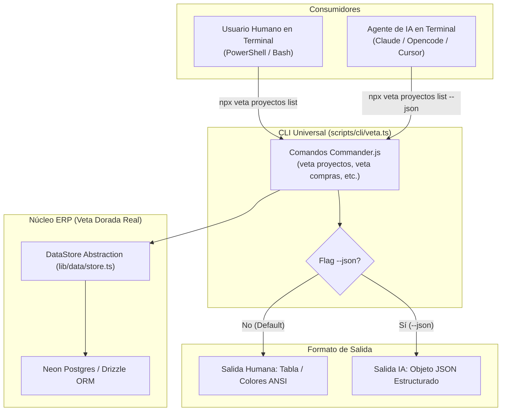

# Plan de Arquitectura e Implementación: CLI Universal de Terminal (Human & AI Ready)

Este documento define la arquitectura simplificada y el plan de implementación para exponer los datos y mutaciones del ERP + Sitio Web de Veta de Oro mediante una **CLI de Terminal Universal** utilizable tanto por **Usuarios Humanos** como por **Agentes de IA (Claude, Opencode, Cursor, etc.)**.

> [!NOTE]
> **Decisión de Simplificación (Axioma 2 de Nam P. Suh):**
> Se descarta formalmente la creación de un Servidor MCP (*Model Context Protocol*) por considerarse sobreingeniería innecesaria. Una CLI bien diseñada con soporte para el flag `--json` ofrece una interfaz unificada, ligera y 100% compatible con terminales para humanos e IAs.

---

## 1. Visión General de la Arquitectura Simplificada



---

## 2. Especificación Técnica de la CLI

### A. Modos de Ejecución:
1. **Ejecución Local (Desarrollo / Servidor Interno):** Conexión directa a `getDataStore()` importando la lógica de `lib/data/store.ts`.
2. **Ejecución Remota (Opcional):** Consultas a los Route Handlers HTTP REST (`/api/v1/...`) mediante `Authorization: Bearer <API_KEY>`.

### B. Salida Dual (Human & AI Ready):
- **Modo Humano (Default):** Renderiza tablas interactivas y texto coloreado usando `cli-table3` y `picocolors`.
- **Modo IA (`--json`):** Retorna el objeto o arreglo JSON puro sin formato visual para que cualquier LLM o agente lo parsee sin esfuerzo.

---

## 3. Ejemplo de Uso de Comandos

```powershell
# --- USO HUMANO ---
# Muestra una tabla estilizada de proyectos
npx veta proyectos listar --estado cotizado

# --- USO PARA AGENTES DE IA ---
# Devuelve JSON puro procesable por el modelo
npx veta proyectos listar --estado cotizado --json

# Crear un cliente
npx veta clientes crear --nombre "Carlos Mendoza" --telefono "3009998877" --json

# Aprobar cotización (Gate E-18)
npx veta proyectos aprobar --id "proj_102" --json
```

---

## 4. Plan de Implementación Paso a Paso

### [Fase 1] Estructura Base de la CLI
- [ ] Instalar librerías ligeras: `npm install commander picocolors cli-table3`.
- [ ] Crear el punto de entrada ejecutable `scripts/cli/veta.ts`.
- [ ] Implementar el middleware global para procesar el flag `--json`.

### [Fase 2] Módulos de Comandos
- [ ] `veta proyectos` (listar, obtener, crear, cambiar-estado).
- [ ] `veta clientes` (listar, buscar, crear).
- [ ] `veta compras` (listar-ordenes, crear-oc).
- [ ] `veta inventario` (consultar-stock, buscar-producto).

### [Fase 3] Verificación y Pruebas
- [ ] Verificar que la salida en modo humano es clara y legible en PowerShell.
- [ ] Verificar que el flag `--json` retorna un JSON válido parseable por `JSON.parse()`.
- [ ] Validar que todas las escrituras respetan `contracts.ts` y no bypassean verificaciones de la DB.
- [ ] Compilación con `npx tsc --noEmit`.

---

## 5. Matriz de Evaluación Simplificada

| Criterio | Métrica de Éxito | Estado |
| :--- | :--- | :---: |
| **Simplicidad (Axioma 2)** | Cero dependencias de servidores extra o protocolos complejos (No MCP). | Aprobado |
| **Compatibilidad Dual** | 100% de los comandos soportan el flag `--json` para IAs. | Pendiente |
| **Paridad de Reglas** | Reutiliza `getDataStore()` directamente sin duplicar lógica SQL. | Pendiente |
| **Verificación TypeScript** | Compilación limpia de la CLI con `npx tsc --noEmit`. | Pendiente |
