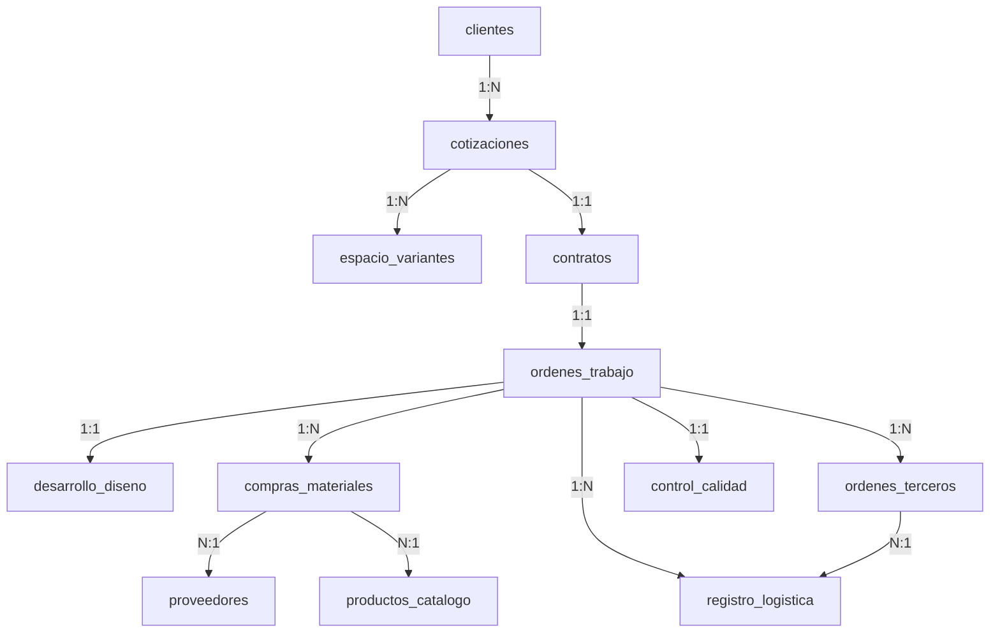

# Propuesta de Arquitectura: Ruta de Proyecto y Gestión Logística (Actualizada)

Esta propuesta define la estructura de datos desacoplada para gestionar el flujo de trabajo de tu taller de muebles (Desarrollo, Compras, Logística y Calidad). Se enfoca en la eficiencia operativa: **hacer el trabajo diario de planeación en 1 hora**, facilitando la captura automática y la toma de decisiones sin fricción.

---

## 📐 Principio de Diseño Axiomático Aplicado

Para minimizar la entrada manual de datos y la entropía del sistema:
1.  **Herencia de Direcciones**: El módulo de logística hereda automáticamente las direcciones de origen y destino basándose en el tipo de viaje (dirección del proveedor, dirección del taller o dirección de obra del cliente).
2.  **Costo Real vs. Referencial**: Compras carga el precio directo del catálogo como una referencia, pero permite registrar el **costo real de factura**, con la opción de actualizar el catálogo base.
3.  **Análisis Numérico de Corte**: En lugar de sobrecomplicar la estructura 3D en la base de datos, el modelado en SketchUp se trata como visualización. El análisis de maquinado y optimización (OpenCutList) se procesa numéricamente mediante un script (Zap) que valida un archivo de Excel/CSV importado.

---

## 🗃️ Estructura de Schemas Actualizada

### 1. Proveedores (`proveedores`) - *Creado y Activo*
Almacena el registro único de proveedores para compras y logística.

| Campo | Tipo | Requerido | Descripción |
| :--- | :--- | :---: | :--- |
| `nombre` | `text` | Sí | Nombre comercial / Razón Social |
| `nit` | `text` | No | Identificación tributaria |
| `telefono` | `text` | No | Contacto telefónico |
| `direccion` | `text` | Sí | Dirección fiscal/taller (usada para heredar en Logística) |
| `categoria` | `select` | Sí | `Tableros`, `Herrajes`, `Vidrios`, `Mesones`, `Tapiceria`, `Varios` |

---

### 2. Desarrollo y Diseño (`desarrollo_diseno`)
Registra el estado del modelado y la lista de corte técnica.

| Campo | Tipo | Requerido | Descripción |
| :--- | :--- | :---: | :--- |
| `orden_trabajo_id` | `relation` | Sí | Relación a `ordenes_trabajo` |
| `estado` | `select` | Sí | `Pendiente`, `En_Modelado`, `Listo_Para_Produccion` |
| `lista_corte_raw` | `text` (JSON/CSV) | No | Lista de corte importada de OpenCutList para el analizador |
| `estado_analisis` | `select` | Sí | `Sin_Analizar`, `Aprobado`, `Falla_Validacion` (menores a 6.5cm) |
| `planos_armado` | `text` (URL) | No | Enlace a planos de armado de taller |
| `planos_instalacion` | `text` (URL) | No | Enlace a planos de instalación en obra |
| `planos_tercerizados` | `text` (URL) | No | Enlace a especificaciones para terceros (mesones/vidrios) |
| `notas` | `markdown` | No | Observaciones del modelador |

> [!NOTE]
> **Zap de Validación**: Se ha creado y registrado el script `analisis_lista_corte`. Al hacer clic en "Validar Lista de Corte", este Zap inspecciona numéricamente la propiedad `lista_corte_raw` para detectar de forma automática piezas con dimensiones menores a 6.5cm (65mm) y notifica al usuario las anomalías encontradas.

---

### 3. Compras y Pedidos de Materiales (`compras_materiales`)
Administra los costos presupuestados frente a los costos reales facturados.

| Campo | Tipo | Requerido | Descripción |
| :--- | :--- | :---: | :--- |
| `orden_trabajo_id` | `relation` | Sí | Relación a `ordenes_trabajo` |
| `proveedor_id` | `relation` | Sí | Relación a `proveedores` |
| `material_id` | `relation` | Sí | Relación a `productos_catalogo` |
| `cantidad` | `number` | Sí | Cantidad requerida de compra |
| `costo_referencial` | `number` | No | Traído del catálogo (`LOOKUP` a `precio_directo`) |
| `costo_real_compra` | `number` | Sí | **Ingreso manual según factura del proveedor** |
| `total_compra` | `number` | No | Calculado (`MULTIPLY` cantidad * costo_real_compra) |
| `estado_pago` | `select` | Sí | `Pendiente`, `Pagado` |
| `estado_recepcion` | `select` | Sí | `Sin_Pedir`, `Solicitado`, `Recibido_Taller` |

> [!TIP]
> **Flujo de Actualización**: Registramos el costo real pagado en la factura. Proponemos un botón secundario (Zap) que actualice automáticamente el `precio_directo` en el catálogo de productos basándose en el último costo real cargado, manteniendo tus presupuestos futuros siempre ajustados a la inflación sin edición manual.

---

### 4. Gestión de Terceros / Outsourcing (`ordenes_terceros`)
Servicios o piezas que se envían a manufacturar externamente.

| Campo | Tipo | Requerido | Descripción |
| :--- | :--- | :---: | :--- |
| `orden_trabajo_id` | `relation` | Sí | Relación a `ordenes_trabajo` |
| `tipo_servicio` | `select` | Sí | `Vidrieria`, `Mesones`, `Espejos`, `Ornamentacion`, `Tapiceria`, `Otro` |
| `descripcion` | `text` | Sí | Detalle técnico del pedido a maquilar |
| `proveedor_id` | `relation` | Sí | Relación a `proveedores` |
| `costo_real` | `number` | Sí | Costo final cobrado por el tercero |
| `planos_desarrollo` | `text` (URL) | No | Enlace a planos de diseño técnico enviados |
| `estado_maquila` | `select` | Sí | `Enviado_A_Maquila`, `Recibido` |
| `viaje_logistica_id` | `relation` | No | Flete asociado para retirar el producto |

---

### 5. Gestión Logística (`registro_logistica`)
Un listado minimalista y ágil para controlar los fletes diarios del taller.

| Campo | Tipo | Requerido | Descripción |
| :--- | :--- | :---: | :--- |
| `orden_trabajo_id` | `relation` | No | Opcional (para fletes específicos del proyecto) |
| `tipo_viaje` | `select` | Sí | `Recepcion_Materiales`, `Recoleccion_Insumos`, `Transporte_Terceros`, `Despacho_Proyecto` |
| `proveedor_transporte` | `select` | Sí | `Yango`, `Uber`, `Vehiculo_Propio`, `Flete_Externo` |
| `origen_heredado` | `text` | No | Derivado dinámicamente según el tipo de viaje |
| `destino_heredado` | `text` | No | Derivado dinámicamente según el tipo de viaje |
| `costo_flete` | `number` | Sí | Costo del servicio cobrado por la app de transporte |
| `estado_viaje` | `select` | Sí | `Programado` o `Cancelado` (tarjeta automática en UI) |
| `fecha_viaje` | `date` | Sí | Fecha del viaje |

#### 🔄 Reglas de Herencia Automática de Direcciones (Cero Fricción)
El sistema deduce origen y destino según el `tipo_viaje` seleccionado para evitar que escribas:
*   **Recepcion_Materiales**:
    *   *Origen*: `proveedores.direccion` (de la relación del proveedor del material)
    *   *Destino*: "Taller Principal" (dirección fija del taller)
*   **Recoleccion_Insumos**:
    *   *Origen*: "Taller Principal"
    *   *Destino*: `proveedores.direccion` (ruta de compras de la semana)
*   **Transporte_Terceros**:
    *   *Origen*: `proveedores.direccion` (del taller del tercero, ej. la marmolería o vidriería)
    *   *Destino*: "Taller Principal" o `cotizaciones.direccion_obra` (si va directo a obra)
*   **Despacho_Proyecto**:
    *   *Origen*: "Taller Principal"
    *   *Destino*: `cotizaciones.direccion_obra` (heredada de la orden de trabajo activa)

---

### 6. Verificación de Calidad (`control_calidad`)
Control físico de entrega.

| Campo | Tipo | Requerido | Descripción |
| :--- | :--- | :---: | :--- |
| `orden_trabajo_id` | `relation` | Sí | Relación a `ordenes_trabajo` |
| `fecha_inspeccion` | `date` | Sí | Fecha |
| `estado` | `select` | Sí | `Aprobado` o `Rechazado_Con_Observaciones` |
| `check_armado` | `boolean` | Sí | Bisagras, nivelación y armado de detalle |
| `check_instalacion` | `boolean` | Sí | Fijaciones y limpieza en obra |
| `check_acabados` | `boolean` | Sí | Filos, cantos y superficies sin rayas |
| `check_electricidad` | `boolean` | Sí | Luces y conexiones funcionales |
| `check_atributos` | `boolean` | Sí | Correspondencia con la cotización del cliente |
| `detalles_falla` | `text` | No | Lista de observaciones en caso de rechazo |

---

## 📅 La Regla de la 1 Hora Diaria: Diseño del Dashboard

Para lograr operar con solo 60 minutos de gestión al día, estructuramos una interfaz basada en "Tarjetas de Acción" (Kanban minimalista de Tareas Activas) en la ruta `/app/dashboard`:

1.  **Diseño (Desarrollo)**:
    *   El modelador entra, carga el Excel de OCL, da clic a **Validar Lista de Corte**. Si sale en verde, adjunta los PDFs de planos y marca `Listo_Para_Produccion`. (Tiempo: 10 min).
2.  **Compras y Logística (El Supervisor)**:
    *   El sistema muestra alertas automáticas de materiales pendientes por pedir.
    *   Das clic en **Programar Flete** para los traslados del día. La dirección de origen/destino ya está rellena. Agendas en Uber/Yango, digitas el costo y queda guardado como `Programado`. (Tiempo: 20 min).
3.  **Recibir en Taller (El Operario)**:
    *   El operario tiene una tablet en taller. Ve las compras en estado `Solicitado`. Cuando llega el camión, da un toque en la tarjeta para cambiarlo a `Recibido_Taller`. No escribe nada. (Tiempo: 5 min).
4.  **Cierre de Calidad**:
    *   Al finalizar el día, el instalador en obra abre la orden, marca los 5 checks de calidad, sube una foto final y presiona **Aprobar Entrega**. (Tiempo: 5 min).
