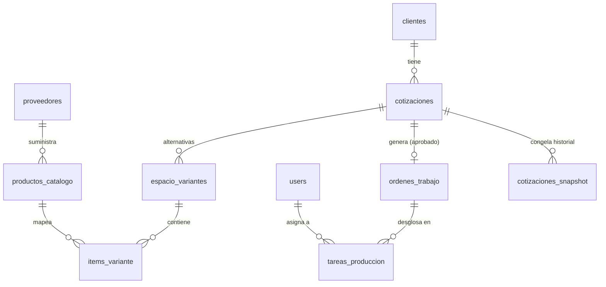

# Plano Arquitectónico de Negocio y Estructura ERP (Vanguardia 2026)
**Metodología:** Diseño Axiomático de Nam Pyo Suh (MIT, 1990)  
**Paradigma:** UI Declarativa Servida por Datos (Server-Driven UI)  
**Objetivo:** Diseñar los cimientos de la base de datos, relaciones, rutas y lógica de permisos del ERP sin generar entropía en el código.

---

## 1. Auditoría Frente a Modelos ERP Vanguardia 2026

Los sistemas ERP tradicionales de las últimas décadas (SAP, Odoo, ERPNext) sufrían de un mal congénito: **acoplamiento monolítico vertical**. Una cotización cambiaba y, por ende, el stock de inventario se recalculaba de inmediato de forma síncrona, bloqueando la base de datos o rompiendo las vistas de los operarios de taller con ruido financiero. 

En **2026**, los modelos de arquitectura de ERP de vanguardia se rigen por tres principios soberanos:

1. **Separación de Estimación (Teoría) vs. Ejecución (Realidad):**
   * La **Cotización** es una simulación comercial compuesta por múltiples variantes opcionales. Muestra precios, márgenes y tarifas.
   * La **Orden de Trabajo (Producción)** es un mandato físico de fabricación en taller. No contiene precios ni márgenes. Solo especifica qué insumos cortar, ensamblar e instalar, junto con los archivos técnicos y modelos 3D (`.glb`).
2. **Server-Driven Dynamic UI (SDUI):**
   * Las interfaces no se programan de forma fija (hardcoded) para cada rol. El motor interpreta esquemas de rutas JSON y proyecta formularios, listas y tableros en base a los permisos del usuario activo y el contexto de los datos.
3. **Flujos Basados en Eventos (Event-Driven Zaps):**
   * El paso de un estado comercial (ej. Cotización Aceptada) a un estado operativo (ej. Lanzamiento a Producción) ocurre mediante micro-scripts orquestados en el servidor (Zaps), garantizando que las bases de datos permanezcan desacopladas y no compartan dependencias circulares.

---

## 2. Paradigma de Diseño Axiomático (Suh)

Para evitar que el código de nuestro ERP tienda al caos (entropía), aplicamos los dos axiomas fundamentales de Nam Pyo Suh:

### Axioma 1: Independencia Funcional
> *"Mantener la independencia de los requerimientos funcionales (RF)."*

En nuestro ERP de Muebles, cada área organizativa tiene un requerimiento funcional único que debe resolverse mediante un parámetro de diseño desacoplado:

* **RF-1: Atracción & Portafolio (Público)** $\rightarrow$ **DP-1:** Landing estática externa (`/`, `/portfolio`, `/design`, `/contact`). No interactúa con la base de datos de producción.
* **RF-2: Negociación & Estimación (Comercial)** $\rightarrow$ **DP-2:** Cotizador dinámico multivariante (`/app/quoting`). Opera sobre los schemas `cotizaciones`, `espacio_variantes` e `items_variante`.
* **RF-3: Abastecimiento & Suministros (Compras)** $\rightarrow$ **DP-3:** Catálogo de insumos y gestión de proveedores (`/app/catalog`). Opera sobre `productos_catalogo` y el nuevo schema `proveedores`.
* **RF-4: Fabricación & Montaje (Taller)** $\rightarrow$ **DP-4:** Agenda diaria y tareas del carpintero (`/app/production`). Opera sobre los nuevos schemas `ordenes_trabajo` y `tareas_produccion`.
* **RF-5: Análisis Ejecutivo (Administración)** $\rightarrow$ **DP-5:** KPIs financieros inmutables (`/app/analytics`). Opera sobre `cotizaciones_snapshot`.

#### Matriz de Diseño Axiomático (Diagonalizada):

| Requerimiento Funcional | DP-1 (Web Pública) | DP-2 (Cotizador) | DP-3 (Catálogo) | DP-4 (Taller) | DP-5 (KPIs Admin) |
| :--- | :---: | :---: | :---: | :---: | :---: |
| **RF-1 (Atracción)** | **X** | 0 | 0 | 0 | 0 |
| **RF-2 (Comercial)** | 0 | **X** | 0 | 0 | 0 |
| **RF-3 (Abastecimiento)**| 0 | X | **X** | 0 | 0 |
| **RF-4 (Taller)** | 0 | 0 | X | **X** | 0 |
| **RF-5 (KPIs Admin)** | 0 | 0 | 0 | 0 | **X** |

> [!NOTE]
> Las dependencias son estrictamente descendentes o nulas. El módulo de taller (RF-4) lee insumos del catálogo de compras (RF-3) para saber qué usar, pero no interfiere en absoluto con la cotización comercial (RF-2), cumpliendo la independencia axiomática.

### Axioma 2: Minimalismo de Información
> *"Minimizar el contenido de información del diseño."*

* **No duplicar cálculos:** Campos como el costo total de materiales en un espacio se calculan **en tiempo de lectura (read-time)** usando derivaciones (`MULTIPLY`, `SUM`, `AGGREGATE`, `LOOKUP`), evitando desincronizaciones de datos históricos.
* **Nomenclatura Estándar:** Purga total de nombres crípticos o metafóricos. Usaremos vocabulario estándar de desarrollo global: `users`, `clients`, `catalog_items`, `quotes`, `production_orders`, `tasks`, `suppliers`, `snapshots`.

---

## 3. Plan de Relaciones y Schemas de Datos (Blueprint)

Para soportar las necesidades de carpinteros (agenda física) y administradores (KPIs/proveedores) sin contaminar los datos, estructuramos el siguiente árbol de esquemas:



### 3.1. Schemas Operativos Existentes (Verificados)
* **`clientes`**: Datos de contacto y fiscales.
* **`cotizaciones`**: Encabezado del proyecto comercial (metadatos de entrega, costos operativos globales).
* **`espacio_variantes`**: Ambientes (ej. Cocina, Baño) y variantes de diseño (ej. Inicial, Premium).
* **`items_variante`**: Detalle de insumos por variante con derivaciones a partir de `productos_catalogo`.
* **`productos_catalogo`**: Maestro de materiales, SKUs y precios de venta calculados en base a márgenes de costo directo (`precio_directo * 1.3`).

### 3.2. Nuevos Schemas Axiomáticos a Implementar

#### Schema: `proveedores` (Suppliers)
Sostiene la relación comercial de insumos, permitiendo auditorías de costo de compra.
* `nit` (text, requerido, primario): Código de identificación fiscal.
* `nombre` (text, requerido): Nombre de la empresa proveedora.
* `contacto` (text): Persona de contacto.
* `telefono` (text): Teléfono comercial.
* `email` (text): Correo electrónico para órdenes de compra.
* `rubro` (text): Categoría (ej. Maderas, Herrajes, Lacas).

#### Schema: `ordenes_trabajo` (Production Orders)
El puente inmutable entre el área comercial y el taller físico. Se crea mediante un script (Zap) cuando una cotización es aprobada.
* `cotizacion_id` (relation -> `cotizaciones`, requerido): Vínculo de origen.
* `codigo_orden` (text, requerido): Código autogenerado legible (ej. `OT-2026-001`).
* `fecha_inicio` (date, requerido): Fecha programada de entrada al taller.
* `fecha_entrega` (date, requerido): Fecha comprometida con el cliente.
* `estado` (select, requerido): `[borrador, en_taller, en_instalacion, terminada, entregada]`.
* `responsable_id` (relation -> `users`): Coordinador general del proyecto.
* `detalles_operaciones` (markdown): Campo libre para notas operativas, listas de chequeo, planos o información técnica que deba transmitirse directamente al operario en el taller.


#### Schema: `tareas_produccion` (Production Tasks)
El plan diario de los operarios de taller. Cada operario ve únicamente sus tareas diarias en su dispositivo.
* `orden_trabajo_id` (relation -> `ordenes_trabajo`, requerido): Orden a la que pertenece.
* `operario_id` (relation -> `users`, requerido): El carpintero asignado a ejecutarla.
* `nombre_tarea` (text, requerido): Acción específica (ej. "Corte de tableros melamina 18mm", "Enchapado de cantos", "Armado cajoneras").
* `area` (select, requerido): `[diseño_tecnico, corte, armado, acabado, instalacion]`.
* `duracion_estimada` (number, en horas): Tiempo teórico para KPI de eficiencia.
* `estado` (select, requerido): `[pendiente, en_proceso, pausada, completada]`.
* `orden_ejecucion` (number): Secuencia recomendada en el día (ej. 1, 2, 3).
* `notas` (markdown): Instrucciones de ensamble y links a planos.

---

## 4. Árbol de Interfaces y Rutas (`/` y `/app`)

Para organizar el acceso al ERP respetando roles y minimizando la complejidad visual, dividimos las rutas de forma axiomática:

```
/ (Público - Layout Landing)
├── /portfolio (Portafolio de Proyectos)
├── /design (Herramientas de Configuración / Inspiración Visual)
└── /contact (Formulario de captación de leads)

/app (Privado - Layout ERP, requiere Auth)
├── /app/dashboard (General KPIs - Vista unificada para Admin o Taller)
├── /app/quoting (Comercial - Cotizador_Pro multivariante con snapshots)
├── /app/catalog (Logística - Catálogo unificado, inventarios y proveedores)
└── /app/production (Operaciones - Calendario y Tarea diaria de carpinteros)
```

### 4.1. Configuración de Rutas Públicas (En `page_routes.json`)

#### Ruta: `/` (Home del Negocio)
* **Layout:** `full` (sin barra de navegación privada, usa navbar institucional).
* **Bloques:**
  * Bloque custom de Hero Section con carrusel e imágenes de proyectos premium generadas por IA.
  * Bloque de presentación de marca (filosofía de diseño de autor).

#### Ruta: `/portfolio` (Galería)
* **Bloques:**
  * `collection` de `productos_catalogo` filtrada únicamente por los productos que tengan el flag `es_portafolio = true`, proyectando imágenes reales en formato `card_grid`.

#### Ruta: `/design` (Estilo)
* **Bloques:**
  * Visualizador interactivo de maderas, acabados y herrajes premium para que el cliente final experimente antes de agendar.

#### Ruta: `/contact` (Captación)
* **Bloques:**
  * `form` de la entidad `clientes` enfocado a prospección (Nombre, Teléfono, Correo, Descripción del proyecto soñado). Al enviarse, crea el registro del cliente de forma automática para la bandeja administrativa.

---

### 4.2. Configuración de Rutas Privadas ERP (`/app`)

#### Ruta: `/app/dashboard` (Centro de Control)
* **Filtro de Rol:** Admin / Empleado.
* **Bloques:**
  * **Si es Administrador:** Proyecta un bloque de KPIs dinámico que lee de `cotizaciones_snapshot` y calcula sumatorias globales de facturación neta mensual, márgenes de ganancia operativa, volumen de cotizaciones cerradas y alertas de stock mínimo.
  * **Si es Carpintero:** Proyecta una tarjeta resumida de sus tareas diarias activas en taller ("Tienes 3 tareas asignadas para hoy").

#### Ruta: `/app/quoting` (El Cotizador - Comercial)
* **Filtro de Rol:** Administrador / Diseñador.
* **Bloques:**
  * Bloque especializado `cotizador_pro` (enlazado al contexto `cotizaciones`).
  * Bloque especializado `data_browser` para realizar búsquedas avanzadas y filtrados analíticos sobre cotizaciones previas.
  * Botón de acción (`action`) enlazado al Zap `exportar_propuesta_pdf_simplificada` para congelar precios, generar el PDF comercial en caliente y persistir la propuesta inmutable en `cotizaciones_snapshot`.

#### Ruta: `/app/catalog` (Inventario y Proveedores)
* **Filtro de Rol:** Administrador / Comprador.
* **Bloques:**
  * `collection` en vista `table` del contexto `productos_catalogo` (maestro de insumos con control de stock).
  * `collection` en vista `table` de la nueva entidad `proveedores`.
  * `form` simplificado para la carga masiva o registro rápido de materiales.

#### Ruta: `/app/production` (Plan de Trabajo Taller - Carpinteros)
* **Filtro de Rol:** Carpintero / Coordinador de Taller.
* **Bloques:**
  * **Si es Coordinador:** Proyecta una vista Kanban/Tabla global del progreso de todas las órdenes de trabajo activas (`ordenes_trabajo` y sus correspondientes `tareas_produccion`).
  * **Si es Carpintero (Taller):** Proyecta un componente especializado de **Lista de Tareas Diarias** (`tasks` asignadas al `operario_id` del usuario activo), ordenadas por secuencia y agrupadas por prioridad. Cada tarea muestra un botón de acción para "Comenzar Tarea" (cambia estado a `en_proceso`) y "Finalizar Tarea" (cambia a `completada`), junto con las notas de armado y plano adjunto en markdown.

---

## 5. Principales Obstáculos de la Implementación (Aprendizajes Dev)

Al construir este ERP sobre el SDK de Agnostyc, es imperativo advertir sobre los siguientes vectores de error recurrentes para evitar bugs y fugas de rendimiento:

### 1. Desincronización del Estado Local en Componentes Custom (`specialized/`)
* **El Obstáculo:** Agnostyc administra su estado global mediante Zustand. Si dentro de un componente especializado realizas una mutación de datos haciendo un `fetch('/api/vault')` directo, el componente local puede renderizarse antes de que el store global de Agnostyc se entere del cambio.
* **La Solución:** Nunca intentes mutar datos directamente modificando estados locales. Utiliza siempre la función `api.dispatchEvent` para ejecutar Zaps de servidor o llama a un Zap de mutación y ejecuta un `refresh()` limpio provisto por los hooks del engine. Respeta la regla de que los componentes especializados solo deben ser proyectores visuales.

### 2. Bucles de Recálculo en Derivaciones Circulares (`config.derivation`)
* **El Obstáculo:** Es muy tentador hacer que el `total_linea` de `items_variante` dependa del precio unitario del catálogo, y al mismo tiempo querer actualizar el catálogo basándose en los costos ponderados agregados de las cotizaciones. Esto crea una relación circular analítica.
* **La Solución:** Las dependencias deben viajar en una sola dirección: de Maestro a Detalle. El catálogo (`productos_catalogo`) alimenta a `items_variante` mediante un `LOOKUP`. Las cotizaciones agregan los totales de las variantes seleccionadas mediante un `AGGREGATE`. Nunca permitas que una entidad padre lea de un hijo que a su vez depende del padre.

### 3. Fugas de Memoria en Visualizaciones 3D (Visores GLB en Taller)
* **El Obstáculo:** Permitir que los carpinteros vean modelos 3D (`modelo_3d` en el catálogo) en sus tabletas es una ventaja competitiva brutal de usabilidad. Sin embargo, si al cambiar de tarea el componente de Three.js / WebGL no libera los buffers y texturas, el navegador de la tableta colapsará por consumo de memoria (GPU leak).
* **La Solución:** Sigue estrictamente el patrón documentado en `Interfaces Custom.md`. Mantén las instancias de la escena, cámara y renderizador en un `useRef` de React y retorna siempre una función de limpieza en el `useEffect` que llame a `renderer.dispose()` y anule los eventos del bucle de cuadros de animación (`cancelAnimationFrame`).

### 4. Filtrado de Roles sobre Vistas JSON Estáticas
* **El Obstáculo:** Como las rutas de las páginas se definen de forma estática en `page_routes.json`, no se pueden inyectar condicionales lógicos complejos en tiempo de compilación para restringir componentes.
* **La Solución:** Implementar la visibilidad de bloques usando la prop `filterState` o filtrando dinámicamente los registros pasados al componente `specialized` en base a las variables de sesión expuestas en el contexto global de la aplicación (ej. `api.getConfig().activeUser`).

---

## 6. Auditoría y Vectores de Entropía en CotizadorPro y sus Rutas

El componente especializado `CotizadorPro.tsx` (que actualmente pesa más de 50 KB y tiene cerca de 1,100 líneas) posee una serie de decisiones de diseño históricas que generan **entropía extrema**, acoplamiento y violaciones directas a los Axiomas de Nam Pyo Suh. 

A continuación, mapeamos detalladamente estos vectores para justificar el plan de purificación:

### Vector 1: Uso de "Esquemas Sombra" (Shadow Schemas) sin Registro Canonical
* **El Problema:** El componente realiza llamadas manuales de lectura y escritura (`fetch('/api/vault')`) a colecciones virtuales como `espacios`, `propuestas` y `propuesta_variantes`. **Estas colecciones no existen en `schema_definitions.json`** (nuestro registro canónico de Agnostyc).
* **La Consecuencia:** Al esquivar el compilador y validador de schemas de Agnostyc, el sistema pierde la capacidad de comprobar la integridad referencial, autogenerar interfaces CRUD de respaldo, tipar los registros en `agnostic-schemas.ts` o realizar copias de seguridad unificadas. Se ha creado una "base de datos paralela e invisible" dentro de archivos JSON sueltos (`espacios.json`, etc.).

### Vector 2: Acoplamiento Parasitario de UI Tab State en Almacenamiento
* **El Problema:** La creación de entidades físicas separadas (`propuestas` y `propuesta_variantes`) sirve exclusivamente para guardar qué tab del selector de variantes está clickeado en la interfaz comercial. Esto viola el **Axioma 1 (Independencia Funcional)** al cruzar almacenamiento de negocio con estado efímero del navegador.
* **La Consecuencia:** En lugar de utilizar el campo canonical `activa` (boolean) que ya posee `espacio_variantes` en `schema_definitions.json` (diseñado para preseleccionar la alternativa ganadora de la cotización), el desarrollador duplicó la jerarquía de relaciones en tablas puente. Esto incrementa de forma artificial la complejidad y el riesgo de corrupción de datos al borrar espacios.

### Vector 3: Peticiones Bloqueantes en Render Inline (Bypass del Zustand Store)
* **El Problema:** En lugar de confiar en la prop `records` inyectada de forma reactiva por el engine desde el store de Zustand, `CotizadorPro` ejecuta un `useEffect` que dispara un `Promise.all` para consultar manualmente **7 namespaces simultáneos** mediante fetch HTTP en cada recarga de página (ver líneas 582-584).
* **La Consecuencia:** Se destruye la caché compartida del engine. Si otra sección del ERP modifica un cliente o un producto, el cotizador no se entera de inmediato (reactividad rota). Además, genera parpadeos visuales (loading spinners) constantes al recargar la vista, degradando severamente la experiencia premium.

### Vector 4: Mutación de Datos Descentralizada e Inline
* **El Problema:** Acciones operacionales críticas (`onRenameEspacio`, `onAddVariante`, `onDuplicateEspacio`, `onAddPropuesta`) están escritas como funciones JavaScript inline que llaman de forma directa a endpoints REST post /api/vault en caliente (por ejemplo, ver líneas 684-690).
* **La Consecuencia:** Si cambian las reglas de negocio de cómo se duplica un espacio (ej: si ahora se debe notificar al catálogo de compras), se debe reescribir código TSX pesado en el cliente, en lugar de orquestar un Zap del lado del servidor.

### Vector 5: Caos de Rutas Duplicadas
* **El Problema:** En `page_routes.json` coexisten `/cotizador` (que renderiza `cotizador_pro`), `/cotizaciones` (duplicada y vacía) y `/Public` (que tiene una estructura anidada de frames inline).
* **La Consecuencia:** Cero coherencia jerárquica con el árbol del root propuesto. Al no estar unificado bajo `/app/quoting` e `/`, las redirecciones de sesión se vuelven inmanejables.

---

## 7. Plan de Purificación para el Sub-sistema de Cotizaciones

Para remover esta entropía de raíz y alinear el módulo comercial a las directrices axiomáticas del blueprint, ejecutaremos el siguiente plan secuencial de purificación técnica:

### Fase 1: Limpieza e Integración de Relaciones en el Registro Canónico
1. **Unificar Espacios y Variantes:**
   * Eliminaremos la colección paralela `espacios.json`.
   * En su lugar, el schema `espacio_variantes` (que ya está registrado en `schema_definitions.json`) guardará el `nombre_espacio` (ej. "Cocina") y el `nombre_variante` (ej. "Inicial") en cada variante de forma unificada.
   * La preselección comercial se basará estrictamente en el campo canonical `activa` (boolean) de `espacio_variantes`.
2. **Purgar Propuestas y Puentes:**
   * Se eliminarán del sistema físico las colecciones `propuestas.json` y `propuesta_variantes.json`.
   * El tab state de "Propuestas" en la UI se calculará puramente agrupando los registros de `espacio_variantes` por su `nombre_variante` mediante un simple `useMemo` del lado del cliente.
3. **Consolidar el Schema `cotizaciones`:**
   * Se mantendrán únicamente los metadatos comerciales puros.

### Fase 2: Transición a Carga Reactiva vía Zustand y Hooks
1. **Aprovechar la Prop `records` del Engine:**
   * En lugar de fetchings manuales bloqueantes, `CotizadorPro` recibirá las cotizaciones y espacios de forma reactiva a través del inyector del engine.
2. **Uso de Lazy Loading Hooks:**
   * Implementaremos el hook canonical `useRelationData('clientes')` para resolver los datos de los clientes y `useRelationData('productos_catalogo')` para la búsqueda en el autocompletado de insumos.
   * Esto elimina los fetchings redundantes del ciclo de montaje del componente React.

### Fase 3: Delegación de Lógica Compleja a Zaps de Servidor
1. **Centralizar la Duplicación:**
   * Acciones complejas como `onDuplicateEspacio` (que requiere iterar sobre ítems y generar nuevos UUIDs) se removerán del componente `.tsx`.
   * Se creará un Zap inmutable en `scripts.json` llamado `duplicar_espacio_variante` y el componente visual simplemente llamará a `api.dispatchEvent('duplicar_espacio_variante', { espacio_id })`.
2. **Centralizar la Exportación:**
   * El botón "Generar PDF" se mantendrá puramente como un disparador de `exportar_propuesta_pdf_simplificada`, cuya lógica inmutable ya está aislada a nivel de base de datos.

### Fase 4: Purga de Rutas y Unificación del Root
1. **Limpieza en `page_routes.json`:**
   * Se eliminarán las rutas `/cotizador`, `/cotizaciones` duplicadas y `/Public`.
   * Se creará una única ruta canónica `/app/quoting` enlazada al contexto `cotizaciones` con el bloque `cotizador_pro`, heredando el layout privado del ERP.

---

## 8. Siguientes Pasos de Ejecución Axiomática

Antes de escribir código TSX o registrar rutas con el CLI, se debe:
1. Validar con el cliente que este modelo conceptual y el árbol de relaciones cubre la totalidad de su realidad operativa.
2. Declarar los schemas `proveedores`, `ordenes_trabajo` (con el nuevo campo `detalles_operaciones` tipo `markdown`) y `tareas_produccion` ejecutando los correspondientes comandos en el CLI de Agnostyc (`create-schema`).
3. Registrar los scripts o Zaps requeridos para la automatización (ej. script de "Aprobar Cotización y Lanzar Orden de Trabajo").
4. Aplicar el **Plan de Purificación** al archivo `CotizadorPro.tsx` eliminando los shadow-fetchings y adaptando el layout para operar con el schema unificado de variantes.
5. Limpiar y unificar las rutas en `page_routes.json` bajo la jerarquía `/` y `/app` usando los comandos agno de Capa 3.

