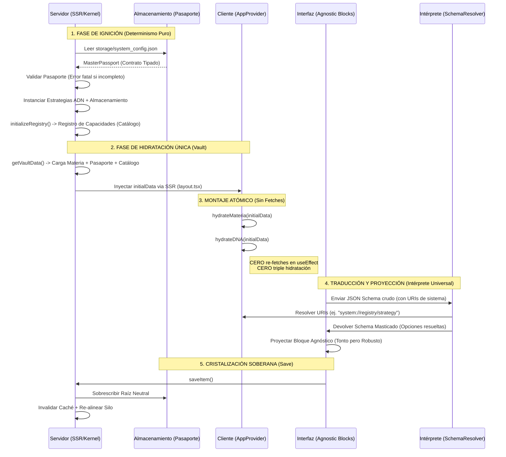

# 🏛️ Protocolo de Carga e Hidratación (Axiomático)

Este documento define el ciclo de vida del flujo de datos y la arquitectura de componentes de la UI, asegurando que el sistema mantenga su agnosticidad bajo los principios de Diseño Axiomático y la Teoría del Actor-Red.

## 1. Mapa de Realidad Cristalizada (Flujo Actual)

El flujo de carga elimina por completo la "triple hidratación" y los fetches fantasma, implementando un único origen de la verdad atómico.

---

## 2. Roadmap Arquitectónico: El Patrón de Intérprete Universal

Para evitar la "Complejidad Ruidosa" (Cajas negras fallando por acoplamiento de datos), implementaremos un cambio estructural en las capas de UI, respetando el **Axioma de Independencia**.

### ¿Cómo simplifica esto la arquitectura?
1. **Erradicación de Mapeadores Espagueti:** Se acabó mutar el JSON en caliente dentro de las secciones (`SystemSection`, `VaultsSection`, etc.). Las secciones volverán a ser proyectores limpios.
2. **Independencia Real:** Los widgets como `AgnosticForm` dejan de importar librerías de infraestructura (`Registry`). Se vuelven esclavos ciegos pero a prueba de balas.
3. **Escalabilidad Universal:** Todo el sistema se comunicará a través de un nuevo protocolo de URIs en el JSON (ej. `"source_uri": "system://capabilities/strategy"`). Si mañana cambiamos el Catálogo, solo se reescribe el Intérprete.

### Plan de Implementación a Detalle

#### FASE 1: El Contrato Semántico (Esquemas)
Los esquemas JSON dejan de tener listas estáticas vacías o hardcodeadas para opciones dinámicas. Se implementará una notación de URI agnóstica.
- **Artefactos afectados:** `sovereignty.schema.json`, `system_project.schema.json`, etc.
- **Acción:** Reemplazar `"options": []` por `"source_uri": "system://registry/strategy"`.

#### FASE 2: El Intérprete Maestro (SchemaResolver)
Se creará un único "Traductor" (Concepto de la TAR) que actúa como puente entre la materia (estado) y la UI.
- **Artefacto nuevo:** `src/lib/agnostic/SchemaInterpreter.ts` (o Hook `useSchemaInterpreter`).
- **Responsabilidad:** Recibir un esquema JSON, buscar claves `source_uri`, interpretar la orden, consultar el origen de datos (Registry o Store), y devolver un esquema con un array nativo inyectado de `{label, value}` puro.

#### FASE 3: Purificación de la Suite Agnóstica (UI Blocks)
Blindar los componentes contra el ruido estructural.
- **Artefacto:** `AgnosticForm.tsx`, `AgnosticCollection.tsx`.
- **Acción:** Implementar validación defensiva (`String(label)`) al mapear opciones. Asegurar que los componentes de Radix UI o similares solo reciban primitivos puros. Se elimina toda lógica de resolución de dentro del componente.

#### FASE 4: Purga de Proyectores (Las Secciones)
Se eliminan todas las variables intermedias.
- **Artefactos:** `SystemSection.tsx`, `VaultsSection.tsx`, `DNASection.tsx`.
- **Acción:** Eliminar `registry.getCapabilities()`, eliminar `enrichedSchema`. Las secciones solo importarán el `sovereigntySchemaRaw`, lo pasarán por el Intérprete (si es un hook), y el resultado directo irá al `<AgnosticForm>`.

### Conclusión Axiomática
La interfaz se convierte en una **"Máquina Trivial"** (Von Foerster): Un output predecible para un input dado. Toda la "Máquina No-Trivial" (lógica de estado y autodescubrimiento) se aísla en el Intérprete, logrando la máxima reducción de entropía posible.
