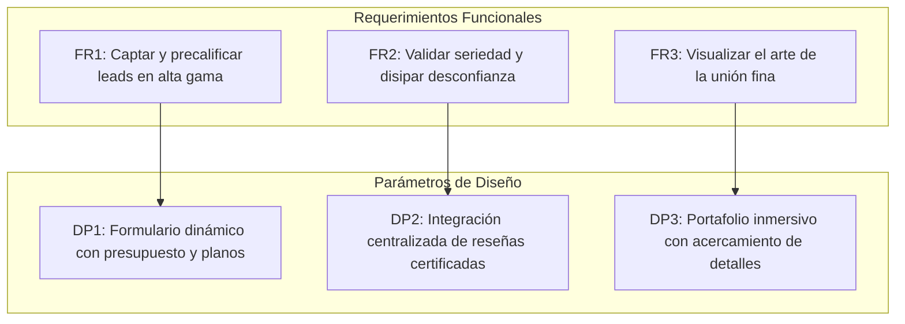

# Auditoría Comercial y Técnica: vetadeoro.co

Este documento presenta un análisis crítico del sitio web actual de **Veta Dorada** (bajo la razón social *Hermanos García González S.A.S* / *HG González S.A.S*). El objetivo es identificar las fricciones comerciales y deficiencias estructurales que limitan su conversión antes de iniciar el cambio de paradigma técnico y de negocio.

---

## 1. Hallazgos Críticos: Los 6 Defectos Comerciales del Sitio Actual

### 🚨 1. Redundancia de Contenido y "Spam" Interno
El sitio web muestra una severa repetición de secciones completas en la misma página de aterrizaje (Landing Page).
*   **Detalle:** Los encabezados `Habita en el bienestar`, `Diseñamos espacios integrales`, `Somos punto de fábrica` y `Sin intermediarios ni sobre costos` se repiten textualmente tanto en la parte superior como en la inferior de la página.
*   **Efecto Comercial:** Transmite falta de rigor en la edición y descuido. Un cliente que busca carpintería de alta gama o proyectos a medida asocia el desorden digital con potencial desorden o falta de detalle en la instalación física.

### 📉 2. Propuesta de Valor Genérica (Comoditización)
El discurso de venta se apoya en clichés de la industria local.
*   **Detalle:** El uso de las frases *"Somos punto de fábrica"* y *"Sin intermediarios ni sobre costos"* es el mismo argumento que utilizan los talleres informales en zonas populares de Bogotá (como el 12 de Octubre o el Restrepo).
*   **Efecto Comercial:** En lugar de posicionar a Veta Dorada como un estudio de diseño y construcción de espacios integrales de bienestar, compite por precio bajo. Se omite la especialización técnica (herrajes Blum/Häfele, optimización CNC, modelado 3D) en el mensaje principal.

### 🧩 3. Inconsistencias de Layout y Bloques Huérfanos
Existen fallos de maquetación en la estructura de información de la página.
*   **Detalle:** El bloque `### Garantía y satisfacción` y `## Nuestro servicio` carecen de contenido descriptivo directo o se encuentran desalineados respecto al flujo lógico de lectura.
*   **Efecto Comercial:** Ruptura de la experiencia de usuario (UX). Al escanear la página, el usuario encuentra secciones vacías o mal hiladas, lo que incrementa la tasa de rebote.

### 🛡️ 4. Ausencia Absoluta de Prueba Social
No hay evidencia verificable de proyectos entregados ni satisfacción de clientes en el cuerpo principal.
*   **Detalle:** Aunque se menciona *"años de tradición y experiencia"*, no se integran calificaciones de Google Business, testimonios de clientes reales con nombres y ubicaciones (ej. "Remodelación en Chicó" o "Cocina en Cedritos"), ni un widget de opiniones validadas.
*   **Efecto Comercial:** La carpintería arquitectónica residencial y comercial genera un alto nivel de desconfianza en Bogotá por temor a incumplimientos en fechas y acabados. Al no exhibir prueba social directa, se pierde la oportunidad de disipar este miedo.

### 🚦 5. Frictionless Linkage vs. Embudo Sin Calificar
El único canal de conversión es un botón directo a WhatsApp.
*   **Detalle:** Todos los CTAs (`COTIZAR POR CHAT`, `AGENDAR AHORA`, `Cotizar ahora`) redirigen al mismo enlace de WhatsApp (`https://wa.link/rmgga6`). No hay un formulario de precalificación, captador de leads, ni estimador interactivo de presupuestos.
*   **Efecto Comercial:** El canal de WhatsApp se satura de mensajes informales de baja intención de compra ("¿Cuánto vale un mueble?"). El equipo comercial gasta tiempo valioso cotizando sin datos clave (medidas, tipo de espacio, presupuesto base) en lugar de atender leads maduros.

### ⚖️ 6. Ruido y Dispersión de Identidad de Marca
El pie de página introduce información corporativa cruzada sin explicación.
*   **Detalle:** Se mencionan de forma consecutiva `Veta Dorada`, `HG González S.A.S` e `Hermanos García González S.A.S`.
*   **Efecto Comercial:** A nivel de marca, confunde. Si bien es necesario por términos legales y facturación, debe estructurarse de manera que no parezca que el cliente le compra a tres entidades distintas.

---

## 2. Diagnóstico de Datos de Conversión (Contexto Bogotá)

De acuerdo con el estudio del mercado local para el sector de diseño de interiores y cocinas integrales:
*   **Costo por Clic (CPC) local:** El CPC en Meta y Google Ads en Colombia es relativamente bajo (~$0.19 USD en redes, y rangos moderados en buscadores). Esto facilita la atracción de tráfico.
*   **Tasa de Conversión (CR):** La tasa de conversión web promedio de las carpinterías tradicionales en la región oscila entre **0.80% y 1.10%**, mientras que los estudios de alta gama alcanzan de **5.00% a 10.00%**.
*   **Conclusión:** El problema de Veta Dorada no es atraer tráfico, sino que la web actual actúa como un colador debido a las fricciones descritas, perdiendo el 99% de las visitas interesadas.

---

## 3. Propuesta de Arquitectura bajo Diseño Axiomático

Para el nuevo paradigma de la plataforma, aplicaremos los principios del **Diseño Axiomático de Nam P. Suh**, que busca desacoplar las funciones del sistema (Requerimientos Funcionales - FRs) de los elementos que las ejecutan (Parámetros de Diseño - DPs), garantizando la mínima complejidad de información.

### Principio de Independencia (Axioma 1)
*   **Evitar Acoplamiento:** La base de datos de proyectos, el cotizador automatizado y el canal de mensería (WhatsApp/Email) deben ser independientes. Modificar el catálogo de cocinas o materiales no debe afectar el motor de cotización o el envío de correos.

### Mínimo Contenido de Información (Axioma 2)
*   **Minimalismo Funcional:** En lugar de interfaces pesadas o redundantes, cada vista del sitio debe tener un único objetivo de comunicación claro. La información técnica del contrato y la garantía se despliega en su propio nodo sin interferir con la experiencia visual del portafolio.
