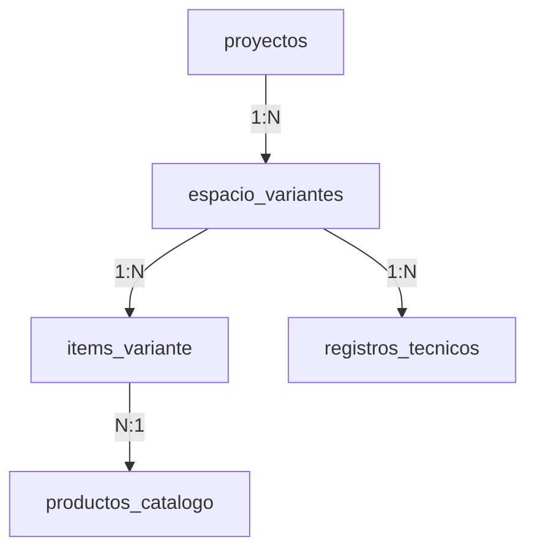
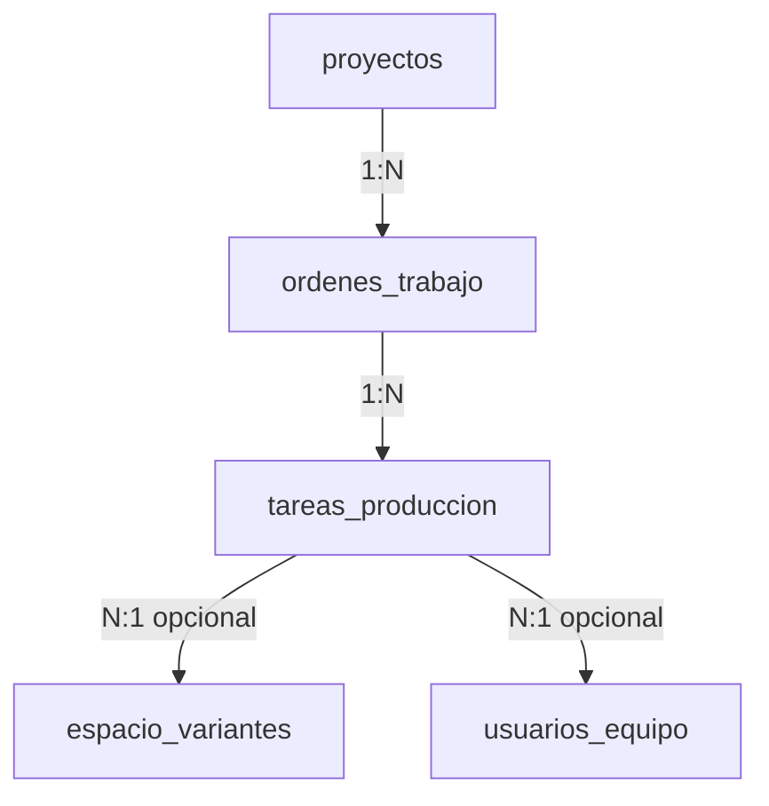
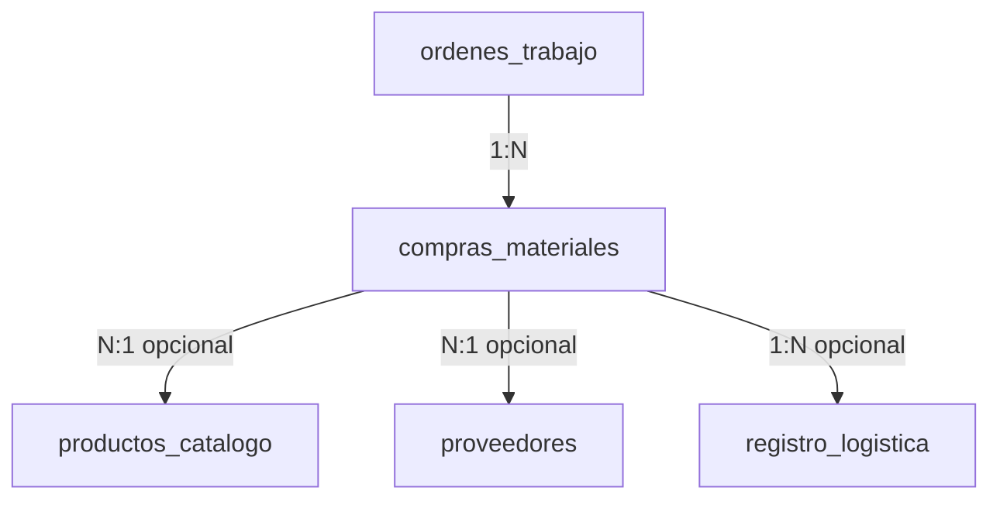
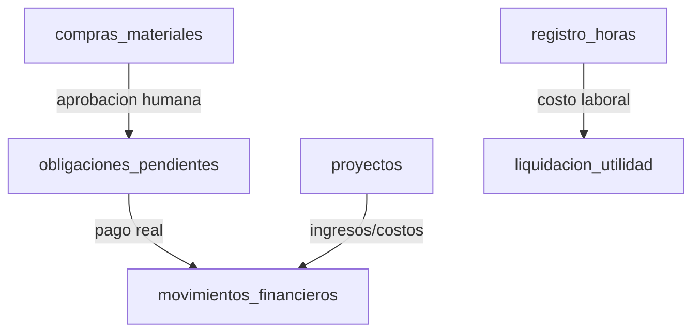
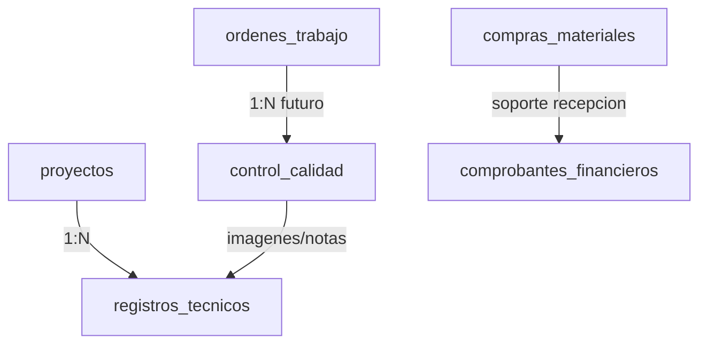

# Arquitectura del Modulo de Produccion: Diseno Axiomatico

## 1. Decision canonica

El schema canonico para el ciclo comercial-operativo es `proyectos`.

El antiguo vocabulario `cotizaciones` queda clasificado como legacy historico. No debe aparecer en nuevas rutas, nuevos scripts, nuevos componentes especializados ni nuevas relaciones de datos. Cualquier referencia vigente a `cotizacion_id`, `CotizacionesRecord`, `useRelationData('cotizaciones')` o `context:cotizaciones` debe tratarse como deuda tecnica de refactor.

Regla canonica:

```text
proyectos
  -> contratos
  -> ordenes_trabajo
  -> tareas_produccion
  -> compras_materiales
  -> registro_horas
  -> cierre financiero
```

El modulo de produccion vive dentro del workspace de Operaciones. Finanzas consume sus resultados para costeo, pagos y utilidad, pero no debe absorber la logica del taller.

## 2. Objetivo del modulo

El modulo de produccion debe convertir un proyecto vendido en una secuencia operacional trazable: preparacion tecnica, abastecimiento, fabricacion, instalacion, control de calidad y cierre de costos reales.

No es un gestor visual de tareas aislado. Es el puente entre el diseno aprobado, los insumos fisicos, el trabajo humano y la rentabilidad final.

## 3. Principios de diseno

### Axioma 1: independencia funcional

Cada entidad debe representar un requerimiento funcional independiente. La ficha de produccion no debe convertirse en un mega-schema con todos los campos del taller, compras, instalacion y finanzas.

### Axioma 2: minimo contenido de informacion

Solo se persiste lo que cambia el estado del negocio. Informacion derivable, como progreso, costo acumulado o materiales faltantes, debe calcularse desde relaciones existentes o mediante Zaps deterministas.

### Matrushka operacional

El usuario de taller debe entrar por contexto, no por base de datos. La navegacion recomendada es:

```text
/app
  /app/operaciones
    /app/operaciones/produccion
    /app/operaciones/produccion/:id
    /app/operaciones/abastecimiento
    /app/operaciones/calidad
```

El sistema puede mantener rutas legacy mientras se refactoriza, pero la direccion conceptual debe ser esta.

## 4. Matriz FR / DP

| FR | Requerimiento funcional | DP | Parametro de diseno |
|---|---|---|---|
| FR1 | Identificar que proyecto entra a taller | DP1 | `ordenes_trabajo` con `proyecto_id` |
| FR2 | Descomponer el trabajo fisico | DP2 | `tareas_produccion` |
| FR3 | Conservar especificaciones tecnicas por espacio | DP3 | `espacio_variantes`, `items_variante`, `registros_tecnicos` |
| FR4 | Detectar y pedir insumos faltantes | DP4 | `compras_materiales` como solicitud y seguimiento |
| FR5 | Confirmar recepcion fisica en taller | DP5 | estado de recepcion en `compras_materiales` |
| FR6 | Medir trabajo real del equipo | DP6 | `registro_horas` |
| FR7 | Controlar instalacion y entrega | DP7 | `tareas_produccion` + futuro `control_calidad` |
| FR8 | Alimentar costos reales sin mezclar dominios | DP8 | Zaps que conectan produccion con finanzas |

La matriz debe mantenerse diagonal o secuencial. Si un componente visual empieza a crear compras, obligaciones, horas y movimientos financieros al mismo tiempo, el diseno se esta acoplando.

## 4.1 Separacion axiomatica de grafos relacionales

El modulo debe entenderse como una federacion de grafos pequenos, no como un grafo unico donde todas las entidades apuntan a todas. Cada grafo tiene un proposito, una entidad raiz y una frontera clara.

### Grafo A: flujo tecnico

Proposito: conservar la definicion tecnica de lo que se debe fabricar.



Reglas:

- Este grafo responde que se diseno, que piezas/materiales lo componen y que evidencia tecnica lo soporta.
- No registra compras reales, pagos ni horas.
- `items_variante` es requerimiento tecnico, no transaccion.
- `registros_tecnicos` y apoyo de obra son evidencia de decision, no tareas de ejecucion.

### Grafo B: flujo operativo de taller

Proposito: controlar la ejecucion fisica.



Reglas:

- Este grafo responde que se esta haciendo, quien lo hace y en que estado esta.
- `ordenes_trabajo` es la puerta de entrada al taller.
- `tareas_produccion` no debe duplicar especificaciones tecnicas; referencia espacios cuando necesita contexto.
- El estado de una tarea no debe usarse como sustituto de recepcion de materiales, pago o control de calidad.

### Grafo C: flujo de abastecimiento y logistica

Proposito: transformar necesidades tecnicas en insumos fisicos disponibles.



Reglas:

- Este grafo responde que falta, que se pidio, que esta en transito y que llego.
- `compras_materiales` puede originarse desde `items_variante`, pero no debe ser el mismo dato.
- El costo real puede anotarse aqui como dato operativo/factura, pero el movimiento de dinero vive en Finanzas.
- La recepcion fisica debe ser evento propio; no se infiere solo porque una obligacion fue pagada.

### Grafo D: flujo financiero derivado

Proposito: convertir eventos aprobados en obligaciones, pagos y rentabilidad.



Reglas:

- Este grafo responde cuanto cuesta, cuanto se pago y cuanto queda.
- Finanzas consume produccion, no la reemplaza.
- `movimientos_financieros` es ledger; no debe guardar estados de taller.
- La utilidad se calcula cruzando ingresos, compras reales y horas reales, no con estimaciones de UI.

### Grafo E: flujo de evidencia y calidad

Proposito: preservar pruebas de decisiones, recepcion, instalacion y garantia.



Reglas:

- Este grafo responde con que evidencia se sostiene una decision o cierre.
- No todo archivo debe ser comprobante financiero.
- No toda foto tecnica debe vivir en Finanzas.
- Si la evidencia cambia el estado de entrega, debe quedar ligada a orden/calidad, no solo a notas libres.

## 4.2 Cruces permitidos entre grafos

Los grafos se cruzan mediante relaciones y Zaps, no mediante componentes monoliticos.

| Cruce | Permitido | Prohibido |
|---|---|---|
| Tecnico -> Operativo | Crear tareas desde espacios validados | Copiar toda la descripcion tecnica dentro de cada tarea |
| Tecnico -> Abastecimiento | Calcular faltantes desde `items_variante` | Convertir cada item tecnico automaticamente en compra pagable |
| Abastecimiento -> Financiero | Crear obligacion tras aprobacion humana | Registrar ledger desde el carrito de taller |
| Operativo -> Horas | Registrar horas por proyecto/orden/tarea | Calcular nomina dentro de la ficha |
| Operativo -> Calidad | Cerrar orden con checklist | Marcar entregado solo porque todas las tareas estan completadas |
| Calidad -> Finanzas | Habilitar cierre de utilidad | Mezclar reclamos de garantia dentro de movimientos financieros |

La regla practica: si una accion modifica dos grafos, debe pasar por Zap con contrato explicito. Si modifica tres o mas, probablemente esta mal descompuesta.

## 5. Entidades canonicas del modulo

### 5.1 `proyectos`

Entidad raiz del ciclo. Representa el compromiso comercial y tecnico aceptado por el cliente.

Responsabilidades:

- Nombre del proyecto.
- Cliente.
- Direccion de obra.
- Dias estimados de entrega.
- Estado comercial-operativo.
- Parametros base usados por contrato, produccion y costeo.

No debe contener tareas de taller, compras, horas ni estados internos de UI.

### 5.2 `ordenes_trabajo`

Entidad de entrada formal al taller.

Campos canonicos esperados:

| Campo | Tipo | Regla |
|---|---|---|
| `proyecto_id` | relation -> `proyectos` | Requerido. Sustituye cualquier `cotizacion_id`. |
| `codigo_orden` | text | Requerido. Identificador humano, ej. `OT-2026-001`. |
| `estado` | select | `pendiente`, `desarrollo_tecnico`, `abastecimiento`, `en_proceso`, `instalacion`, `entregada`, `garantia`, `cancelada`. |
| `fecha_entrega` | date | Fecha objetivo ajustable por operacion. |
| `notas` | markdown/text | Observaciones globales de taller. |
| `descripcion_semantica` | markdown | Proposito y reglas de negocio. |

Regla: una orden pertenece a un solo proyecto. Un proyecto puede tener una orden principal y, si el negocio lo exige mas adelante, ordenes complementarias; no se debe anticipar esa complejidad sin necesidad real.

### 5.3 `tareas_produccion`

Unidad minima de avance operacional.

Campos canonicos esperados:

| Campo | Tipo | Regla |
|---|---|---|
| `orden_trabajo_id` | relation -> `ordenes_trabajo` | Requerido. |
| `espacio_variante_id` | relation -> `espacio_variantes` | Opcional, cuando la tarea pertenece a un espacio. |
| `nombre_tarea` | text | Requerido. |
| `estado` | select | `pendiente`, `bloqueada`, `en_progreso`, `pausada`, `completada`, `requiere_revision`. |
| `operario_id` | relation -> `usuarios_equipo` | Opcional, no text libre. |
| `notas` | markdown/text | Observaciones puntuales. |

Regla: las tareas no calculan costos. El costo sale de `registro_horas` y de los costos directos asociados al proyecto.

### 5.4 `espacio_variantes`

Representa los espacios o frentes de trabajo del proyecto: cocina, closet, bar, mueble, etc.

Canon:

- Debe relacionarse a `proyectos` mediante `proyecto_id`.
- No debe conservar `cotizacion_id`.
- Contiene jornadas estimadas por fase: desarrollo tecnico, taller, instalacion.
- Sirve para filtrar items, tareas y especificaciones en la ficha.

### 5.5 `items_variante`

Detalle de insumos o piezas asociadas a un espacio.

Responsabilidades:

- Relacionar `variante_id` con `productos_catalogo`.
- Guardar cantidad, unidad y precio referencial.
- Alimentar la lista tecnica inicial y el diffing de abastecimiento.

No debe representar una compra real. La compra real o solicitud fisica vive en `compras_materiales`.

### 5.6 `compras_materiales`

Entidad puente entre necesidad tecnica, compras y recepcion en taller.

Campos canonicos recomendados:

| Campo | Tipo | Regla |
|---|---|---|
| `orden_trabajo_id` | relation -> `ordenes_trabajo` | Requerido cuando la compra es de proyecto. |
| `proyecto_id` | relation -> `proyectos` | Opcional si se deduce desde la orden; util para consultas directas. |
| `material_id` | relation -> `productos_catalogo` | Opcional si es material catalogado. |
| `proveedor_id` | relation -> `proveedores` | Opcional hasta seleccionar proveedor. |
| `descripcion` | text | Nombre humano del material o servicio. |
| `cantidad` | number | Cantidad requerida. |
| `unidad_medida` | text/select | Unidad fisica. |
| `costo_real_compra` | number | Se completa al confirmar factura/pago real. |
| `estado` | select | `solicitado`, `cotizado`, `aprobado`, `en_transito`, `recibido`, `rechazado`, `anulado`. |
| `fecha_compra` | date | Fecha de solicitud o compra. |
| `notas` | markdown/text | Observaciones. |

Regla: produccion puede solicitar y recibir. Finanzas paga y registra ledger. Compras puede completar proveedor, precio y soporte.

### 5.7 `registro_horas`

Fuente de verdad del costo laboral real.

Campos canonicos recomendados:

| Campo | Tipo | Regla |
|---|---|---|
| `fecha` | date | Requerido. |
| `usuario_id` | relation -> `usuarios_equipo` | Requerido. |
| `proyecto_id` | relation -> `proyectos` | Requerido. |
| `orden_trabajo_id` | relation -> `ordenes_trabajo` | Recomendado. |
| `tarea_produccion_id` | relation -> `tareas_produccion` | Opcional, para granularidad fina. |
| `horas_ordinarias` | number | Valor numerico. |
| `horas_extras` | number | Valor numerico. |
| `estado_pago` | select | `pendiente`, `preliquidado`, `pagado`, `anulado`. |
| `descripcion_semantica` | markdown | Contexto y reglas. |

Regla: la hora no debe depender de texto libre de proyecto. Debe relacionarse al proyecto canonico.

### 5.8 Futuro `control_calidad`

Debe crearse solo si se valida que el checklist de entrega necesita persistencia independiente. No conviene meter checks de calidad dentro de `ordenes_trabajo`.

Campos posibles:

- `orden_trabajo_id`
- `fecha_inspeccion`
- `responsable_id`
- `estado`
- `check_armado`
- `check_acabados`
- `check_instalacion`
- `check_limpieza`
- `imagenes_soporte`
- `observaciones`

## 6. Ficha de produccion

La ficha de produccion es una vista compuesta, no una entidad.

Debe resolver:

```text
proyecto activo
  -> orden_trabajo
  -> espacios activos
  -> items por espacio
  -> registros tecnicos / apoyo tecnico
  -> tareas por orden y por espacio
  -> solicitudes de materiales
  -> horas reales
```

### Secciones recomendadas

1. Encabezado operativo
   - Codigo OT.
   - Nombre del proyecto.
   - Cliente.
   - Direccion de obra.
   - Fecha de entrega.
   - Estado de orden.

2. Especificaciones por espacio
   - Nombre del espacio.
   - Descripcion.
   - Colores/texturas.
   - Imagenes o croquis.
   - Items tecnicos.
   - Jornadas estimadas.

3. Lista de materiales y abastecimiento
   - Requerido segun `items_variante`.
   - Solicitado segun `compras_materiales`.
   - Pendiente por pedir.
   - En transito.
   - Recibido.

4. Tareas de taller
   - Agrupadas por estado y espacio.
   - Acciones minimas: iniciar, pausar, completar, marcar revision.
   - No borrar tareas completadas; anular o cambiar estado si hay error.

5. Registro de horas
   - Entrada rapida por usuario/tarea.
   - Vista de horas acumuladas.
   - Comparacion contra jornadas estimadas.

6. Evidencia y apoyo tecnico
   - Fotos de obra.
   - Croquis.
   - Requisitos de instalacion.
   - Observaciones de visita.

7. Cierre
   - Checklist de instalacion/calidad.
   - Estado final de orden.
   - Preparacion para calculo financiero.

## 7. Flujos operativos

### 7.1 Activacion de produccion

```text
proyecto aprobado
  -> contrato generado
  -> anticipo confirmado por finanzas
  -> zap_crear_orden_trabajo_desde_proyecto
  -> orden en estado pendiente/desarrollo_tecnico
```

El anticipo pertenece a Finanzas. La creacion de la orden pertenece a Operaciones.

### 7.2 Desarrollo tecnico

```text
orden_trabajo
  -> revision de espacios activos
  -> revision de items_variante
  -> registros_tecnicos / planos / lista de corte
  -> tareas base generadas o ajustadas por humano
```

El jefe de taller debe validar antes de disparar compras. No debe haber automatizacion ciega desde lista comercial hacia compra real.

### 7.3 Abastecimiento

```text
items_variante
  -> diff contra compras_materiales existentes
  -> solicitud de faltantes
  -> seleccion proveedor / costo
  -> obligacion financiera si aplica
  -> despacho
  -> recepcion fisica en taller
```

La recepcion fisica libera tareas bloqueadas por material.

### 7.4 Produccion en taller

```text
tareas_produccion
  -> iniciar
  -> registrar horas
  -> pausar si hay bloqueo
  -> completar
  -> revision si aplica
```

Las tareas pueden depender de materiales recibidos, pero esa dependencia no debe resolverse con texto libre. Si se vuelve critica, debe aparecer una entidad intermedia de dependencias o una regla de Zap.

### 7.5 Instalacion y entrega

```text
orden_trabajo
  -> estado instalacion
  -> tareas de instalacion
  -> control calidad
  -> estado entregada
  -> cierre financiero del proyecto
```

## 8. Zaps propuestos

Cada Zap debe tener una responsabilidad unica y recalcular desde datos fuente cuando afecte costos o estados criticos.

### `zap_crear_orden_trabajo_desde_proyecto`

- Trigger: boton en proyecto aprobado o contrato.
- Payload: `payload.record.id` de `proyectos`.
- Reads: `ordenes_trabajo`, `proyectos`.
- Writes: crea `ordenes_trabajo`.
- Eventos: `notify`, `materia_sync`.
- Regla: no crea orden duplicada para el mismo proyecto.

### `zap_generar_tareas_base_produccion`

- Trigger: boton en ficha.
- Payload: orden activa.
- Reads: `ordenes_trabajo`, `espacio_variantes`, `plantillas_tareas`, `tareas_produccion`.
- Writes: `tareas_produccion`.
- Eventos: `notify`, `materia_sync`.
- Regla: genera sugerencias o tareas base, pero no pisa tareas ya creadas por humano.

### `zap_solicitar_compra_materiales`

- Trigger: ficha o central de abastecimiento.
- Payload: orden, proyecto e items auditados por humano.
- Reads: `items_variante`, `productos_catalogo`, `compras_materiales`.
- Writes: `compras_materiales`.
- Eventos: `notify`, `materia_sync`.
- Regla: no crea obligaciones financieras definitivas sin validacion de Compras/Finanzas.

### `zap_convertir_compra_en_obligacion`

- Trigger: compra aprobada con proveedor/costo.
- Payload: compra o lote de compras.
- Reads: `compras_materiales`, `proveedores`, `obligaciones_pendientes`.
- Writes: `obligaciones_pendientes`.
- Eventos: `notify`, `materia_sync`.
- Regla: Finanzas conserva el pago real en `movimientos_financieros`.

### `zap_confirmar_recepcion_material`

- Trigger: boton de recepcion en taller.
- Payload: compra.
- Reads: `compras_materiales`, `tareas_produccion`.
- Writes: actualiza estado de compra; opcionalmente desbloquea tareas.
- Eventos: `notify`, `materia_sync`.
- Regla: si hay cantidad incompleta o material defectuoso, usar estado `rechazado` o notas; no borrar.

### `zap_registrar_horas_tarea`

- Trigger: formulario rapido en ficha.
- Payload: usuario, proyecto, orden, tarea, horas.
- Reads: `usuarios_equipo`, `registro_horas`.
- Writes: `registro_horas`.
- Eventos: `notify`, `materia_sync`.
- Regla: las horas alimentan nomina y costo real; no se calculan en UI.

### `zap_cerrar_orden_trabajo`

- Trigger: cierre de produccion/instalacion.
- Payload: orden.
- Reads: `tareas_produccion`, `compras_materiales`, `registro_horas`.
- Writes: `ordenes_trabajo`, posiblemente `control_calidad`.
- Eventos: `notify`, `materia_sync`.
- Regla: bloquea cierre si hay tareas criticas pendientes o materiales no recibidos.

## 9. Interfaces recomendadas

Las interfaces deben disenarse desde ergonomia cognitiva, no desde exhibicion de datos. Produccion ocurre en taller, obra, celular, tablet y escritorio; por eso la UI debe reducir memoria de trabajo, evitar scroll cognitivo innecesario y sostener acciones tactiles claras.

### `/app/operaciones/produccion`

Vista macro de ordenes de trabajo.

- Kanban por estado.
- Filtros: en curso, instalacion, garantia.
- Indicadores derivados: progreso, dias restantes, materiales pendientes, tareas bloqueadas.
- Acceso a ficha.
- En escritorio: sidebar persistente o tabs visibles; no esconder navegacion principal en menu hamburguesa.
- En movil: tablero convertido a lista por estados con divulgacion progresiva; no forzar columnas Kanban horizontales como experiencia primaria.

### `/app/operaciones/produccion/:id`

Ficha de produccion.

- Vista centrada en una orden.
- Secciones por espacio y tareas.
- Acciones de taller y abastecimiento.
- Registro de horas.
- Evidencias.
- En movil: acciones principales en zona baja de pulgar, con botones de minimo 44-48px de alto y separacion de 8px.
- En escritorio: layout de dos o tres columnas solo si el contenido conserva jerarquia; no usar tarjetas anidadas.

### `/app/operaciones/abastecimiento`

Central de compras operativas.

- Faltantes por proyecto.
- Carritos/lotes auditados por humano.
- Estado logistico.
- Relacion con proveedor y costo.
- En tablet: listas densas con primera columna persistente si hay tabla; si el uso principal es tactil, preferir filas expandibles.

### `/app/operaciones/calidad`

Solo si el checklist se vuelve flujo propio.

- Ordenes listas para entrega.
- Checklist.
- Evidencia final.
- Observaciones de garantia.

## 9.1 Heuristicas UX y responsive

Cruce aplicado desde `INS_Pantallas responsive y CSS.md` y las reglas de ergonomia cognitiva del corpus:

| Dimension | Directriz para produccion |
|---|---|
| Carga cognitiva | Cada pantalla debe responder una pregunta principal: que hago hoy, que falta, que llego, que cierro. |
| Divulgacion progresiva | La ficha inicia con estado, tareas y faltantes. Detalles tecnicos, evidencias y costos se expanden bajo demanda. |
| Patron de escaneo | Usar titulos de capa y bloques compactos para lectura tipo layer-cake; evitar parrafos largos en movil. |
| Accion tactil | Botones criticos con 44-48px minimo, separacion de 8px y ubicacion inferior en movil. |
| Reflow | La ficha debe funcionar a 320px sin overflow horizontal salvo tablas tecnicas protegidas con `overflow-x:auto`. |
| Layout | CSS Grid para composicion general; Flexbox para controles internos. Usar `minmax(min(100%, 300px), 1fr)` en grillas adaptables. |
| Estabilidad visual | Imagenes, previews y planos con `aspect-ratio` para evitar CLS. |
| Texto | Maximo recomendado de lectura: 45-75 caracteres por linea. Evitar all-caps en cuerpo de texto. |
| Modalidad | Dialogs o Sheets tecnicos en movil deben ocupar pantalla completa o casi completa, con cierre visible y foco controlado. |
| Hover | Ninguna accion critica debe depender solo de hover; todo debe tener click/tap/focus equivalente. |

Nota de revision: el archivo `AGNOSTIC_DOCS/INS_ergonomia cognitiva para el diseno de experiencia.md` aparece sin contenido legible en la lectura local de PowerShell. Se conserva el cruce metodologico con las reglas ergonomicas ya presentes en el corpus y con `zaps_engineering_metodologia.md`: workspaces aislados, friccion cero, minima carga visual y accion humana en puntos criticos.

## 9.2 Flags anticipados de entropia

Estos flags deben bloquear o al menos disparar discusion antes de implementar.

| Flag | Sintoma | Riesgo | Correccion arquitectonica |
|---|---|---|---|
| Doble vocabulario | `cotizacion_id` y `proyecto_id` conviven | El engine renderiza o filtra por coincidencia historica | Migrar a `proyecto_id` y eliminar aliases |
| Componente omnisciente | Un TSX consulta proyectos, compras, obligaciones, ledger y horas | Acoplamiento de grafos y bugs silenciosos | Separar componente por grafo y orquestar con Zaps |
| Compra automatica ciega | Items tecnicos se vuelven obligaciones sin auditoria | Pago de materiales incorrectos | Human-in-the-loop antes de crear obligacion |
| Estado comodin | `estado` intenta representar pago, recepcion y avance | Ambiguedad operacional | Estados separados por entidad/grafo |
| Texto libre como relacion | Operario, proyecto, proveedor o material guardado como string | Imposible costear y filtrar con precision | Usar relation con `entity` definido |
| Mega ficha persistida | Crear schema `ficha_produccion` con todo dentro | Duplica datos y rompe trazabilidad | La ficha es vista compuesta, no entidad |
| Tabla movil rota | Tablas densas colapsan en tarjetas gigantes | Perdida de contexto y exceso de scroll | Sticky first column + overflow horizontal o filas expandibles |
| Botones pequenos | Acciones de taller con targets menores a 44px | Error tactil en obra/taller | Aumentar area tactil y separacion |
| Modal estrecho | Planos/modelos en modal pequeno en celular | Lectura y manipulacion deficientes | Sheet full-screen en movil |
| KPI decorativo | Muchas metricas sin accion asociada | Ruido visual | Mostrar solo metricas que cambian una decision |
| Zap multiproposito | Un Zap compra, paga, recibe y cierra | Falla dificil de auditar | Un Zap por responsabilidad |
| SSR inflado | Cargar catalogos completos para selects secundarios | HTML pesado y navegacion lenta | Lazy load via relation/select |

## 9.3 Contrato responsive de la ficha

### Movil, 320px-479px

- Flujo vertical.
- Header compacto con OT, proyecto y estado.
- Acciones principales en barra inferior o bloque inmediato.
- Secciones plegables: tareas, faltantes, espacios, evidencias, horas.
- No mostrar tres columnas ni dashboards laterales.
- Evitar textos tecnicos largos en primera pantalla.

### Tablet, 768px-1023px

- Dos columnas solo si ambas mantienen contexto visible.
- Lista de tareas y panel de detalle pueden convivir.
- Controles tactiles conservan tamano movil.
- Abastecimiento puede usar filas expandibles.

### Escritorio, 1280px+

- Sidebar o nav contextual persistente.
- Layout de dos/tres zonas: resumen, tareas, detalle tecnico.
- Tablas densas permitidas para compras/horas.
- Indicadores superiores compactos, no hero visual.

## 10. Refactor pendiente por renombre `cotizaciones` -> `proyectos`

Este refactor debe hacerse antes de endurecer el modulo.

Referencias conceptuales a corregir:

- Rutas con `context:cotizaciones`.
- Componentes que importan `CotizacionesRecord`.
- Hooks con `useRelationData('cotizaciones')`.
- Zaps que escriben `cotizacion_id`.
- Datos existentes en `ordenes_trabajo` con `cotizacion_id`.
- Filtros de `espacio_variantes` que usen `cotizacion_id`.
- Textos de UI que sigan diciendo cotizacion cuando ya es proyecto operativo.

Destino:

```text
cotizacion_id -> proyecto_id
cotizaciones -> proyectos
CotizacionesRecord -> ProyectosRecord
nombre_proyecto se mantiene como campo humano
```

Obstaculo observado: actualmente hay un registro de `ordenes_trabajo` con `cotizacion_id`, mientras el schema generado declara `proyecto_id`. Esto rompe el contrato de datos y puede hacer que partes del modulo funcionen por coincidencia historica, no por arquitectura.

## 11. Reglas anti-entropia

- No editar JSON manualmente; usar CLI/MCP Agno para schemas, rutas y registros.
- No tocar `packages/` para resolver necesidades de este fork.
- No meter logica de negocio en `AgnosticRenderer`.
- No crear un mega-schema `ficha_produccion`.
- No duplicar `cotizacion_id` y `proyecto_id`.
- No crear alias camelCase.
- No borrar registros operativos con valor de auditoria; usar estados `anulado`, `rechazado` o `cancelada`.
- No crear Zaps multiproposito que hagan compra, pago, recepcion y cierre a la vez.
- No cargar catalogos de relacion en SSR si solo se necesitan para selects.

## 12. Plan de implementacion sugerido

Este plan requiere aprobacion explicita antes de escribir codigo o mutar datos.

### Fase 0: auditoria

- Ejecutar `agno validate`.
- Listar referencias a `cotizaciones`.
- Confirmar registros con `cotizacion_id`.
- Definir migracion de datos a `proyecto_id`.

### Fase 1: canon de datos

- Alinear `ordenes_trabajo` a `proyecto_id`.
- Alinear `espacio_variantes` y relaciones operativas.
- Regenerar `src/generated/agnostic-schemas.ts`.
- Validar que el invariant se mantenga.

### Fase 2: ficha estable

- Refactorizar `FichaProduccion` para leer `proyectos`.
- Eliminar dependencias de `CotizacionesRecord`.
- Separar datos secundarios por hooks claros.
- Mantener la ficha como composicion de entidades, no como entidad persistida.

### Fase 3: abastecimiento desacoplado

- Separar Central de Abastecimiento en flujo de solicitud.
- Crear o ajustar Zaps minimos.
- Conectar compras con obligaciones financieras solo despues de validacion humana.

### Fase 4: horas y costeo real

- Enriquecer `registro_horas` con orden/tarea si se valida necesario.
- Crear entrada rapida de horas.
- Alimentar calculos financieros de utilidad con compras reales + horas reales.

### Fase 5: cierre y calidad

- Validar si `control_calidad` amerita schema propio.
- Crear checklist de entrega.
- Cerrar orden con bloqueo ante pendientes criticos.

## 13. Criterio de exito

El modulo esta bien disenado si:

- Un proyecto aprobado genera una orden sin ambiguedad.
- La ficha muestra toda la informacion necesaria sin duplicarla.
- Taller sabe que hacer hoy.
- Compras sabe que falta y que ya llego.
- Finanzas puede costear sin preguntar al taller.
- Las horas reales quedan ligadas al proyecto.
- La utilidad del proyecto puede calcularse desde datos trazables.
- Ningun componente necesita conocer simultaneamente todos los dominios para funcionar.
