# 📖 DISEÑO DE DETALLE: MÓDULO HOME (VETA DORADA)

Este documento detalla la especificación técnica, de contenido y de estilos para la reconstrucción del Home (`VetaHome.tsx`) de **Veta Dorada**. Esta propuesta integra la hoja de estilos de **Luz & Biofilia**, resuelve los hallazgos de la auditoría de rutas y fundamenta las decisiones de diseño mediante los marcos de **Ergonomía Cognitiva** y **Maquetación Responsiva / CSS**.

---

## 1. Concepto Estético y Tokens Aplicados

La interfaz se rediseña para transmitir amplitud, calma y conexión natural, abandonando el tema oscuro original para adoptar una dominancia lumínica.

### A. Paleta de Colores en Código (Tokens)
*   **Fondo Principal (Luz Solar):** `--color-bg-light` (`#FCFBF9` / HSL `hsl(40, 30%, 98%)`)
*   **Fondo Alterno (Lino Natural):** `--color-bg-alt` (`#F3EFE9` / HSL `hsl(38, 26%, 93%)`)
*   **Acento Madera Noble:** `--color-wood-raw` (`#D7C4A5` / HSL `hsl(37, 39%, 75%)`)
*   **Texto Principal (Carbón Suave):** `--color-text-main` (`#2B2B2B` / HSL `hsl(0, 0%, 17%)`)
*   **Texto Secundario (Piedra):** `--color-text-sub` (`#7A7873` / HSL `hsl(43, 4%, 46%)`)
*   **Acento de Lujo (Negro Premium):** `--color-contrast-luxury` (`#0A0A0A` / HSL `hsl(0, 0%, 4%)`)

### B. Tipografía de Precisión
*   **Títulos:** `Outfit` (Visualmente geométrica y limpia, representando estructura).
*   **Cuerpo de Texto:** `Inter` o `Roboto` (Optimizado para lectura fluida y descripciones técnicas).

---

## 2. Maquetación Responsiva y Rendimiento CSS
*Basado en `INS_Pantallas responsive y CSS.md`*

### A. Tipografía y Espaciado Fluido
Para evitar saltos visuales bruscos entre resoluciones y mantener la consistencia estética:
*   **Fórmula Fluid H1 (Outfit):** 
    $$\text{font-size: clamp(2rem, calc(1.5rem + 1.8vw), 3.5rem)}$$
    *(Escala progresivamente de 32px en pantallas móviles de 320px a 56px en pantallas de escritorio de 1200px)*
*   **Espaciados de Relleno (Padding/Margin):**
    *   `--spacing-md`: `clamp(1.25rem, calc(0.909rem + 1.7vw), 2rem)` (20px $\rightarrow$ 32px)
    *   `--spacing-lg`: `clamp(2rem, calc(1.09rem + 4.55vw), 4rem)` (32px $\rightarrow$ 64px)

### B. Estructura de Rejillas y Flujo
*   **Garantía de Reflow (WCAG 2.2):** Se prohíbe el uso de anchos rígidos en píxeles. Los contenedores usan `max-width: 1200px` and `width: 100%`.
*   **Rejillas Auto-ajustables (Grid sin Media Queries):**
    ```css
    .veta-grid-auto {
      display: grid;
      grid-template-columns: repeat(auto-fill, minmax(min(100%, 320px), 1fr));
      gap: var(--spacing-md);
    }
    ```
    *(La función `min(100%, 320px)` asegura que el contenedor nunca desborde lateralmente en dispositivos extremadamente angostos)*

### C. Optimización de Rendimiento de Carga (Core Web Vitals)
*   **Mitigación de CLS (Cumulative Layout Shift):** Todos los renders e imágenes del portafolio del Home deben definir una relación de aspecto explícita mediante la propiedad CSS:
    ```css
    .render-container {
      aspect-ratio: 16 / 9;
      width: 100%;
      height: auto;
    }
    ```
*   **Optimización del LCP (Largest Contentful Paint):** La imagen principal del Hero del Home se cargará mediante formato de última generación (AVIF o WebP) e incorporará el atributo prioritario:
    ```html
    
    ```

---

## 3. Ergonomía Cognitiva y Arquitectura de Lectura
*Basado en `INS_ergonomía cognitiva para el diseño de experiencia.md`*

### A. Mitigación del Patrón en F (Escaneo Visual Ineficiente)
Para evitar que el usuario ignore el 70% del contenido de la página, implementaremos el **Patrón Layer-Cake (Pastel en Capas)**:
1.  Uso sistemático de subtítulos descriptivos jerarquizados.
2.  Marcado de palabras técnicas clave en negrita suave (`font-semibold`).
3.  Uso de listas no ordenadas con iconos discretos de madera natural para romper la fatiga ocular.

### B. Respuesta Atómica para Búsqueda Generativa (SEO 2026-2027)
Incorporamos un bloque de texto que responde a la definición de la marca en un formato estructurado de **46 palabras**, óptimo para la indexación y lectura rápida del cerebro (memoria de trabajo):

> *"Veta Dorada es un estudio de carpintería arquitectónica ubicado en Bogotá. Especializados en el diseño, modelado 3D y fabricación directa de cocinas integrales, vestidores y mobiliario residencial de alta gama, garantizan precisión milimétrica y herrajes de estándar global para optimizar el bienestar y valor de su hogar."*

### C. Geometría de Interacción (Zonas del Pulgar y WCAG Target Sizes)
*   **Mobile Thumb Zone:** En pantallas móviles, los botones primarios de acción (como el CTA para agendar asesoría) se ubican simétricamente en el eje central y en la zona inferior cómoda de la pantalla, evitando la esquina superior donde la precisión táctil decae al 61%.
*   **Tamaño del Objetivo de Toque:** De acuerdo con las pautas de accesibilidad y usabilidad móvil, todos los botones o enlaces interactivos en pantallas táctiles tendrán un tamaño mínimo de `48px x 48px` (o área interactiva expandida mediante rellenos) con una separación de seguridad entre botones contiguos de mínimo `8px` para evitar el error de pulsación accidental.
*   **Media Queries de Interacción:** Los efectos de transición al pasar el cursor (hover) se encapsulan condicionalmente para no entorpecer la interacción en pantallas táctiles:
    ```css
    @media not all and (hover: none) {
      .veta-btn:hover {
        transform: translateY(-2px);
        background-color: var(--color-contrast-luxury);
      }
    }
    ```

---

## 4. Estructura de Bloques del Home (`VetaHome.tsx`)

A continuación se detalla la composición de secciones del nuevo Home, siguiendo un orden que minimiza la carga cognitiva del usuario:

```mermaid
graph TD
    A[Header: VetaHeader] --> B[Hero Section: Luz y Biofilia]
    B --> C[Respuesta Atómica: Definición Curada]
    C --> D[Sección de Validación Técnica: Diseño 3D a Fábrica]
    D --> E[Sección Portafolio: Espacios a Medida - Colecciones]
    E --> F[Modal Híbrido: VetaAgendar]
    F --> G[Footer: VetaFooter - Desacoplamiento Legal]
```



### Secciones en Detalle:

#### Sección 1: El Hero Lumínico (Entrada)
*   **Propósito:** Transmitir estatus, calidez y captar el interés inmediato del visitante.
*   **Visual:** Imagen de gran formato y ultra-luminosa de una cocina integrada con plantas de interior y luz solar suave.
*   **Mensaje Principal (Outfit, 300 font-weight, clamp fluid):**
    *   *Título:* "Habita en el bienestar"
    *   *Subtítulo (Inter, 300, 1.7 line-height):* "Diseñamos y fabricamos mobiliario residencial en Bogotá. 3D interactivo y producción artesanal directa desde fábrica."
    *   *CTA Primario:* "Agendar Asesoría" (Redirecciona o abre `VetaAgendar` en el modal de conversión).

#### Sección 2: Validación Técnica (Por qué Veta Dorada)
*   **Propósito:** Demostrar autoridad técnica y mitigar las dudas del cliente.
*   **Maquetación:** Rejilla fluida de tres columnas (`.veta-grid-auto`).
*   **Puntos de Validación (Layer-Cake):**
    1.  **Disminuye la incertidumbre:** *"Visualice cada detalle de su proyecto antes de cortar la primera pieza. Modelamos en 3D y definimos presupuestos transparentes y detallados, "*
    2.  **Punto de Fábrica Directo:** *"Sin intermediarios ni sobrecostos. Fabricamos en nuestra planta de Bogotá garantizando el control total de la calidad y plazos de entrega."*
    3.  **Asosoria con diseñadores de interiores:** *" "*

#### Sección 3: Acceso a Portafolios (Espacios a Medida)
*   **Propósito:** Mantener la ruta `/espacios-a-medida` para la galería física y conceptual de mobiliario sin generar redundancias en la base de datos de rutas.
*   **Visual:** Render o fotografía de alta calidad en formato `aspect-ratio: 16 / 9` con efecto zoom sutil de hover (`scale-103` duración `0.8s`).
*   **Acciones:** Botón secundario para visitar la galería completa de espacios y colecciones.

#### Sección 4: El Modal de Calificación (`VetaAgendar.tsx`)
*   **Propósito:** Captura de prospectos (leads) calificados reduciendo el spam.
*   **Diseño UX:** Caja modular que a pantalla completa en dispositivos móviles despliega un flujo en 2 pasos:
    *   *Paso 1:* Selección del tipo de proyecto (Cocina, Clóset, Muebles Auxiliares) y estado del mismo.
    *   *Paso 2:* Datos del contacto (Nombre y teléfono) con redirección parametrizada al WhatsApp de la marca, registrando el identificador publicitario en segundo plano de manera segura en la base de datos local.

#### Sección 5: El Footer Desacoplado (`VetaFooter.tsx`)
*   **Propósito:** Cumplimiento de transparencia y dirección física en Bogotá.
*   **Texto Legal Crítico (Fondo Blanco Hueso con borde madera muy sutil):**
    > *"Veta Dorada es una marca registrada. Todos los procesos de facturación, contratos legales, recaudos y garantías son operados y representados legalmente por la sociedad HERMANOS GARCIA GONZALEZ SAS, con NIT 901421357-9."*
*   **Ubicación de Fábrica:** Dirección física registrada en la ciudad de Bogotá para optimizar la relevancia de búsqueda local.
