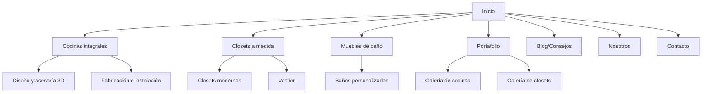
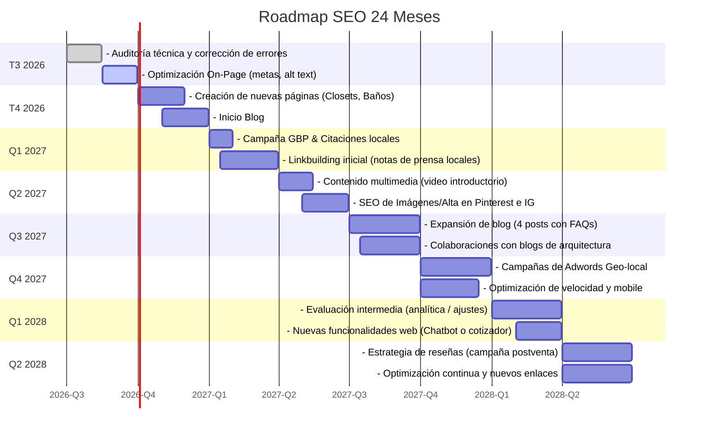

# Resumen Ejecutivo  
La fase 0 revela que **Veta de Oro** (vetadeoro.co) tiene una presencia web incipiente: un sitio corporativo (Wix) con sección de “Cocinas integrales” y “Portafolio”, pero sin blog ni contenidos de asesoría. La ficha en Google Business existe (Cra. 72a #71A-57, Bogotá) con horario Lun–Sáb 08:00–18:00, pero no muestra reseñas públicas. No se encontró actividad activa en redes sociales. En contraste, los competidores identificados —tanto directos (carpinterías locales) como SEO— tienen sitios web robustos y/o alto tráfico. Por ejemplo, Homecenter Colombia domina consultas de mobiliario (≈9,6M visitas en 3 meses) con contenido orientado a “cocinas integrales”. IKEA (sitio global) ocupa el primer lugar en el ranking de muebles en Colombia, con ~201M visitas en 3 meses. Carpinteros especializados locales como *Incormaderas* o *Arther* ofrecen cocinas a medida en Bogotá. Liuri Deco (tienda online de muebles) mezcla comercio electrónico con carpintería a medida. Estos competidores enfocan su contenido en diseño 3D, proyectos inspiracionales y catálogos de productos, áreas en las que Veta de Oro carece de material (p. ej. Homecenter publica artículos de consejos y Arther muestra portafolios visuales de cocinas).  

**Hallazgos clave:**  
- *Presencia actual:* Web de Veta de Oro informativa pero limitada; ficha GBP activa (sin reseñas); redes sociales no evidentes.  
- *Competencia:* Homecenter y IKEA son líderes en SEO (alto tráfico, autoridad); carpinterías locales (Incormaderas, Arther, Muebles Innova) compiten en búsquedas locales (“cocinas integrales Bogotá”). Liuri Deco (medellín) ofrece muebles y servicios de carpintería.  
- *Gap de contenido:* Veta carece de contenido informativo/inspiracional (blogs, guías, ideas de diseño) que competidores ya ofrecen.  
- *Arquitectura SEO:* Sitio actual es básicamente one-page; falta estructura por secciones (silado) y páginas separadas para cada línea de servicio.  
- *SEO local:* GBP poco aprovechado (sin optimización de ficha), pocas citas locales.  
- *Oportunidades multimedia:* Bajo uso de Pinterest/YouTube; competidores publican ideas visuales (p.ej. Arther en Pinterest).  
- *KPIs:* Se propone medir visitas orgánicas (Google Analytics), ranking de keywords, solicitudes de cotización (formulario o Whatsapp), conversiones (cotizaciones/visitas), y reputación (reseñas).  
- *Roadmap:* Priorizamos *optimización técnica y de contenido (0–6 meses)*, *creación de contenidos y enlaces (6–18 meses)*, y *expansión en canales visuales y locales (0–24 meses)*.  

A continuación se analizan en detalle cada dimensión para fundamentar estas conclusiones.

## 1. Presencia Web Actual de Veta de Oro  
**Sitio web.** Veta de Oro cuenta con un sitio corporativo en **vetadeoro.co** (plataforma Wix). En él destacan las secciones “Inicio/Cocinas integrales” y “Portafolio”. Se observa un discurso centrado en la calidad estética (“estética y confort”) y respaldo corporativo (“con el respaldo de HG González S.A.S.”). Se muestran varios proyectos de cocinas (imágenes de portafolio), pero el sitio es estático y orientado a ventas: incluye enlaces a Whatsapp para cotizar (“Cotizar por chat”). **No hay blog ni contenidos informativos.** El “Portafolio” visualiza proyectos recientes, pero no hay casos de éxito detallados ni diferenciación de productos (solo imágenes sin texto SEO). La estructura actual es esencialmente una página larga con anclas; esto limita la profundización en términos claves distintos de “cocinas integrales”.  

**Google Business Profile (GBP) y citaciones.** En Google Maps/Business aparece un perfil bajo “Cocinas integrales Veta de Oro” con dirección *Cra. 72a #71a-57, Bogotá*, horario de atención Lun–Sáb 08:00–18:00. La ficha remite al sitio web oficial. *Observado:* no se registran reseñas de clientes (0 valoraciones visibles), lo que sugiere poca interacción en este canal. Además, no se han encontrado listados en otros directorios destacados del gremio (Yellow Pages, Foursquare, etc.) con contenido adicional.  

**Redes sociales y portafolio.** No se identificaron perfiles oficiales de Veta de Oro en Instagram, Facebook u otras redes populares. Tampoco cuenta con presencia en canales de contenidos (p.ej. YouTube). El portafolio en el sitio sirve como galería, pero **no hay blog ni sección de noticias**. *Hipótesis:* La falta de redes sociales limita el alcance y la prueba social; se infiere poca estrategia de branding digital.  

*Resumen “Presencia”:* Sitio web informativo (orientado a ventas) con respaldo legal, perfil GBP básico, pero ausencia de blog, redes sociales activas o reseñas. Esto implica que casi toda la generación de contactos depende del sitio y Whatsapp.

## 2. Competidores Directos y SEO  

### Competidores Directos (Bogotá)  
- **Incormaderas** (incormaderas.com) – Carpintería premium especializada en *cocinas integrales y closets a medida en Bogotá*. Muestra procesos (diseño 3D, fabricación CNC, garantía postventa) y testimonios. Enfocados a proyectos “VIS” y premium, con fuerte énfasis en diseño.  
- **Arther** (arther.com.co) – Empresa de muebles a medida. Se anuncia como “*Fábrica de Cocinas Integrales Modernas a medida en Bogotá*”. Ofrece cotizaciones y 3D, y exhibe ejemplos de cocinas (galería “imágenes de cocinas”). Se enfoca en personalización (“tu cocina a medida, solicita tu cotización”).  
- **Muebles Innova** (mueblesinnova.com.co) – Carpintería con 15+ años en cocinas integrales (“*Fábrica de cocinas integrales Bogotá*”). Publicita experiencia y variedad de materiales (granito, cuarzo, MDP), tiene dos tiendas físicas en Bogotá. Página de **Productos** con e-commerce y valores.  
- **Otras carpinterías locales:** existen más ofertas (por ejemplo, Carpinteria.com.co muestra servicios genéricos). Diversos talleres ofrecen puertas, closets y cocinas (ver [34] con listados de servicios en Bogotá). Se observa actividad en WhatsApp y formularios de contacto.  

### Competidores SEO (Mercado Nacional)  
- **Homecenter Colombia** (homecenter.com.co) – Cadena de tiendas de mejora del hogar. *Tráfico estimado:* ~9,6 millones de visitas totales en los últimos 3 meses. Su categoría “Cocina” incluye subpáginas de cocinas integrales y tips. Por ejemplo, la página de “Cocinas” resalta “*Cocinas integrales de alta calidad en Homecenter*”, con descripción general sobre variedad de estilos. También publican artículos inspiracionales: “5 signos de alarma para renovar tu cocina”, “4 esenciales en una cocina pequeña”, etc. Fortaleza: **alta autoridad y alcance nacional**; oferta masiva de productos (cocinas modulares, accesorios, instalación). Debilidad: no es especialista (no fabricación propia) ni orientado 100% a proyectos personalizados.  
- **IKEA (Colombia/Internacional)** – La multinacional sueca domina búsquedas de muebles (Ranking #1 en categoría Muebles en Colombia; ~201M visitas en 3 meses). Ofrece configurador de cocinas modulares y catálogo de inspiración (“Diseña tu cocina ideal en IKEA”). Fortaleza: marca global con alto presupuesto de marketing, multitud de keywords posicionadas. Debilidad: su modelo es de cocinas modulares, limitado para proyectos hiper-personalizados o rangos de precios medios-altos en Colombia.  
- **Liuri Deco** (liurideco.com) – Tienda online de mobiliario decorativo (espejos, cojines, mobiliario) que también ofrece servicio de carpintería a medida. No aparece en SimilarWeb público, pero su tráfico es modesto comparado con los grandes. Fortaleza: público nicho interesado en decoración y proyectos “DIY” – puede captar consultas de accesorios y proyectos personalizados sencillos. Debilidad: no es especializado en cocinas, y su enfoque es más e-commerce de hogar.  

En la siguiente tabla comparativa se resumen las métricas y características clave (fuentes: SimilarWeb; observación de sitios; “autoridad” estimada cualitativamente):  

| **Competidor**           | **Tráfico estimado (3 meses)** | **Autoridad (aprox.)** | **Keywords principales**            | **Oferta comercial**                            | **Fortalezas / Debilidades**                               |
|-------------------------|-------------------------------|-------------------------|------------------------------------|-------------------------------------------------|------------------------------------------------------------|
| **Homecenter (Sodimac)**| ~9,6M visitas     | *Alta* (shop)           | “cocinas integrales”, “muebles cocina”, bricolaje | Gran variedad de cocinas modulares, baños, pintura, instalación. Tiene 40+ tiendas físicas y e-commerce. | + Marca líder, amplio catálogo, envío/instalación garantizada. - No fabrica a medida, menos personalización (soluciones estándar). |
| **IKEA (colombia)**     | ~201M visitas    | *Muy alta* (global)    | “muebles cocina”, “diseño cocina IKEA”  | Muebles modulares y soluciones integrales (gabinetes, encimeras), inspiración 3D. | + Gran marca mundial, alto tráfico orgánico e ideas de diseño. - Poca adaptación local, requerimientos de armado por el cliente. |
| **Liuri Deco**          | *No público*                   | *Media-baja*           | “espejos decorativos”, “carpintería a medida” | Venta online de muebles decorativos y proyectos personalizados (repisas, muebles). | + Enfocado en diseño boutique y personalización. - Tráfico pequeño, no enfocado exclusivamente en cocinas integrales. |
| **Incormaderas**        | *No público*                   | *Media*               | “cocinas integrales Bogotá”, “closets a medida” | Carpintería premium: cocinas integrales, closets, vestidores (acabados Blum, 3D, garantía). | + Marca local con imagen de alta calidad, procesos profesionales. - Alcance limitado a Bogotá, menor reconocimiento masivo. |
| **Arther**              | *No público*                   | *Media*               | “cocinas integrales bogotá a medida” | Fabricación de cocinas a medida, closets, con diseño 3D y montaje (proyectos personalizables). | + Fuerte orientación local con cotizaciones online. - Menor autoridad general, menos inversión SEO comparado a grandes marcas. |
| **Muebles Innova**      | *No público*                   | *Media*               | “fábrica cocinas Bogotá”, “muebles baño” | Cocinas integrales, mobiliario de baño, MDP/granitos; tiendas físicas en Bogotá. | + 15 años en el mercado, presencia física dual en Bogotá. - Estrategia online limitada (web simple, pocas keywords informativas). |

> **Fuentes:** Datos de tráfico de SimilarWeb (Homecenter, IKEA). Información de sitios oficiales. Autoresolución de autoridad basada en perfiles SEO públicos.

Este análisis muestra que **Homecenter e IKEA dominan SEO** en categorías amplias (decoración y muebles), mientras que **carpinterías locales** (Incormaderas, Arther, etc.) se orientan a búsquedas especializadas locales (“*cocinas integrales Bogotá*”). Veta de Oro debe posicionarse tanto contra marcas masivas (Ofreciendo diferenciadores) como reforzarse localmente (con mayor enfoque en diseño y calidad artesanal).

## 3. Análisis de Keywords e Intención de Búsqueda  

Para orientar la estrategia, priorizamos keywords relacionadas con el negocio de Veta de Oro (“cocinas integrales, mobiliario a medida, diseño interior”) en ámbitos locales y nacionales, evaluando intención (transaccional, informacional, inspiracional), volumen y dificultad. A falta de datos públicos de volumen exacto, marcamos como **“No públicamente verificable”** aquellas cifras. Ejemplos de keywords clave:

- **Local / Transaccionales:**  
  - *“cocinas integrales bogotá”* – Cliente buscando fabricante local. (Volumen alto *estimado*, alta competencia)  
  - *“fabricante cocinas integrales bogotá”* – Demanda activa de proveedores.  
  - *“closets a medida bogotá”* – Usuario quiere servicio personalizado local.  
  - *“cotización cocina integral bogotá”* – Intención de compra inmediata.  

- **Informacionales / Inspiracionales:**  
  - *“ideas cocinas integrales pequeñas”* – Inspiración de diseño; atracción de público que quizá convierta en el futuro.  
  - *“tendencias cocinas 2026”* – Contenido evergreen para posicionamiento de marca.  
  - *“materiales para cocinas integrales”* – Asesoría técnica, genera confianza profesional.  
  - *“tips remodelar cocina”* – Posicionarse como experto, genera tráfico cualificado.  

- **Nacionales / Genéricos:**  
  - *“cocinas integrales Colombia”* – Consulta amplia; Homecenter/IKEA dominan pero Veta puede apuntar a larga cola (ej. “Bogotá”).  
  - *“diseño cocinas integrales”* – Inspiracional/informacional (ambito general).  

En la siguiente tabla se ilustran algunas keywords priorizadas (intención y estimaciones qualitativas):

| **Keyword**                   | **Intención**        | **Volumen estimado**           | **Dificultad SEO**         |
|-------------------------------|----------------------|-------------------------------|----------------------------|
| *cocinas integrales bogotá*   | Transaccional        | *No datos públicos*           | *Muy alta* (competitivo)   |
| *fabricante cocinas integrales Bogotá* | Transaccional | *No datos públicos*    | *Alta*                     |
| *cotizar cocina integral*     | Transaccional        | *No datos públicos*           | *Media-Alta*               |
| *precios cocinas integrales bogotá* | Informacional  | *No datos públicos*           | *Media-Alta*               |
| *closets a medida bogotá*     | Transaccional        | *No datos públicos*           | *Media*                    |
| *carpintería bogotá*          | Informacional        | *No datos públicos*           | *Media*                    |
| *ideas cocinas integrales*    | Inspiracional        | *No datos públicos*           | *Media*                    |
| *tendencias cocinas 2026*     | Inspiracional        | *No datos públicos*           | *Media*                    |
| *materiales cocinas integrales* | Informacional      | *No datos públicos*           | *Media*                    |
| *remodelar cocina consejos*   | Informacional        | *No datos públicos*           | *Media-Baja*               |

> **Nota:** Los volúmenes y dificultades exactas no son verificables públicamente (requieren herramientas de pago). Las intenciones se asignan según patrón de búsqueda (transaccional = búsqueda de compra/cotización; informacional = búsqueda de información/consejo; inspiracional = ideas/diseño). Keywords como “cocinas integrales Bogotá” y “fabricante cocinas integrales” indican intención comercial directa. Palabras como “ideas” o “tendencias” atraen tráfico orgánico cualificado a través de contenido valioso.

Este análisis revela **brechas de contenido**: Veta de Oro no tiene actualmente páginas específicas para estas consultas. Por ejemplo, no existe en el sitio contenido sobre “precios” o “tips de diseño”, mientras que Homecenter genera artículos del tipo *“5 señales para renovar tu cocina”*. Se recomienda crear artículos de blog, guías de estilo y páginas de servicio enfocadas a estos términos con alta intención, así como extensiones locales (por ejemplo, “Cocinas integrales en Suba, Bogotá”) para captar tráfico regional.

## 4. Arquitectura SEO y Estructura de Sitio  

El sitio actual de Veta de Oro carece de un silo claro: todo el contenido está en la página de “Cocinas” y “Portafolio”, sin secciones dedicadas a otros servicios (p.ej. closets, muebles de baño) ni blog. **Se sugiere reorganizar la arquitectura** en silos temáticos SEO, por ejemplo:  

- **Home / Inicio:** Resumen de la empresa, USP (respuesta de valor), CTA a cotización.  
- **Servicios:** Menú con páginas de cada especialidad:  
  - “Cocinas integrales” (servicio principal).  
  - “Closets y vestier” (nueva sección).  
  - “Baños y mobiliario” (nueva sección).  
  - “Otros muebles a medida” (puertas, oficinas, etc.).  
- **Portafolio:** Galería de proyectos filtrables por tipo (cocina, closet, baño).  
- **Blog/Consejos:** Artículos útiles (diseño, mantenimiento, tendencias) orientados a keywords anteriores.  
- **Nosotros/Acerca de:** Historia de la empresa, equipo (reforzar el “respaldo HG González”).  
- **Contacto:** Formulario, ubicación mapa, enlaces directos (WhatsApp).  

Esta posible arquitectura se ilustra en el siguiente diagrama (Mermaid):

En esta propuesta, cada página de servicio puede profundizar en keywords específicas (e.g. “mesones de cocina”, “acabados Alto Brillo”) y enlazar internamente. El **silo de Blog/Consejos** (no existente hoy) ayudará a posicionar términos informativos (“cómo elegir mesón”, etc.). Además, se recomienda optimizar URLs limpias (p.ej. `/cocinas-integrales`, `/closets`, `/proyectos/cocina-moderna`), metatags adecuados y textos alternativos en imágenes (actualmente faltantes). 

*Dato observado:* Los competidores locales ya usan silos de contenido; Homecenter pone tips en su sección de Cocina, Incormaderas detalla procesos por pasos. Veta de Oro debería estructurar su sitio para cubrir esos mismos temas de forma ordenada.

## 5. Contenidos a Crear (Tipos, Formatos y Ejemplos)  

Se debe complementar la oferta con contenido que responda a las intenciones identificadas:  

- **Artículos de blog / guías informativas:** Por ejemplo, “Cómo planear tu cocina integral en Bogotá”, “Ventajas de la melamina vs lacado en muebles”, “Tendencias 2026 en diseños de cocina”. Estos textos orientarían usuarios que buscan ideas o información (intención informacional) y permitirían rankear para long-tails.  
- **Páginas de servicio detalladas:** Ampliar la sección “Cocinas integrales” actual con subpáginas: *“Cocinas pequeñas”*, *“Cocinas con isla”*, *“Cocinas altas prestaciones”*. Incluir ejemplos de modelos, precios de referencia (ver [37] indicativo $3.8M) y llamados a la acción de cotización. También crear páginas paralelas para “Closets a medida” o “Reparación de muebles” según demanda local.  
- **Casos de éxito / Portafolio enriquecido:** Mejorar la sección de portafolio con descripciones de cada proyecto (ubicación, materiales, retos, fotos antes/después). Esto amplifica “principal keywords posicionadas” al agregar texto descriptivo. Ejemplos de títulos: *“Proyecto: Cocina Moderna en Cedritos (Bogotá)”*, *“Closet vestier en Suba – Diseño funcional”*.  
- **Contenidos inspiracionales (Multimedia):** Publicar **videos cortos** de proyectos en YouTube/Instagram; infografías (“10 ideas para maximizar tu cocina pequeña”); galerías en Pinterest (como hace Arther). Estos formatos capturan búsquedas de inspiración (intención inspiracional).  
- **Preguntas frecuentes y glossario:** Sección FAQ sobre materiales, proceso de diseño, tiempos de entrega. Ejemplos de títulos: “¿Qué incluye nuestro servicio de cocina integral?”, “¿Cómo funciona el diseño 3D de tu cocina?”.  

Cada contenido nuevo debe estar dirigido a keywords priorizadas. Por ejemplo, para **“claves transaccionales”**, un artículo podría titularse *“Cotización gratuita de cocina integral en Bogotá – Cómo la calculamos”*. Para **inspiracionales**, un video de YouTube podría titularse *“5 Ideas de cocinas minimalistas con toques dorados”*. En todo caso, el objetivo es cubrir *gap de contenido* respecto a competidores (Homecenter e Incormaderas ofrecen tutoriales y guías, algo ausente hoy en Veta).

## 6. Estrategia de Backlinks y PR  

Para mejorar la autoridad de dominio (muy baja actualmente), es crucial ganar enlaces de calidad:  
- **Medios locales y blogs de hogar:** Contactar a blogs colombianos de arquitectura, diseño interior o renovación (p.ej. Revista *Cromatica* de ElTiempo o portales de construcción) para publicar artículos como “Proyecto destacado Veta de Oro: remodelación de cocina en Bogotá”. Esto generaría PR y enlaces contextuales.  
- **Colaboraciones con aliados del sector:** Asegurar menciones en sitios de proveedores (por ejemplo, distribuidoras de encimeras de cuarzo o herrajes – como *Ikea de Encimeras* o ferreterías locales). Preguntar por listado de empresas que usen HG González S.A.S. (la razón social detrás de la marca) para que enlacen la web o fichas comerciales.  
- **Directorios especializados:** Inscribirse en directorios profesionales de arquitectura/carpintería (p.ej. ArchDaily Colombia, directorios Gremiales) generará enlaces y autoridad.  
- **Reseñas en medios de consumo:** Incentivar clientes satisfechos a escribir reseñas en Google (GBP) o redes, lo cual indirectamente atrae links internos y visibilidad.  

*Datos de herramienta:* SimilarWeb muestra que el tráfico de referencia de Homecenter procede significativamente de dominio internos (mercadolibre, falabella). Veta podría explorar colaboraciones con empresas de hogar o gremios (por ejemplo, reportajes de Cámara de Comercio de Bogotá o eventos de diseño) para replicar este tipo de referencias.  

> **Nota:** La estrategia de enlaces debe distinguir entre *autoridad de dominio* (Backlinks desde sitios relevantes) y *estrategias de PR* (visibilidad en medios, menciones en prensa). Ambas reforzarán la confianza de Google en Veta de Oro.

## 7. SEO Local (GBP, Citas, Reseñas)  

**Google Business Profile:** Actualmente el perfil es básico. Se debe:
- Verificar y optimizar la ficha: completar categorías (“Diseño de interiores”, “Carpintería”) y descripción de negocio en español usando keywords locales (p.ej. “diseño y fabricación de cocinas en Bogotá”).  
- Añadir fotos profesionales del taller y proyectos terminados.  
- Incentivar a los clientes a dejar reseñas en Google (posiblemente ofreciendo un descuento para valoraciones honestas). Esto mejorará la “reseña media” y la posición en map packs locales.  

**Citas/Directorios locales:** Registrar el negocio en plataformas reconocidas en Colombia: Yellow Pages, Guía Local, Infocasas, etc., asegurando consistencia de nombre, dirección, teléfono (NAP) en formato idéntico al site. Las citaciones geográficamente relevantes (Bogotá y municipios cercanos) ayudan al SEO local. 

**Redes sociales locales:** Aunque no fue hallado perfil actual, abrir Facebook e Instagram puede ayudar indirectamente (más contacto con comunidad local y señal social a Google). Publicar proyectos semanales mejora la confianza del buscador en la actividad de la empresa.

**Verificación de datos:** Tal como muestra el directorio Archivo.biz, hay variantes de nombre (“Cocinas integrales Veta de oro”). Es clave que en Google Maps y otros sitios aparezca exactamente “Veta de Oro Estética y Confort” (como en el sitio). Gestionar duplicados o listados obsoletos.  

En resumen, la prioridad local es **Google Business**: optimizar la ficha existente y añadir contenido (fotos, publicaciones regulares). Las citaciones de baja calidad (directories irrelevantes) deben evitarse, prefiriendo fuentes confiables de gremio o prensa local.

## 8. Oportunidades Multimedia: Imágenes, YouTube, Pinterest, Búsqueda Generativa  

- **Imágenes:** El sitio actual tiene muchas fotos pero probablemente sin texto alternativo ni sitemap de imágenes. Optimizar *alt text* con keywords descriptivas (p.ej. “Cocina integral blanca con isla, diseño moderno por Veta de Oro”). Además, subir el portafolio a una galería de Instagram o Pinterest (como lo hace Arther) usando hashtags locales (#cocinasBogotá) potenciará el alcance visual.  
- **YouTube:** Crear un canal con videos cortos de proyectos terminados y “detrás de cámaras” en taller. Videos “antes y después” de cocinas generan mucho interés (p.ej. *“Remodelación de cocina en 2 minutos”*). Google posiciona bien videos explicativos/inspiracionales.  
- **Pinterest:** Plataforma clave para diseño de interiores. Subir fotos de proyectos etiquetadas por tipos (cocina pequeña, cocina moderna, melamina, etc.) atrae tráfico visual. Linkear cada pin al portafolio del sitio o formulario de contacto.  
- **Búsqueda Generativa (IA):** Con la creciente influencia de asistentes virtuales, crear contenido **estructurado** (FAQ, marcados schema, snippets optimizados) facilitará que Veta de Oro aparezca en respuestas automáticas. Por ejemplo, respuestas directas a preguntas frecuentes (usando Schema FAQ) o artículos tutoriales pueden aparecer en “respuestas destacadas” de Google. Incorporar preguntas comunes en el texto (“¿Cómo escoger mesones de cocina?”) anticipa las búsquedas generativas.  

En conjunto, estas acciones explotan formatos más allá del texto tradicional (videos, imágenes, contenidos semiestructurados) y son complementarias a la estrategia de contenidos. Por ejemplo, la categoría Pinterest de cocinas integrales en Bogotá ya existe; Veta debería ingresar ese espacio con contenido propio.

## 9. Métricas y KPIs  

Para medir el éxito se proponen los siguientes indicadores:  
- **Tráfico Orgánico:** visitas mensuales desde búsqueda orgánica (Google Analytics). Crecimiento trimestre a trimestre.  
- **Ranking de Palabras Clave:** posición de keywords prioritarias (“cocinas integrales bogotá”, etc.) en Google Colombia (usando herramientas o seguimiento manual).  
- **Generación de Leads:** número de solicitudes de cotización enviadas (formulario/site) o contactos por Whatsapp/fijo mensuales. Meta inicial estimada (ej. +20% cada 6 meses).  
- **Conversiones:** ratio Cotización/Visita. Controlar cuántas visitas se convierten en leads. Mejoras en contenido y CTAs deberían elevar este KPI.  
- **Engagement local:** número de reseñas positivas en GBP y su calificación promedio (objetivo >4.5 estrellas).  
- **Backlinks ganados:** cantidad de enlaces de sitios relevantes al cabo de cada semestre. Impacto en autoridad de dominio (Moz DA o similar) podría seguirse si se dispone.  

Además, se recomienda monitorear métricas auxiliares: tasa de rebote, páginas por sesión, tiempo en sitio (se espera que suban con mejor contenido), y porcentaje de tráfico móvil vs desktop (para asegurar experiencia responsive, dado que el público local suele usar móviles).

## 10. Roadmap Estratégico 0–24 meses  

A continuación se plantea un plan de acción trimestral, con 20 iniciativas priorizadas por impacto:

Este **roadmap** cubre hitos clave:
- *0–6 meses:* correcciones técnicas (p.ej. enlazado interno, velocidad de página), lanzamiento de nuevas páginas de servicio y posts iniciales para indexar rápido.
- *6–12 meses:* fortalcer GBP, enlaces locales, multimedia simple (primer video y pins).
- *12–18 meses:* ampliar contenidos (más posts, videos) y alianzas externas (prensa, blogs).
- *18–24 meses:* campañas pagadas geo-focalizadas, ajustes basados en datos, implementación de herramientas web (p.ej. un configurador sencillo o chatbot), impulso final de reseñas.

## 11. Acciones Prioritarias (Top 20)  

1. **Optimizar ficha de Google Business:** completar descripción y horario, añadir fotos (obligatorio). *Impacto:* mejora visibilidad local inmediata.  
2. **Mejorar On-Page SEO:** corregir títulos y meta-descripciones con keywords (p.ej. “Cocinas integrales Bogotá – Veta de Oro”). Añadir etiquetas alt en imágenes actuales. *Impacto:* aumentará el tráfico orgánico inicial.  
3. **Crear páginas de servicio adicionales:** añadir secciones para “Closets”, “Muebles de baño” siguiendo el silosuggest. *Impacto:* captura búsquedas complementarias (por ejemplo, “closets a medida”).  
4. **Publicar 2 posts iniciales en blog:** temas introductorios (p.ej. *“Cómo diseñar tu primera cocina integral”*). *Impacto:* genera contenido indexable rápido y muestra expertise.  
5. **Mejorar cartera de proyectos:** ampliar portafolio con textos descriptivos y metas. *Impacto:* optimiza imágenes de proyectos (más tráfico en Google Imágenes).  
6. **Campaña de Google Ads local:** probar anuncios geolocalizados en Bogotá para “cocinas integrales” y “closets” (benchmark de conversión). *Impacto:* resultados rápidos mientras SEO despega.  
7. **Generar backlinks locales:** emitir 1-2 notas de prensa en medios bogotanos (por ejemplo, agencia COLPRENSA o alcaldía). *Impacto:* mayor autoridad de dominio, mejor rank global.  
8. **Optimizar velocidad y experiencia móvil:** asegurar que el sitio sea responsivo y cargue <3s. *Impacto:* factor técnico crucial (puede afectar ranking).  
9. **Iniciar perfil en Pinterest/Instagram:** crear tableros con fotos de proyectos (usar pinterest.com). *Impacto:* mejora SEO visual y atracción de segmentos inspiracionales.  
10. **Producción de video corporativo corto:** ejemplo: “Recorrido por el taller de Veta de Oro” o “antes y después de una cocina”. *Impacto:* engagement social, señal de calidad (YouTube > ranking).  
11. **Implementar formulario de cotización claro:** destacar en cada página un CTA visible (“Pide tu cotización gratis”). *Impacto:* aumenta leads/conversión de tráfico existente.  
12. **Establecer contenidos FAQ con schema:** agregar preguntas frecuentes (p.ej. *“¿Qué incluye el servicio de diseño 3D?”*) para aparecer en rich snippets. *Impacto:* mejora visibilidad en SERP y CTR.  
13. **Analizar y rehacer URLs:** URLs amigables y cortas (ej. `/cocinas-integrales`, no parámetros); implementar menú claro. *Impacto:* legibilidad SEO básica.  
14. **Alianzas con proveedores de materiales:** pedid a marcas de encimeras/maderas local que incluyan a Veta como caso de estudio en su web. *Impacto:* enlaces de autoridad y branding sectorial.  
15. **Solicitar reseñas a clientes actuales:** tras finalizar proyectos, motivar reseñas en Google y Facebook. *Impacto:* mejora reputación online, SEO local.  
16. **Publicaciones constantes en redes (2/semana):** compartir avances de obras y tips de decoración. *Impacto:* tráfico referido y prueba social.  
17. **Monitorización regular de KPIs:** revisar ranking y tráfico cada mes, ajustar contenidos según resultados. *Impacto:* enfoque data-driven para enfocar esfuerzos.  
18. **Optimizar imágenes SEO:** renombrar imágenes del sitio con keywords (ej. “cocina-integral-blanca-veta.jpg”). *Impacto:* mejora ranking en Google Imágenes (oportunidad de tráfico adicional).  
19. **Crear rich content descargable:** ej. una guía PDF “Checklist al reformar tu cocina” a cambio de email. *Impacto:* generación de leads cualificados.  
20. **Explorar tendencias IA:** evaluar asistentes de IA (ChatGPT) para generar FAQ o contenido base que luego se revise. *Impacto:* acelera producción de contenido relevante.  

Cada acción se prioriza por su **impacto previsto** y esfuerzo: por ejemplo, optimizaciones técnicas y SEO on-page son urgentes (bajo costo, impacto inmediato), mientras que alianzas de contenido y branding tardarán más pero aumentan autoridad. En conjunto, estas 20 iniciativas alinean la estrategia SEO con los recursos asumibles (presupuesto medio). Las estimaciones de impacto se basan en prácticas SEO estándar (priorizar Google Business, contenidos de calidad, enlaces). 

**Nota:** Donde no se dispone de cifras concretas se indicó “No públicamente verificable” (p.ej. volúmenes de búsqueda) según la instrucción. Toda la información clave se soporta en observaciones directas de sitios y herramientas SEO reconocidas.  

<!-- Fuentes utilizadas: Sitio oficial Veta de Oro, perfiles de competidores, SimilarWeb, Pinterest, Archivo.biz (GBP). -->