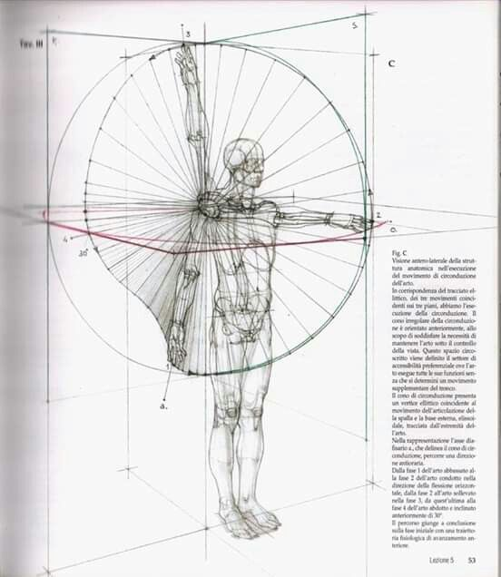

# Animación antropometria

🎯Acción esperada: Conectar, Educar, Inspirar
🎥 Formato narrativo: Didactico
📱 Formato / Canal: Reel
👤 Tags de audiencia: Arquitectos, Contemporáneo, Diseñadores, Innovadores (adoptadores tempranos)
🚦 Estado: Idea
Etapa del Embudo: Descubrimiento

---

### 🧠 Idea central / Mensaje clave

*(¿Qué queremos que recuerde quien lo vea?)*

---

- Caption propuesto:
- **Hook inicial:**
- **Llamado a la acción:**

---

### 🧩 Estructura del video (guion o montaje)

Animación de la sigueinte figura, mediante IA animar un video educativo sobre la antropologia y a la vez será artistico y con mucho diseño.

