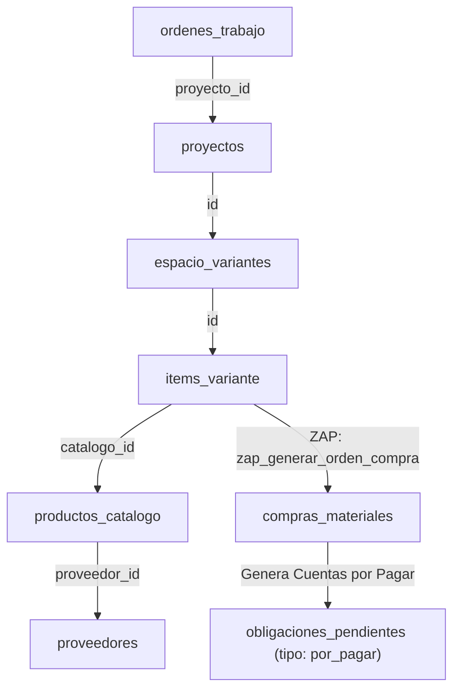

# 📐 Diseño de Detalle: Módulo de Producción (Ficha Técnica Tabulada en Diálogo Modal)

Este documento detalla la reestructuración de la ficha de producción en el Taller (`src/components/specialized/ProjectDetails.tsx`). Sustituimos el panel lateral anterior (`Sheet`) por un **Diálogo Modal Completo de Alta Densidad** (`Dialog` de ancho completo `max-w-6xl` o `w-[92vw]`), optimizando el espacio horizontal para el visor 3D y la planilla interactiva de tipo "Sheets", reduciendo la fatiga operativa del operario en el taller.

---

## 🎯 1. Principios de Diseño y Ergonomía Cognitiva

De acuerdo con **[INS_ergonomía cognitiva para el diseño de experiencia.md](file:///c:/Users/javir/Documents/DEVs/empresa_muebles_clone/AGNOSTIC_RESEARCHS.md/INS_ergonom%C3%ADa%20cognitiva%20para%20el%20dise%C3%B1o%20de%20experiencia.md)**:
1.  **Foco Cognitivo Absoluto (Fitts & Gibson):** Al utilizar un overlay modal completo (`Dialog` con backdrop oscuro) en lugar del panel lateral, eliminamos las distracciones visuales del Kanban de fondo. Esto asegura que el carpintero centre el 100% de su atención en los despieces, notas y planos.
2.  **Optimización Horizontal de Planillas (Reflow & Zoom):** El ancho expandido de `max-w-6xl` reduce la necesidad de scroll horizontal en la cuadrícula de insumos, permitiendo visualizar de un vistazo el SKU, cantidades, notas de compra y casillas de anulación de forma simultánea.
3.  **Accesibilidad Cognitiva (Brusilovsky):** Excluimos del módulo de taller toda información financiera, precios unitarios o márgenes comerciales. El carpintero solo visualiza dimensiones, SKUs, unidades y notas de armado, reduciendo la carga mental intrínseca del operario.

---

## 📁 2. Arquitectura de Componentes y Submódulos `.tsx`

Para mantener la cohesión y evitar la duplicación de código, definimos los componentes a utilizar, refactorizar o eliminar:

### A. Submódulos a Mantener / Reutilizar:
*   `src/components/specialized/Viewer3DModal.tsx`: Modal interactivo que renderiza el despiece tridimensional de los módulos del proyecto. Se invoca directamente desde la pestaña de Planos.
*   `src/components/specialized/cotizador/ApoyoTecnicoPanel.tsx`: Componente de carga de fotografías de obra, visitas técnicas y checklists. Se empotra tal cual en la pestaña 3.
*   `src/components/specialized/taller/SemaforoSuministrosBadge.tsx`: Badge indicador del estado de materias primas en inventario. Se conserva en el Header.

### B. Submódulos a Refactorizar / Modificar:
*   `src/components/specialized/ProjectDetails.tsx`: **Será reescrito por completo**. Pasa de ser una lista de tareas simple a convertirse en la Ficha Técnica Tabulada principal con el header persistente y las 3 pestañas operativas empotrada en un modal Dialog.

---

### 📋 Header Persistente (Contexto de Obra)
Se mantiene estático en la parte superior del panel lateral sin importar la pestaña seleccionada:
*   **Identificador:** Código de Orden (ej. `OT-2026-004`) y Nombre de Proyecto / Cliente.
*   **Semaforización:** `SemaforoSuministrosBadge` para conocer la disponibilidad de materiales.
*   **Dirección de Obra:** Texto legible con botón de copia rápida al portapapeles (`Copy` icon).
*   **Fecha de Entrega:** Fecha estimada destacada en color ámbar.
*   **Estado de Orden:** Un selector (`select` dropdown) de estado de la orden (`pendiente`, `en_proceso`, `instalacion`, `entregada`) para que el jefe de taller actualice el Kanban directamente desde el lateral.

---

### 🗂️ Pestaña 1: Planos, Espacios, 3D e Insumos (Módulo Sheets)
Mapea los datos físicos del proyecto usando los mismos esquemas de cotización e introduce la validación de materiales de taller:

1.  **Visualización Tridimensional e Insumos:**
    *   Botón "Ver Despiece 3D" (abre `Viewer3DModal`).
    *   Selector o acordeón de Espacios (`espacio_variantes`) del proyecto.
2.  **Módulo de Planillas (Spreadsheet/Grid de Insumos):**
    Presenta una cuadrícula interactiva tipo "Sheets" de todos los ítems (`items_variante`) pertenecientes a la variante activa del espacio seleccionado, agregando columnas de control técnico:
    *   **Ítem / Descripción / SKU / Cantidad:** Datos de solo lectura importados de la cotización original.
    *   **Columna "Notas de Compra":** Campo de texto editable donde el operario define requerimientos de adquisición (ej: *"Marca Blum original"*, *"Corte a veta horizontal"*).
    *   **Columna "Estado (Anular)":** Un interruptor o casilla de verificación para marcar el ítem como **Anulado** (`anulado: true`). Los ítems anulados se visualizan tachados y quedan excluidos del requerimiento final.
    *   **Acción "Agregar Ítem de Fabricación":** Permite al taller añadir una fila para un material imprevisto necesario en el armado (ej: herrajes de refuerzo, adhesivo extra), seleccionando del catálogo o ingresando un SKU temporal.
3.  **Botón de Envío: "Generar Orden de Compra"**
    *   Este disparador ejecuta el nuevo zap `zap_generar_orden_compra` a través de `/api/engine`. El Zap consolida y agrupa los insumos validados por el taller y crea los registros de compras y cuentas por pagar correspondientes.

---

### 📋 Pestaña 2: Tareas de Taller
Control operativo del proceso de fabricación física:
1.  **Lista de Tareas (`tareas_produccion`):**
    *   Muestra el listado de tareas pendientes de la Orden de Trabajo.
    *   Botones de control rápido: "Iniciar/Reactivar" (cambia a `en_progreso`), "Pausar" (`pausada`), y "Finalizar" (`completada`).
2.  **Asignación de Operario:**
    *   Un menú desplegable (`select`) cargado dinámicamente con los usuarios del equipo (`usuarios_equipo`) con rol de taller. Permite asignar o reasignar la tarea a un carpintero específico.
3.  **Agregar Tarea Rápida:**
    *   Un input simple y botón "Agregar" para registrar tareas de taller imprevistas o de última hora.

---

### 📎 Pestaña 3: Apoyo Técnico y Medidas de Obra
*   **Integración:** Renderiza directamente `<ApoyoTecnicoPanel proyectoId={order.data.proyecto_id} />`.
*   **Comportamiento:** Permite visualizar fotos de retoma cargadas por el equipo de diseño y registrar nuevas visitas técnicas o diagramas de apoyo.

---

## 🗄️ 4. Contrato de Datos, Zaps y Esquema Relacional

El módulo opera de manera completamente integrada con la base relacional del repositorio. El siguiente diagrama muestra la jerarquía y pertenencia:



### A. Esquemas de Sustento (Databases JSON)
1.  **`items_variante` (Esquema de Cotización):**
    *   *Uso:* Almacena las especificaciones de compra agregadas por el taller y el flag de anulación.
    *   *Propiedades dinámicas añadidas:* `notas_compra: string`, `anulado: boolean`, `compra_generada: boolean`.
2.  **`productos_catalogo` & `proveedores` (Catálogo Maestro):**
    *   *Uso:* Permite asociar los ítems de material a sus respectivos proveedores para agrupar las compras de forma automática.
3.  **`compras_materiales` (Esquema de Compras):**
    *   *Uso:* Registro maestro del requerimiento de materiales del proyecto para control del área de adquisiciones.
4.  **`obligaciones_pendientes` (Esquema Financiero):**
    *   *Uso:* Registra la cuenta por pagar resultante (`tipo: 'por_pagar'`) para que el flujo de tesorería apruebe los desembolsos.

---

## ⚡ 5. Zaps del Módulo y Flujos Financieros

### 🔌 Nuevo Zap: `zap_generar_orden_compra`
*   **Entrada (Payload):** `{ proyecto_id: string }`
*   **Comportamiento del Servidor:**
    1.  Consulta todos los espacios activos del proyecto y sus respectivos `items_variante`.
    2.  Filtra únicamente los ítems donde `anulado` no sea `true` y `compra_generada` no sea `true`.
    3.  Consulta los productos del catálogo (`productos_catalogo`) para resolver el `proveedor_id` y el costo sugerido (`precio_compra` o `costo_real`).
    4.  Agrupa los insumos por `proveedor_id`.
    5.  Para cada grupo de proveedor:
        *   Crea un registro de compra en `compras_materiales` (estado: `pendiente`, valor calculado = sumatoria de cantidades * costo unitario).
        *   Crea una obligación pendiente de pago en `obligaciones_pendientes` (`tipo: 'por_pagar'`, `estado: 'pendiente'`) con el valor total agrupado, cruzándolo con el `proveedor_id` para trazabilidad del área financiera.
    6.  Marca `compra_generada: true` en todos los ítems procesados del proyecto para evitar duplicidad de solicitudes de compra.

---

## ⚠️ 6. Análisis Axiomático: Vectores de Entropía y Banderas de Seguridad

De acuerdo con el Pensamiento de Diseño Axiomático, identificamos los siguientes riesgos y sus banderas de control para proteger la integridad operacional y financiera:

### 🚩 Vector A: Solapamiento de Edición Comercial vs Taller (Axioma 1 - Independencia)
*   **Riesgo:** Si un comercial edita o actualiza la cotización (cambiando cantidades o descartando espacios) al mismo tiempo que el taller está validando insumos y planos, se generará una pérdida de coherencia de datos, borrando notas de taller o anulaciones.
*   **Bandera de Mitigación:** **Bloqueo de Modificación Comercial.** Cuando el proyecto pasa a estado `'produccion'`, el formulario de edición de ítems en `CotizadorPro` se bloquea por completo. El comercial puede visualizar la cotización pero no mutarla. Cualquier cambio posterior requiere una solicitud de modificación controlada.

### 🚩 Vector B: Duplicación en Emisión de Compras
*   **Riesgo:** Si el jefe de taller hace clic repetidas veces en "Generar Orden de Compra", el sistema podría emitir múltiples órdenes de compra redundantes para los mismos materiales, duplicando las deudas en el sistema financiero.
*   **Bandera de Mitigación:** **Flag de Consolidación de Compra.** El Zap verifica y cambia el estado `compra_generada` a `true` a nivel de cada ítem y bloquea el botón en la interfaz una vez procesado, a menos que se añadan nuevos ítems manuales en fase de taller, los cuales se procesarían de manera incremental.

### 🚩 Vector C: Ítems Huérfanos de Proveedor
*   **Riesgo:** Si la orden incluye insumos no registrados en el catálogo o materiales de catálogo que no tienen asignado un `proveedor_id`, el algoritmo de agrupación fallará o creará compras sin destinatario.
*   **Bandera de Mitigación:** **Proveedor Comodín.** El Zap verifica si `proveedor_id` es nulo o vacío. Si lo es, asocia la compra al proveedor comodín "Compras Directas Taller" o "Por Asignar", permitiendo que el área de compras clasifique el gasto manualmente sin bloquear la orden de trabajo.

---

## 📐 7. Plano de UI Exacto (Diagramación, Layout y Ergonomía)

El diseño de maquetación e interacción de la Ficha de Taller se valida bajo los estándares de **[ERGONOMIA_COGNITIVA_CANVAS.md](file:///c:/Users/javir/Documents/DEVs/empresa_muebles_clone/storage/fork_doc/ERGONOMIA_COGNITIVA_CANVAS.md)** y **[INS_Pantallas responsive y CSS.md](file:///c:/Users/javir/Documents/DEVs/empresa_muebles_clone/AGNOSTIC_RESEARCHS.md/INS_Pantallas%20responsive%20y%20CSS.md)**.

### A. Diagramación de Layout (Estructura de Bloques ASCII)

```text
+-----------------------------------------------------------------------------+
| HEADER PERSISTENTE (Contexto de Obra)                                       |
| [OT #codigo] - [Nombre Proyecto / Cliente]          [Semaforo Suministros]  |
| Direccion: Calle 45 # 12-34 [Copy] | Entrega: 12-Ago-2026                   |
| Estado OT: [ Dropdown Selector (pendiente | en_proceso | entregada) ]        |
+-----------------------------------------------------------------------------+
| SELECTOR DE PESTAÑAS (Fácil Alcance / Confort Zone)                         |
|  [ PESTAÑA 1: Espacios & Insumos ]   [ PESTAÑA 2: Tareas ]   [ PESTAÑA 3: Apoyo ] |
+-----------------------------------------------------------------------------+
| CONTENIDO DE LA PESTAÑA ACTIVA (Scrollable Vertical)                         |
|                                                                             |
|  (Pestaña 1 Activa):                                                         |
|  +-----------------------------------------------------------------------+  |
|  | [Boton: VER MODELO 3D (Ancho completo, Altura 48px, Color Ambar)]     |  |
|  +-----------------------------------------------------------------------+  |
|  | Selector de Espacio: (x) Cocina   ( ) Baño Auxiliar   ( ) Vestier     |  |
|  +-----------------------------------------------------------------------+  |
|  | Planilla "Sheets" de Insumos (Scroll Horizontal, 1era Columna Sticky)  |  |
|  | Descripcion [Sticky] | SKU [St.] | Cantidad | Notas Compra | Anular   |  |
|  | ---------------------+-----------+----------+--------------+--------- |  |
|  | Meson Granito        | M-GR-002  | 2.5 mt   | [Input text] | [ ] Cas. |  |
|  | Bisagra Cierre Suave | B-CS- Blum| 12 un    | [Input text] | [ ] Cas. |  |
|  | + Agregar Insumo Manual de Taller...                                  |  |
|  +-----------------------------------------------------------------------+  |
|  | Especif. Fabricación (Markdown):                                      |  |
|  | [ Textarea para notas_markdown del Espacio (Max Width: 66ch) ]        |  |
|  +-----------------------------------------------------------------------+  |
|  | [ BOTON: GENERAR ORDEN DE COMPRA (Zona de Confort Central, H-12) ]    |  |
|  +-----------------------------------------------------------------------+  |
+-----------------------------------------------------------------------------+
```

### B. Especificaciones Técnicas de CSS y Adaptabilidad

1.  **Envoltura del Contenedor Principal (`ProjectDetails`):**
    *   Se maqueta dentro de un componente `DialogContent` de Shadcn UI de ancho ampliado (`max-w-6xl w-[92vw] h-[88vh] flex flex-col bg-white overflow-hidden p-0`).
    *   El cuerpo interno del contenido de la pestaña activa posee scroll vertical independiente (`flex-1 overflow-y-auto p-4 md:p-6 space-y-6`).
2.  **Maquetación del Grid "Sheets" de Insumos:**
    *   Para soportar la visualización responsiva e híbrida táctil en taller sin desbordamientos de CLS, la planilla de insumos se encapsula en una envoltura con desplazamiento horizontal:
        ```css
        .sheets-wrapper {
          overflow-x: auto;
          -webkit-overflow-scrolling: touch;
          border: 1px solid var(--stone-200);
          border-radius: 1rem;
        }
        ```
    *   **Columnas Pegajosas (Sticky Context):** Las celdas de identificación (Descripción del Ítem y SKU) se anclan de forma estática a la izquierda para mantener la legibilidad durante el scroll horizontal:
        ```css
        .col-sticky-item {
          position: sticky;
          left: 0;
          z-index: 10;
          background-color: rgb(255 255 255);
          border-right: 2px solid var(--stone-100);
        }
        ```
3.  **Matemática de Espaciados y Tipografía:**
    *   Evitamos escalones de media queries toscos. El espaciado interior se rige por variables fluidas:
        *   `padding` del diálogo: `clamp(1rem, calc(0.8rem + 1vw), 1.5rem)`.
        *   `font-size` del Header principal: `clamp(1.1rem, calc(0.95rem + 0.5vw), 1.35rem)`.
    *   La longitud de línea de las cajas de notas y especificaciones Markdown se acota con la directiva `max-w-[66ch]` (`max-inline-size: 66ch`) para propiciar el *Layer-Cake Scanning Pattern* y evitar el cansancio visual.

### C. Alineación Biomecánica y Objetivos Físicos (Thumb Zone)

1.  **Hit Targets Coarse (Táctiles):**
    *   Siguiendo la especificación ergonómica móvil (Google/Android `48x48dp`, Apple `44x44pt`), el botón "Ver Modelo 3D", las pestañas del selector, las casillas de verificación de anular y el botón final "Generar Orden de Compra" se declaran con una altura o área activa mínima de **48px** (`min-h-[48px]` o `h-12`).
    *   Los inputs del Sheets para escribir las *Notas de Compra* tienen un padding interior cómodo y una altura mínima de **38px** para interacción fluida en tablets de taller.
2.  **Amortiguación de Errores (Safety Margins):**
    *   Se establece una zona de amortiguación mínima de **12px** (`gap-3`) entre botones adyacentes (por ejemplo, el botón "Pausar" y "Finalizar" de la Pestaña 2) para evitar activaciones erróneas por fatiga del pulgar en condiciones de uso de taller (operación en movimiento o manos con guantes).
3.  **Alineación de Datos para Escaneo Rápido (Lawn-Mower Pattern):**
    *   Para optimizar la lectura tabular en zigzag:
        *   *Textos y Descripciones:* Alineados a la izquierda (`text-left`).
        *   *SKUs y Códigos:* Fuente monoespaciada compacta (`font-mono text-[10px] text-stone-400`).
        *   *Cantidades e Insumos:* Destacados a la derecha (`text-right font-semibold`).
        *   *Casillas de Estado / Anulación:* Centrados (`flex justify-center`).
