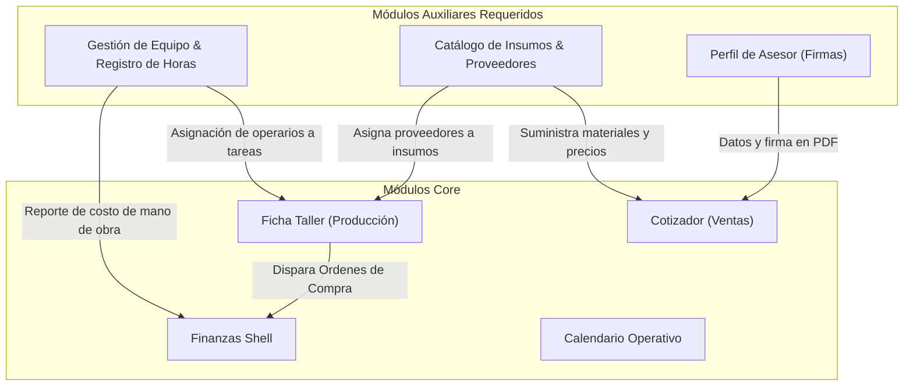

# 🗺️ Mapa de Módulos y Submódulos Auxiliares del ERP

Este documento contiene el inventario exhaustivo de los módulos y submódulos auxiliares del ERP Veta de Oro para dar cumplimiento al **[MANIFEST GOAL.MD](file:///c:/Users/javir/Documents/DEVs/empresa_muebles_clone/storage/fork_doc/MANIFEST%20GOAL.MD)**. Cruzamos el estado actual del repositorio, identificando qué piezas faltan para garantizar la operatividad de los flujos de Ventas, Producción y Finanzas.

---

## 📊 1. Inventario del Estado Actual (¿Qué existe hoy?)

| Módulo Core | Estado | Componente Principal | Ficheros Vinculados |
| :--- | :--- | :--- | :--- |
| **Comercial (Ventas)** | Maduración Alta | `CotizadorPro.tsx` / `ComercialKanban.tsx` | `src/components/specialized/cotizador/` |
| **Taller (Producción)** | Planificación / Diseño | Ficha Técnica Tabulada (`ProjectDetails.tsx`) / Canvas de Filas | `src/components/specialized/taller/` |
| **Finanzas (Cuentas)** | Maduración Media-Alta | `FinanzasShell.tsx` (Gestión de saldos, cuentas y egresos/ingresos) | `src/components/specialized/finanzas/` |
| **Calendario / Kronos** | Planificación | Vista agenda, cuadrícula y tareas cruzadas (`VetaCalendar.tsx`) | `src/components/specialized/calendar/` |

---

## 🧩 2. Módulos Auxiliares Faltantes (Roadmap de Integración)

Para que los sistemas principales funcionen sin lagunas de datos o manipulación directa de JSONs, se requieren los siguientes submódulos y pantallas de soporte:

### A. Módulo de Gestión de Equipo y Operarios (Recursos Humanos)
*   **Propósito:** Registrar al personal del taller y campo para poder asignar tareas de producción y calcular el costo de mano de obra real del proyecto.
*   **Submódulos a crear:**
    1.  `src/components/specialized/equipo/EquipoDirectory.tsx` (Ruta `/app/equipo`):
        *   Directorio y listado de personal (`usuarios_equipo`).
        *   Formulario de registro y edición: Nombre, Correo, Rol (Taller, Instalador, Comercial, Administración) y Costo por Hora (`costo_hora`).
    2.  `src/components/specialized/equipo/RegistroHoras.tsx` (Time Tracking):
        *   Widget donde un operario registra las horas dedicadas (`registro_horas`) a una tarea específica (`tareas_produccion`).
*   **Esquemas de Sustento:** `usuarios_equipo`, `registro_horas`.

### B. Módulo de Gestión de Catálogo Maestro y Proveedores (Adquisiciones)
*   **Propósito:** Evitar tener que dar de alta insumos o materiales editando archivos crudos. Permite alimentar las opciones de compra automáticas de taller.
*   **Submódulos a crear:**
    1.  `src/components/specialized/compras/ProveedoresDirectory.tsx` (Ruta `/app/proveedores`):
        *   Administrador de Proveedores (`proveedores`): NIT, Nombre, Dirección, Categoría (Madera, Herrajes, Piedras).
    2.  `src/components/specialized/compras/CatalogoManager.tsx` (Ruta `/app/catalogo`):
        *   Gestión de insumos del catálogo (`productos_catalogo`): SKU, Nombre, Unidad de Medida, Costo Sugerido, Proveedor Preferido.
*   **Esquemas de Sustento:** `productos_catalogo`, `proveedores`.

### C. Módulo de Perfil de Usuario y Seguridad (Mi Cuenta)
*   **Propósito:** Ajustar datos básicos del usuario autenticado (nombre, firma digital, rol en sesión) que se estampan en los PDFs de contratos y presupuestos.
*   **Submódulos a crear:**
    1.  `src/components/specialized/perfil/UserProfile.tsx` (Ruta `/app/perfil`):
        *   Vista de configuración de datos de contacto del asesor comercial y sus firmas registradas.

### D. Central de Cuentas por Pagar y Conciliación (Finanzas Extendida)
*   **Propósito:** Unificar las órdenes de compra generadas en taller para que tesorería realice los desembolsos.
*   **Submódulos a crear (Integrados a `FinanzasShell`):**
    1.  `ConciliacionBancaria.tsx`:
        *   Pantalla para casar los comprobantes financieros de egreso contra los movimientos reales de las cuentas (`cuentas_financieras`).
*   **Esquemas de Sustento:** `comprobantes_financieros`, `movimientos_financieros`.

---

## 🕸️ 3. Diagrama de Relación de Módulos Auxiliares



---

## ⚡ 4. Zaps Auxiliares para Soportar la Operación

1.  `zap_registrar_horas_laborales`:
    *   *Payload:* `{ usuario_id, tarea_id, horas }`
    *   *Acción:* Registra la fila en `registro_hours`, consulta el `costo_hora` de `usuarios_equipo`, calcula el costo total y genera un egreso o cuenta por pagar de tipo nómina interna vinculada al proyecto.
2.  `zap_actualizar_costos_proyecto`:
    *   *Payload:* `{ proyecto_id }`
    *   *Acción:* Recalcula los costos reales (sumando compras de materiales ejecutadas + horas registradas de operarios) y actualiza el margen de utilidad real del proyecto en `proyectos`.

---

## 📐 5. Rigor de Detalle: Diseño de Interfaz (Planos de UI y CSS)

### 👥 A. Gestión de Equipo (`EquipoDirectory.tsx` & `RegistroHoras.tsx`)

#### 1. Plano de Maquetación (ASCII)
```text
+-----------------------------------------------------------------------------+
| DIRECTORIO DE EQUIPO                                                        |
+-----------------------------------------------------------------------------+
| BUSCAR INTEGRANTE: [ Buscar por nombre o rol... ]       [+ NUEVO INTEGRANTE]|
|                                                                             |
| COLUMNA IZQUIERDA (Lista de Personal)      | COLUMNA DERECHA (Time Tracker) |
| +----------------------------------------+ | +----------------------------+ |
| | Integrante  | Rol      | Costo/Hr      | | REGISTRO DE HORAS TALLER     | |
| | -------------+----------+------------- | | Operario: [ Select Oper. v]| |
| | [AH] Alejandro| Taller   | $12,500 COP | | Orden T:  [ Select OT   v]| |
| | [MA] M. Ángel | Comercial| $15,000 COP | | Tarea:    [ Select Tarea v]| |
| | [CF] Carlos F.| Instal.  | $11,000 COP | | Horas:    [ 4.5 ] hs       | |
| +----------------------------------------+ | | [ REGISTRAR TIEMPO (H-12) ]| |
|                                            | +----------------------------+ |
+-----------------------------------------------------------------------------+
```

#### 2. Especificación CSS y Ergonomía
*   **Grid de Doble Columna Fluida:**
    ```css
    .team-grid-container {
      display: grid;
      grid-template-columns: repeat(auto-fit, minmax(320px, 1fr));
      gap: clamp(1rem, calc(0.8rem + 1vw), 2rem);
    }
    ```
*   **Hit Targets y Inputs:**
    *   Selector de operario e inputs numéricos con altura mínima de **48px** (`h-12`) para fácil selección dactilar en tabletas colgadas en muros de taller.
    *   Filas de la tabla con `min-h-[52px]` y separaciones claras de 8px para evitar fatiga dactilar.

---

### 📦 B. Catálogo Maestro y Proveedores (`CatalogoManager.tsx` & `ProveedoresDirectory.tsx`)

#### 1. Plano de Maquetación (ASCII)
```text
+-----------------------------------------------------------------------------+
| ADQUISICIONES Y INVENTARIO DE INSUMOS                                       |
| [ Pestaña: Catálogo de Materiales ]          [ Pestaña: Directorio Proveed.]|
+-----------------------------------------------------------------------------+
|                                                                             |
| (Pestaña Catálogo):                                                         |
| Buscar SKU: [ Input search... ]              [+ AGREGAR MATERIAL AL CAT. ]  |
| +-------------------------------------------------------------------------+ |
| | SKU      | Insumo / Descripción   | Unidad | Costo Sug. | Proveedor     | |
| | ---------+------------------------+--------+------------+-------------- | |
| | CR-MDF18 | MDF 18mm RH Masisa     | Placa  | $185,000   | Masisa S.A.   | |
| | HE-B Blum| Bisagra Cierre Suave   | Unidad | $9,500     | Blum Colombia | |
| +-------------------------------------------------------------------------+ |
+-----------------------------------------------------------------------------+
```

#### 2. Especificación CSS y Ergonomía
*   **Tabla Densidad Alta (Fila Compacta):**
    *   Fila de la tabla compactada a **40px** (`h-10`) con fuente de **13px** (`text-sm`) para permitir ver hasta 20 materiales simultáneos en pantalla sin necesidad de scroll vertical.
    *   Columna "Proveedor" renderizada como un selector inline directo (`select` minimalista) que permite reasignar el proveedor del insumo en caliente.
    *   Alineación a la derecha para la columna "Costo Sugerido" (`text-right font-mono`) para facilitar la comparación numérica.

---

### 🖋️ C. Perfil de Asesor y Firmas (`UserProfile.tsx`)

#### 1. Plano de Maquetación (ASCII)
```text
+-----------------------------------------------------------------------------+
| CONFIGURACIÓN DE PERFIL Y FIRMA DIGITAL                                     |
+-----------------------------------------------------------------------------+
| Nombre:  [ Juan Sebastián Asesor   ]  Correo:  [ juan@vetadorada.co ]       |
| Celular: [ +57 300 123 4567        ]  Rol:     [ Comercial Asesor ]         |
| --------------------------------------------------------------------------- |
| FIRMA DIGITAL AUTORIZADA (Estampado en Contratos PDF)                       |
| +-------------------------------------------------------------------------+ |
| |                                                                         | |
| |                 [ Dibuje su firma aquí sobre el lienzo ]                | |
| |                                                                         | |
| +-------------------------------------------------------------------------+ |
| [ Botón: Limpiar Lienzo ]                      [ Botón: Subir PNG Firma ]   |
| --------------------------------------------------------------------------- |
| [ BOTÓN GUARDAR CAMBIOS (Ancho completo - Altura 48px - Color Verde) ]     |
+-----------------------------------------------------------------------------+
```

#### 2. Especificación CSS y Ergonomía
*   **Lienzo de Firma (Signature Pad):**
    *   Contenedor del canvas con `aspect-ratio: 3 / 1` y borde con guiones grises (`border-2 border-dashed border-stone-200`).
    *   Soporte completo para gestos táctiles mediante eventos de puntero (`pointerdown`, `pointermove`, `pointerup`) para capturar la firma con lápiz óptico o dedo.
    *   El botón de Guardar Cambios se sitúa en la parte inferior como un bloque masivo de **48px** (`h-12 w-full`) respetando la Zona Natural de confort biomecánico del pulgar.

---

### 🏦 D. Central de Conciliación Bancaria (Extensión `FinanzasShell.tsx`)

#### 1. Plano de Maquetación (ASCII)
```text
+-----------------------------------------------------------------------------+
| CONCILIACIÓN DE MOVIMIENTOS Y OBLIGACIONES                                  |
+-----------------------------------------------------------------------------+
| SALDO EN BANCOS: $42,500,000 COP               OBLIGACIONES PTES: $12,900,000|
|                                                                             |
| COLUMNA A: Movimientos Bancarios           | COLUMNA B: Obligaciones Ptes.  |
| +----------------------------------------+ | +----------------------------+ |
| | ( ) 28-Jun: Recibo Transf.  +$5,000,000| | ( ) OT-1002 Anticipo Cocina  | |
| | ( ) 29-Jun: Pago Proveedor  -$1,250,000| |     Monto: $5,000,000 (Cobro)| |
| | ( ) 30-Jun: Retiro Cajero     -$200,000| | ( ) Compra Masisa MDF        | |
| +----------------------------------------+ |     Monto: $1,250,000 (Pago) | |
|                                            | +----------------------------+ |
| -------------------------------------------+-------------------------------- |
| [ ACCIÓN: CONCILIAR SELECCIONADOS (Une A y B, cambia estados y genera comp) ]|
+-----------------------------------------------------------------------------+
```

#### 2. Especificación CSS y Ergonomía
*   **Distribución Bidimensional (Layout de Pantalla Dividida):**
    *   En resoluciones de escritorio, se muestra como dos paneles paralelos con desplazamiento independiente (`overflow-y-auto max-h-[500px]`).
    *   La selección de un elemento en la Columna A y un elemento en la Columna B activa de forma reactiva el botón central de Conciliación en color de marca destacada (Color Ámbar).
    *   Los inputs tipo Radio/Checkbox de selección poseen una zona de amortiguación de **8px** a su alrededor para evitar clics dobles accidentales.
