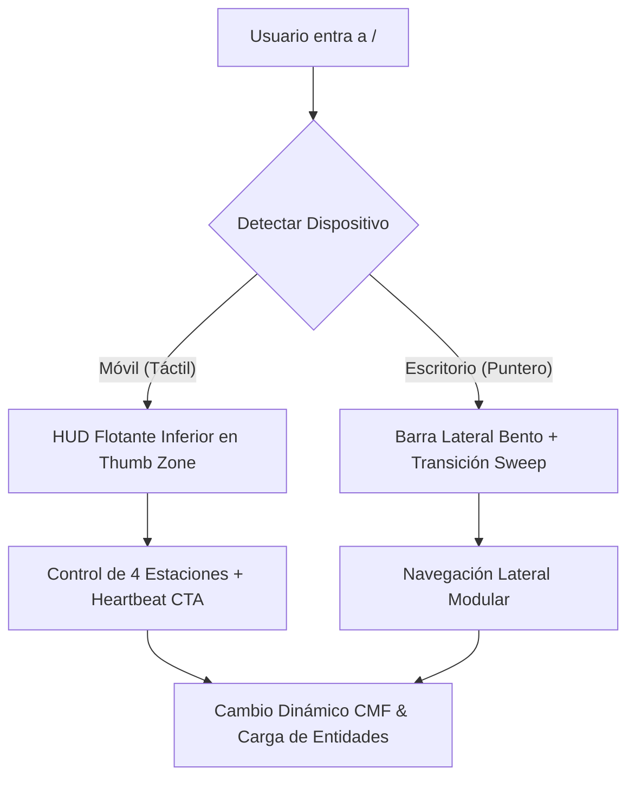
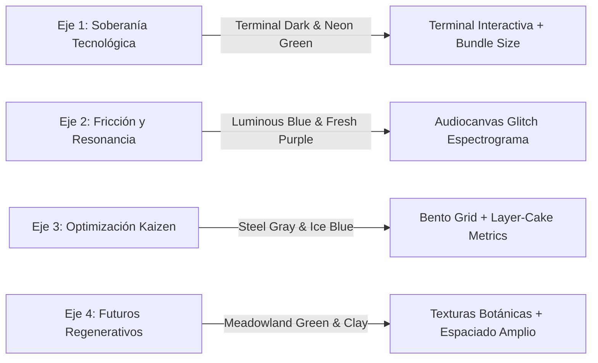

# Diseño de Detalle: Módulo Home (Sitio Web Airhon)

**Especificación Técnica de Interfaz, Estaciones HUD, CMF y Capa Generativa**  
**Enfoque:** Lenguaje Estándar de la Industria, Ergonomía Cognitiva y Diseño Axiomático  
**Versión:** 2.0 (Rediseño Concepto "HUD Station Bifurcada")  
**Fecha:** Junio 2026  

---

> [!NOTE]
> Este documento técnico define la arquitectura de interacción y el comportamiento de la página de inicio (Home). Se proscribe el diseño lineal de scroll infinito en favor de una **HUD Shell interactiva por estaciones**. El desarrollo de software soberano se consagra como el pilar fundamental (Eje 1) de la práctica profesional de Airhon.

---

## 1. Topología de Navegación: HUD Station Bifurcada

Para mitigar la carga cognitiva y optimizar la usabilidad en múltiples dispositivos, la página de inicio se concibe como una interfaz reactiva gobernada por el estado de la **Estación Activa** (`active_station`).

### 1.1. Vista Móvil: HUD de Confort del Pulgar (*Thumb Zone Navigation*)
* **Contenedor:** Una barra flotante en el tercio inferior de la pantalla con efecto *glassmorphism* (fondo translúcido con desenfoque de fondo y borde sutil).
* **Selectores de Estación:** 4 botones táctiles de área expandida ($52 \times 52\text{ px}$) colocados en la zona natural de alcance del pulgar.
* **El Botón Central "Heartbeat":** Un botón de acción rápida de alto impacto visual con una micro-animación de pulso concéntrico. Al pulsarlo, despliega un *Bottom Sheet* (hoja inferior táctil) con el formulario de contacto para evitar el scroll.

### 1.2. Vista de Escritorio: Barra Lateral Bento & Estaciones Espaciales
* **Panel Lateral Izquierdo:** Un contenedor Bento persistente de $280\text{ px}$ de ancho con micro-animaciones en CSS que indican el estado de carga y la estación activa.
* **Transiciones de Sweep Horizontal:** El cambio entre estaciones activa un barrido elástico de pantalla (`framer-motion` o CSS transforms) simulando el desplazamiento físico de módulos industriales.

---

## 2. Los 4 Ejes Profesionales (Estaciones Dinámicas)

El comportamiento de la interfaz y la paleta de diseño (CMF - Color, Material, Finish) se adaptan en tiempo real al cambiar la estación activa:

### Estación 1: Soberanía Tecnológica (Desarrollo de Software)
* **CMF:** Terminal Dark. Fondo de consola `hsl(220, 15%, 8%)` con acentos en verde terminal/fósforo (`hsl(120, 100%, 45%)`).
* **Composición de UI:** Bloques de código interactivos, visualización en tiempo real del peso del bundle del sitio web ($<15\text{ KB}$ de JS inicial) y tiempos de latencia simulados en el Edge.
* **Componente Interactivo:** Una micro-consola de comandos interactiva donde el usuario puede escribir comandos simples (e.g., `inspect`, `help`, `clear`) para consultar especificaciones de los proyectos de software (como *Agnostic Indra*).

### Estación 2: Fricción y Resonancia (Arte Digital y Sonoro)
* **CMF:** Fondo negro profundo `hsl(0, 0%, 4%)` con acentos en `Luminous Blue` (`hsl(210, 100%, 50%)`) y `Fresh Purple` (`hsl(270, 80%, 60%)`).
* **Composición de UI:** Estética glitch controlada. Los metadatos de los proyectos se muestran en tipografía monoespaciada con sutiles aberraciones cromáticas en hover.
* **Componente Interactivo:** Un canvas visual interactivo que dibuja el espectro de ondas sonoras en tiempo real. Cuenta con un reproductor de audio integrado para escuchar los paisajes sonoros y composiciones electroacústicas del portafolio.

### Estación 3: Optimización y Diseño de Servicios (Kaizen / Producto)
* **CMF:** Gris acero industrial `hsl(210, 10%, 23%)` y azul hielo `hsl(190, 70%, 90%)`.
* **Composición de UI:** Bento Grid de alta densidad informativa. Estructura basada en el patrón de "pastel en capas" (*Layer-Cake*) para escanear de un vistazo cifras de ROI, entregables, metodologías Kaizen y los hitos del servicio de consultoría.
* **Componente Interactivo:** Una calculadora reactiva de proyectos que estima el CapEx (inversión inicial) y OpEx (costo recurrente) para implementaciones a medida, permitiendo al cliente modular la cotización.

### Estación 4: Futuros Regenerativos (Diseño Social y Co-Creación)
* **CMF:** Meadowland Green (`hsl(140, 30%, 40%)`) y Clay (`hsl(25, 40%, 55%)`). Fondo de contraste suave y orgánico.
* **Composición de UI:** Tipografía con serifa suave, espaciado generoso (`--spacing-lg`) y visualización de proyectos de co-creación comunitaria (ej. *Raíz Solar* y *Colectivo Rústico*).
* **Componente Interactivo:** Bitácora interactiva de territorio y co-creación participativa, estructurada con fotografías de bordes redondeados y narrativas en formato de tarjetas de investigación social.

---

## 3. Capa Generativa: La Red de Indra (*Indra's Net Loader*)

Para consolidar la identidad del portafolio desde el primer segundo de carga, la interfaz integra una simulación generativa basada en el concepto de la Red de Indra:

* **WebGL/Canvas 2D Particle System:** Una malla de nodos interconectados flotando tridimensionalmente. Los nodos son atraídos magnéticamente al cursor del usuario o a los toques táctiles.
* **Fricción por Movimiento:** Movimientos rápidos del puntero o pulsaciones múltiples inyectan ondas de fuerza elástica en la red, generando aberraciones cromáticas y pequeños glitchs en la visualización.
* **Suspensión Activa (Optimización Energética):**
  > [!IMPORTANT]
  > Para cumplir con la filosofía del Eje 1 (bajo consumo de recursos y tecnología soberana), el bucle de renderizado (`requestAnimationFrame`) se **pausa automáticamente** mediante un `IntersectionObserver` cuando el cargador se desvanece o la estación no requiere soporte dinámico de partículas. Esto reduce el consumo de CPU y GPU a exactamente $0\%$ en reposo.

---

## 4. Sección 3: Casos de Estudio Destacados (Bento Grid)

Cada estación renderiza los proyectos del schema `proyectos` relacionados al `eje_id` correspondiente, filtrando aquellos marcados como `destacado = true`.

* **Estructura Bento:** Las tarjetas adoptan diferentes tamaños en escritorio según su jerarquía de datos, y colapsan en una sola columna táctil en móvil.
* **Campos Requeridos en Pantalla:**
  1. **Tag de Categoría:** Relación directa con el eje.
  2. **Nombre del Proyecto:** Tipografía destacada.
  3. **Resumen Corto:** Texto descriptivo limitado a 120 caracteres.
  4. **Año y Rol:** Ubicados en el pie de la tarjeta.
  5. **Enlace:** Enlace interactivo `Ver caso de estudio →`.

---

## 5. Captura y Conversión: Bottom Sheet de Contacto

El botón central de la barra HUD (móvil) o el botón de agendar en la barra Bento (escritorio) abren el formulario de contacto de manera no intrusiva:

* **Móvil:** Se desliza una hoja desde la parte inferior (*Bottom Sheet*) que cubre el 80% de la pantalla, permitiendo cerrar el formulario con un gesto de deslizamiento rápido (*swipe down*) del pulgar.
* **Escritorio:** Modal enfocado con efecto blur de fondo.
* **Campos del Formulario (Schema `contactos`):**

| ID del Campo | Label de UI | Tipo de Input | Regla de Validación |
| :--- | :--- | :--- | :--- |
| `contacto_nombre` | `Nombre completo / Organización` | Texto | Requerido, min 3 caracteres |
| `contacto_email` | `Correo electrónico` | Email | Requerido, formato válido |
| `contacto_servicio` | `Tipo de requerimiento` | Dropdown | Selección obligatoria (Enum) |
| `contacto_mensaje` | `Detalles de tu iniciativa` | Textarea | Requerido, min 10 caracteres |

*Opciones del Dropdown (`contacto_servicio`):*
1. "Soberanía Tecnológica (Eje 1)" → `desarrollo_software`
2. "Resonancia y Arte Digital (Eje 2)" → `arte_digital`
3. "Optimización y Diseño de Servicios (Eje 3)" → `optimizacion_procesos`
4. "Diseño Social y Participativo (Eje 4)" → `diseno_participativo`
5. "Otro requerimiento" → `otro`

---

## 6. Pie de Página (Footer de Control)

* **Copyright:** `© 2026 AIRHON. Todos los derechos reservados.`
* **Privacidad:** Enlace a política de Habeas Data e integridad de datos.
* **Enlaces Sociales:** GitHub, LinkedIn y Bandcamp/Soundcloud.
