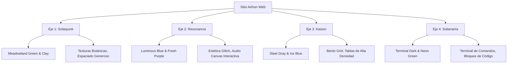

# Arquitectura de Navegabilidad y Comunicación Visual: Airhon Web

**Manual de Diseño de Interfaz (UI/UX) y Ergonomía Cognitiva**  
**Inspiración:** Tendencias CMF 2026-2027 & Biomecánica del Pulgar (Hoober)  
**Versión:** 1.0  
**Fecha:** Junio 2026  

---

## 1. Topología de Navegación: HUD Station Bifurcada

Para garantizar una experiencia fluida, el sitio no utilizará la navegación jerárquica clásica en cascada (que incrementa la carga cognitiva). En su lugar, implementamos un modelo de **Navegación por Estaciones** (HUD), adaptando físicamente la interfaz al dispositivo del usuario.

### 1.1. Vista Móvil: HUD de Confort del Pulgar (*Thumb Zone Navigation*)
El 75% de las interacciones móviles ocurren con el pulgar. El menú superior "hamburguesa" se proscribe por estar en la zona crítica de dolor o estiramiento (*Ow Zone*).

* **Barra HUD Flotante Inferior:** Un contenedor elástico con efecto de vidrio esmerilado (*glassmorphism*) ubicado permanentemente en el tercio inferior de la pantalla (Zona Natural de Confort).
* **Control Segmentado de 4 Ejes:** Un slider táctil que permite saltar entre los 4 ejes de forma instantánea deslizando el pulgar.
* **El Botón Central "Heartbeat":** Un botón de acción rápida (CTA) de $52 \times 52\text{ px}$ en el centro ergonómico para agendar o iniciar contacto.

```
  ┌──────────────────────────┐
  │                          │  ◄── Zona Crítica (Ow Zone):
  │     [Cabecera Fija]      │      Solo títulos e indicadores.
  │                          │
  ├──────────────────────────┤
  │                          │  ◄── Zona de Transición:
  │    Área de Contenido     │      Tarjetas de proyectos, bitácoras.
  │         Dinámico         │      
  │                          │
  ├──────────────────────────┤
  │    ( )  ( )  ( )  ( )    │  ◄── Zona Natural (Confort del Pulgar):
  │  ┌────────────────────┐  │      Botones de navegación HUD,
  │  │    [ CTA Central ] │  │      selectores rápidos, deslizadores.
  │  └────────────────────┘  │
  └──────────────────────────┘
```

### 1.2. Vista de Escritorio: Barra Lateral Bento & Estaciones Espaciales
* **Barra Lateral Izquierda:** Un panel persistente de $260\text{ px}$ de ancho. Muestra el estado activo de la "estación" actual con una micro-animación en CSS que imita el latido de un corazón (relacionado con *Heartbeat Brands*).
* **Transiciones de Sweep Horizontal:** Saltar de un eje a otro activa un barrido de pantalla mediante `framer-motion` o CSS elástico, simulando la transición de módulos físicos.

---

## 2. Identidad Visual por Eje (CMF 2026-2027)

Cada eje tiene su propia personalidad cromática y de comportamiento de interfaz para guiar al usuario visualmente sin necesidad de textos instructivos redundantes.



### Eje 1: Futuros Regenerativos & Co-Creación
* **Paleta CMF:** `Meadowland Green` (`hsl(140, 30%, 45%)`) y `Clay` (`hsl(25, 40%, 60%)`). Evoca tierra, botánica y ciclo cerrado.
* **Composición:** Espaciado amplio (`--spacing-xl`), tipografías con serifa suave para cabeceras y fotografías de territorio con bordes redondeados orgánicos.

### Eje 2: Fricción y Resonancia (Arte)
* **Paleta CMF:** `Luminous Blue` y `Fresh Purple` sobre un fondo negro profundo.
* **Composición:** Estética de error controlado (*Glitch Art*). Canvas interactivo que dibuja el espectro del arte sonoro en tiempo real. Tipografía monoespaciada para metadatos del arte.
* **Fricción Visual:** Filtro sutil de aberración cromática en hover para simular el hardware análogo descalibrado.

### Eje 3: Arquitectura de Servicios (Producto)
* **Paleta CMF:** Tonos neutros industriales, gris acero y azul hielo.
* **Composición:** Alta densidad informativa. Estructura de Bento Grid. Uso del patrón de "pastel en capas" (*Layer-Cake*) para que los tomadores de decisión corporativos puedan escanear rápidamente cifras de ROI y SLA.

### Eje 4: Soberanía Tecnológica (Código)
* **Paleta CMF:** Consola oscura. Fondo `hsl(220, 15%, 10%)` con acentos en verde terminal o fósforo.
* **Composición:** Bloques de código interactivos, visualización en tiempo real del peso del bundle del sitio web ($<15\text{ KB}$ de JS inicial) y tiempos de latencia en el Edge.

---

## 3. Ergonomía Cognitiva y Control de Lectura

Para mitigar el **efecto mirilla (*peephole effect*)** en pantallas móviles, donde la retención de lectura compleja cae a la mitad ( Singh et al., Univ. of Alberta), se imponen las siguientes directrices tipográficas y de diseño:

### 3.1. Mitigación de la Fatiga Lectora
* **Divulgación Progresiva:** Las bitácoras no cargan páginas completas de inmediato. Se presenta un resumen de escaneo (*Layer-Cake*) con un botón interactivo que despliega una hoja inferior táctil (*Bottom Sheet*) que el usuario puede cerrar fácilmente deslizando el pulgar hacia abajo.
* **Ancho Óptimo de Línea:** Acotado rigurosamente mediante CSS:
  ```css
  .articulo-cuerpo {
    max-inline-size: 66ch; /* Evita que el ojo pierda la línea en el retorno visual */
    line-height: 1.6;
  }
  ```

### 3.2. Tokens de Espaciado y Tipografía Fluida (`clamp`)
Para evitar saltos visuales abruptos entre móviles y monitores 4K, implementamos el escalado matemático elástico continuo:

```css
:root {
  /* Espaciados elásticos calculados entre 320px y 1200px viewport */
  --spacing-sm: clamp(0.75rem, calc(0.522rem + 1.14vw), 1.25rem);
  --spacing-md: clamp(1.25rem, calc(0.909rem + 1.7vw), 2rem);
  --spacing-lg: clamp(2rem, calc(1.09rem + 4.55vw), 4rem);

  /* Escalado tipográfico fluido */
  --font-h1: clamp(2rem, calc(1.5rem + 2.5vw), 3.5rem);
  --font-h2: clamp(1.5rem, calc(1.2rem + 1.5vw), 2.5rem);
  --font-body: clamp(1rem, calc(0.95rem + 0.25vw), 1.125rem);
}
```

---

## 4. Calibración de la Interacción Táctica e Interaction Queries

Implementamos CSS condicional para que el sistema detecte físicamente si el dispositivo del usuario es un smartphone táctil o una computadora de escritorio con puntero preciso:

```css
/* Botón de Interacción Principal */
.cta-station {
  display: inline-flex;
  align-items: center;
  justify-content: center;
  border-radius: var(--radius-lg);
  font-weight: 600;
  transition: transform 0.2s cubic-bezier(0.34, 1.56, 0.64, 1);
}

/* 1. DISPOSITIVOS TÁCTILES (Smartphones, Tabletas) */
@media (pointer: coarse) {
  .cta-station {
    min-width: 48px;
    min-height: 48px; /* Hit Target conforme WCAG 2.2 / Google Material */
    padding: 1rem 2rem;
    margin: 8px; /* Zona de amortiguación mínima anti-fat-finger */
  }
}

/* 2. DISPOSITIVOS CON PUNTERO DE PRECISIÓN (Mouse, Trackpad) */
@media not all and (hover: none) {
  .cta-station {
    padding: 0.75rem 1.5rem;
  }
  .cta-station:hover {
    transform: scale(1.03) translateY(-2px);
    box-shadow: 0 10px 20px rgba(0, 0, 0, 0.1);
  }
}
```


---

## 5. Capa Generativa WebGL y Arte en Código (Indra's Net Loader)

Para infundir la identidad de arte digital y soberanía tecnológica desde el primer segundo, el sitio incorporará elementos interactivos generativos de alto rendimiento que actúan como "obras de arte en código".

### 5.1. El Pre-cargador Global: *La Red de Indra* (Indra's Net)
En lugar de un spinner genérico, el tiempo de carga e hidratación del sitio web mostrará una simulación WebGL interactiva basada en la red de nodos interconectados de **Agnostic Indra**:

* **Estructura Visual:** Un sistema de partículas en 3D (WebGL/Three.js o fragment shaders puros para máximo rendimiento) que representa una red cristalina de nodos flotantes. Cada nodo brilla reflejando la luz del cursor del usuario (gravedad interactiva).
* **Fricción y Glitch:** Pequeños impulsos eléctricos (vectores de fuerza elástica) recorren los enlaces. Si el usuario hace tap en la pantalla táctil o mueve el mouse rápido, el sistema genera una pequeña "onda de glitch" (desplazamiento de vértices y aberración cromática) que se atenúa suavemente.
* **Transición de Entrada (*Dispersion Sweep*):** Al completarse la carga del sitio, los nodos no desaparecen con un simple *fade-out*. Un vector de fuerza de dispersión repele los nodos hacia las esquinas del viewport en una animación fluida a $60\text{ fps}$, desvaneciéndose para revelar la interfaz de la estación activa.

### 5.2. Toques Generativos de Acompañamiento
* **Filtros de Puntero (Magnetic Pull):** Los botones interactivos en escritorio (`cta-station` y controles HUD) tendrán un efecto magnético sutil en WebGL que deforma levemente una rejilla de fondo al pasar el cursor.
* **Soberanía Energética (Optimización Solarpunk):**
  * Para cumplir con la filosofía del Eje 1 (limitar el impacto tecnológico en los recursos), el bucle de renderizado de WebGL (`requestAnimationFrame`) se **pausará automáticamente (suspensión activa)** cuando el cargador termine o el canvas quede fuera del viewport mediante un `IntersectionObserver`. Esto reduce el consumo de CPU y GPU del cliente a exactamente $0\%$ cuando está consumiendo el portafolio estático.

---

Este diseño axiomático de componentes garantiza que la interfaz se adapte de forma autónoma al contexto físico y neurológico de cada usuario, entregando una experiencia premium libre de entropía de código.
