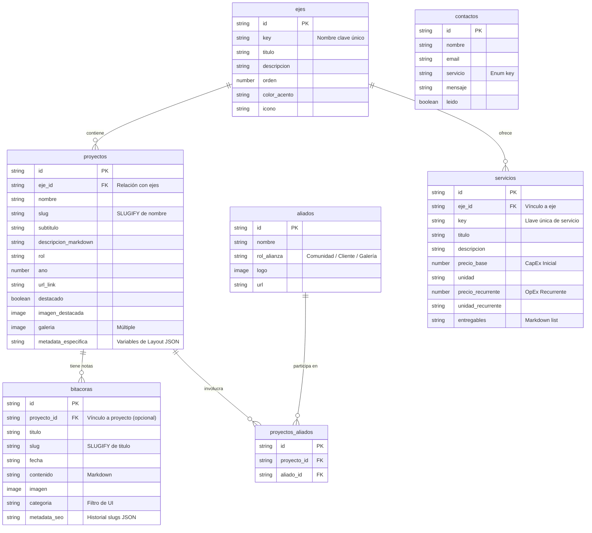

# Arquitectura de Schemas Grafo-Relacionales: Sitio Web Airhon

**Documento Técnico de Diseño de Base de Datos y Modelo de Información**  
**Metodología:** Diseño Axiomático (Nam P. Suh) & Invariantes del Agnostic System  
**Versión:** 1.0  
**Fecha:** Junio 2026  

---

## 1. Fundamentos Arquitectónicos

Siguiendo la **doctrina de diseño axiomático** y las leyes de normalización del `Agnostic System` detalladas en `AGNOSTIC_DOCS/INS_Sistemas shcemas y disñeo axioamtico.md`:

1. **Diseñar desde la entidad, no desde la pantalla:** Evitamos la entropía de crear una tabla gigante para sostener layouts de UI efímeros. Dividimos el dominio en entidades lógicas (sustantivos que persisten).
2. **Axioma de Independencia (Axioma 1):** Los esquemas se estructuran de forma desacoplada para evitar dependencias circulares. Un cambio en la estructura de `bitacoras` no debe alterar las relaciones lógicas de `proyectos` o `ejes`.
3. **Axioma de Información (Axioma 2):** Maximizamos la simplicidad y evitamos duplicar cadenas de texto estáticas repetitivas mediante el uso de relaciones normalizadas.
4. **Regla de Invariantes del Motor:** El nombre de la base de datos local `storage/{project}/db/{namespace}.json` debe coincidir exactamente con el nombre del schema definido en la CLI (`agno> create-schema <name>`).

---

## 2. Mapa Grafo-Relacional (Entidades y Dependencias)



---

## 3. Especificación Detallada de los Schemas

A continuación se definen los campos exactos, tipos de datos y configuraciones que se inyectarán en la base de datos mediante el CLI `agno`.

### 3.1. Schema: `ejes`
Representa los 4 pilares curatoriales de la práctica de Airhon.

* **`key`** (type: `text`, required): Identificador en snake_case (e.g. `futuros_regenerativos`, `friccion_resonancia`, `arquitectura_servicios`, `soberania_tecnologica`).
* **`titulo`** (type: `text`, required): Nombre legible para navegación e interfaces (e.g., "Futuros Regenerativos & Co-Creación").
* **`descripcion`** (type: `text`): Párrafo de introducción conceptual para la visualización del eje.
* **`orden`** (type: `number`, required): Índice de ordenamiento para asegurar la jerarquía secuencial de los ejes.
* **`color_acento`** (type: `text`): Token de color CSS o código HEX de acento CMF (e.g., `var(--sat-accent-meadowland)`).
* **`icono`** (type: `text`): Nombre del icono Lucide (e.g., `Sprout`, `Radio`, `Layers`, `Code`).

### 3.2. Schema: `proyectos`
Mantiene la información y registros multimedia de las obras, plataformas y desarrollos.

* **`eje_id`** (type: `relation`, entity: `ejes`, required): Clave foránea que asocia el proyecto a su eje principal.
* **`nombre`** (type: `text`, required): Nombre comercial o artístico del proyecto (e.g. "Agnostic Indra", "Raíz Solar").
* **`slug`** (type: `text`): Slug de URL amigable.
  * *Configuración:* `{"derivation": {"op": "SLUGIFY", "args": ["nombre"]}}` (calculado en read-time).
* **`subtitulo`** (type: `text`): Resumen corto de una línea.
* **`descripcion_markdown`** (type: `text`): Explicación detallada del proyecto. Soporta Markdown nativo para renderizado enriquecido.
* **`rol`** (type: `text`): Rol desempeñado (e.g. "Diseñador Especulativo", "Desarrollador Lead").
* **`ano`** (type: `number`): Año de ejecución (e.g. 2026).
* **`url_link`** (type: `text`): Link externo a Github, pieza sonora o producción final.
* **`destacado`** (type: `boolean`): Bandera para indicar si el proyecto se renderiza en la sección principal de la Home.
* **`imagen_destacada`** (type: `image`): Imagen principal del proyecto (*SmartImageInput*).
* **`galeria`** (type: `image`): Colección de imágenes adicionales (*SmartImageInput* con soporte múltiple).
* **`metadata_especifica`** (type: `text`): Almacén de configuración flexible en formato JSON String para soportar variables específicas de cada layout (e.g., reproductor de audio, métricas, diagramas) de forma desacoplada.

### 3.3. Schema: `bitacoras`
Bitácoras de campo, notas de voluntariado, y reflexiones críticas sobre arte digital y desarrollo.

* **`proyecto_id`** (type: `relation`, entity: `proyectos`): Relación opcional en caso de que la nota pertenezca a un proyecto en desarrollo.
* **`titulo`** (type: `text`, required): Título de la entrada.
* **`slug`** (type: `text`): Slug de URL amigable.
  * *Configuración:* `{"derivation": {"op": "SLUGIFY", "args": ["titulo"]}}`.
* **`fecha`** (type: `text`, required): Fecha de la bitácora (e.g. "2026-06-28").
* **`contenido`** (type: `text`, required): Cuerpo de la entrada en Markdown.
* **`imagen`** (type: `image`): Imagen de cabecera de la entrada.
* **`categoria`** (type: `text`, required): Identificador para filtrado en UI (e.g., `diseno_social`, `arte_digital`, `software_libre`).
* **`metadata_seo`** (type: `text`): Historial de slugs anteriores almacenados en formato JSON Array para soporte de redirecciones 301.

### 3.4. Schema: `aliados`
Colección centralizada de colaboradores, colectivos, comunidades u ONGs con las que Airhon co-crea. Evita duplicaciones y permite vistas relacionales tipo grafo.

* **`nombre`** (type: `text`, required): Nombre del colectivo o colaborador (e.g. "Colectivo Rústico", "Colectivo Nodus").
* **`rol_alianza`** (type: `text`): Relación (e.g. "Comunidad Co-creadora", "Cliente de Desarrollo").
* **`logo`** (type: `image`): Logotipo o avatar.
* **`url`** (type: `text`): Enlace web del aliado.

### 3.5. Schema: `proyectos_aliados`
Tabla intermedia N:M para relacionar proyectos con múltiples aliados o colaboradores de forma desacoplada.

* **`proyecto_id`** (type: `relation`, entity: `proyectos`, required): Clave de asociación.
* **`aliado_id`** (type: `relation`, entity: `aliados`, required): Clave de asociación.

### 3.6. Schema: `servicios`
Muestra comercial de los servicios profesionales tangibles que Airhon ofrece para los ejes de sistemas y código.

* **`eje_id`** (type: `relation`, entity: `ejes`, required): Asociación con el eje (comúnmente Eje 3 o Eje 4).
* **`key`** (type: `text`, required): Llave identificadora única de servicio (e.g. `auditoria_kaizen`, `desarrollo_software`, `infraestructura_serverless`, `soporte_evolutivo`).
* **`titulo`** (type: `text`, required): Nombre del servicio (e.g. "Auditoría Kaizen de Procesos", "Arquitectura Serverless").
* **`descripcion`** (type: `text`): Detalle del alcance del servicio.
* **`precio_base`** (type: `number`): Valor monetario base / inversión inicial (CapEx).
* **`unidad`** (type: `text`): Formato de cobro del precio base (e.g., "COP único", "COP / hito").
* **`precio_recurrente`** (type: `number`): Valor monetario periódico de soporte u OpEx (e.g., 1200000).
* **`unidad_recurrente`** (type: `text`): Formato de cobro periódico (e.g., "COP / mes").
* **`entregables`** (type: `text`): Lista en formato Markdown de los hitos o entregables incluidos.

### 3.7. Schema: `contactos`
Persistencia de los mensajes enviados a través de la calculadora o el formulario de la Home.

* **`nombre`** (type: `text`, required): Nombre o empresa del solicitante.
* **`email`** (type: `text`, required): Correo de contacto.
* **`servicio`** (type: `text`, required): Tipo de requerimiento seleccionado (almacena el value snake_case).
* **`mensaje`** (type: `text`, required): Detalles y notas adicionales.
* **`leido`** (type: `boolean`): Estado de lectura interna (para administración).

---

## 4. Comandos CLI Canónicos para Creación de Schemas

Para implementar esta estructura de datos en tu entorno local sin tocar los archivos JSON manualmente (bajo pena de romper la integridad del motor), debes ejecutar los siguientes comandos desde tu terminal.

*Recuerda utilizar el flag `--env-file=.env.local` si deseas sincronizar con tu base de datos Neon Postgres.*

```bash
# 1. Crear Schema: ejes
npx tsx --env-file=.env.local scripts/agno.ts create-schema ejes field:key:text field:titulo:text field:descripcion:text field:orden:number field:color_acento:text field:icono:text

# 2. Crear Schema: proyectos (eje_id es relation, metadata_especifica para datos de layouts)
npx tsx --env-file=.env.local scripts/agno.ts create-schema proyectos field:eje_id:relation field:nombre:text field:subtitulo:text field:descripcion_markdown:text field:rol:text field:ano:number field:url_link:text field:destacado:boolean field:imagen_destacada:image field:galeria:image field:metadata_especifica:text

# Configurar relación del eje_id y derivación del slug
npx tsx --env-file=.env.local scripts/agno.ts set proyectos.eje_id.entity ejes
npx tsx --env-file=.env.local scripts/agno.ts set proyectos.slug.config "{\"derivation\":{\"op\":\"SLUGIFY\",\"args\":[\"nombre\"]}}"

# 3. Crear Schema: bitacoras (incluye categoria y metadata_seo para redirects)
npx tsx --env-file=.env.local scripts/agno.ts create-schema bitacoras field:proyecto_id:relation field:titulo:text field:fecha:text field:contenido:text field:imagen:image field:categoria:text field:metadata_seo:text

# Configurar relación del proyecto_id y derivación del slug
npx tsx --env-file=.env.local scripts/agno.ts set bitacoras.proyecto_id.entity proyectos
npx tsx --env-file=.env.local scripts/agno.ts set bitacoras.slug.config "{\"derivation\":{\"op\":\"SLUGIFY\",\"args\":[\"titulo\"]}}"

# 4. Crear Schema: aliados
npx tsx --env-file=.env.local scripts/agno.ts create-schema aliados field:nombre:text field:rol_alianza:text field:logo:image field:url:text

# 5. Crear Schema: proyectos_aliados (Tabla intermedia)
npx tsx --env-file=.env.local scripts/agno.ts create-schema proyectos_aliados field:proyecto_id:relation field:aliado_id:relation
npx tsx --env-file=.env.local scripts/agno.ts set proyectos_aliados.proyecto_id.entity proyectos
npx tsx --env-file=.env.local scripts/agno.ts set proyectos_aliados.aliado_id.entity aliados

# 6. Crear Schema: servicios (tarifas split CapEx/OpEx, entregables y key)
npx tsx --env-file=.env.local scripts/agno.ts create-schema servicios field:eje_id:relation field:key:text field:titulo:text field:descripcion:text field:precio_base:number field:unidad:text field:precio_recurrente:number field:unidad_recurrente:text field:entregables:text
npx tsx --env-file=.env.local scripts/agno.ts set servicios.eje_id.entity ejes

# 7. Crear Schema: contactos
npx tsx --env-file=.env.local scripts/agno.ts create-schema contactos field:nombre:text field:email:text field:servicio:text field:mensaje:text field:leido:boolean

# 8. Compilar Contratos de Tipos de TypeScript
npm run agnostic:compile
```

---

## 5. Estrategia de Carga de Datos Iniciales (Seed Data)

Una vez que los schemas estén creados, se recomienda sembrar datos simulando tus proyectos reales. Esto se puede hacer cómodamente desde el panel administrativo local de Next.js (`/admin`) o mediante comandos CLI tipo:

```bash
# Registrar Eje 1
npx tsx --env-file=.env.local scripts/agno.ts create-record ejes key=futuros_regenerativos titulo="Futuros Regenerativos & Co-Creación" orden=1 color_acento="var(--sat-accent-meadowland)" icono="Sprout"

# Registrar Proyecto de Raíz Solar vinculado al Eje 1
# (Se necesitará obtener el ID autogenerado del Eje 1 mediante "npx tsx scripts/agno.ts records ejes")
npx tsx --env-file=.env.local scripts/agno.ts create-record proyectos eje_id=<EJE_1_ID> nombre="Raíz Solar" subtitulo="Soberanía alimentaria en Tenjo con bio-inspiración" ano=2026 destacado=true
```

Esta separación formal de datos garantiza la escalabilidad total: mañana puedes agregar 50 proyectos o 20 colectivos nuevos y la UI se actualizará automáticamente de manera reactiva e impecable.
